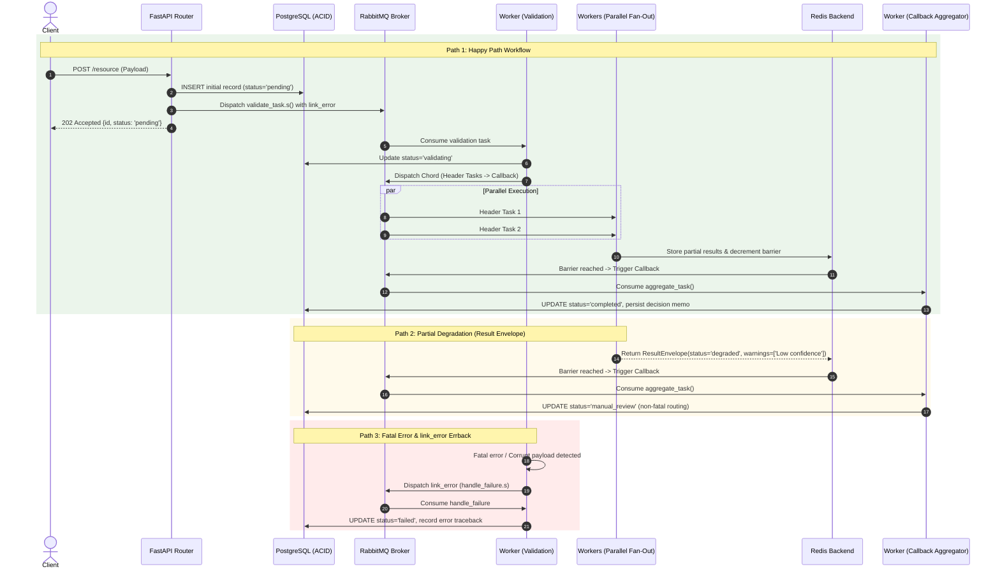

# Celery Documentation & Architectural Visualization

This skill guides the creation of production-grade documentation, test plans (`docs/TEST_PLAN.md`), architectural audits (`docs/ARCHITECTURE_AND_STANDARDS.md`), and Mermaid diagrams.

---

## 1. Docstring Standards (Google Style)
Every module, class, and public function must have Google-style docstrings clearly explaining purpose, arguments, return values, and raised exceptions:

```python
def process_ledger_entry(amount_cents: int, transaction_type: str) -> dict[str, Any]:
    """Execute minor-unit balance adjustment for a single ledger record.

    Validates that the transaction amount is positive and calculates the resulting
    ledger impact using exact integer arithmetic to avoid IEEE 754 float drift.

    Args:
        amount_cents: Transaction magnitude in minor units (integer cents).
        transaction_type: One of 'credit' or 'debit'.

    Returns:
        A dictionary containing the parsed ledger delta and updated status.

    Raises:
        ValueError: If amount_cents is non-positive or transaction_type is unknown.
    """
```

---

## 2. Code Readability & Step-by-Step Block Comments
When methods or functions contain multiple logical steps or when clean code alone cannot fully convey non-obvious domain decisions:

1. **Docstring per Method**: Every function, method, and internal task must have a Google-style docstring.
2. **Self-Documenting Prose**: Use expressive domain names so high-level logic reads like prose.
3. **Sequential Step Comments**: Partition complex or multi-stage functions into numbered blocks (`# 1. ...`, `# 2. ...`). A developer skimming the file must be able to grasp the whole flow just from method calls and step comments.

### Pattern Example:
```python
async def ingest_credit_dossier(
    session: AsyncSession,
    application_id: UUID,
    manifest: dict[str, str],
) -> DossierSubmitResponse:
    """Validate incoming application dossier and orchestrate Celery canvas execution.

    Args:
        session: Active async database session.
        application_id: Unique application identifier.
        manifest: Mapping of document types to staged filesystem paths.

    Returns:
        DossierSubmitResponse confirming ingestion and Celery task dispatch.

    Raises:
        HTTPException: If application is not found or already in progress.
    """
    # 1. Validate application exists and state allows ingestion
    app_record = await _get_application_or_404(session, application_id)
    if app_record.status != "pending":
        raise HTTPException(status_code=409, detail="Application already submitted")

    # 2. Persist registered documents and partition pages in DB
    registered_docs = await _persist_dossier_manifest(session, application_id, manifest)

    # 3. Assemble distributed Celery canvas (Chord: parallel processors -> aggregation)
    canvas = build_underwriting_canvas(application_id, registered_docs)

    # 4. Dispatch workflow to RabbitMQ with fatal-error errback
    async_result = canvas.apply_async(link_error=handle_workflow_failure.s(str(application_id)))

    # 5. Transition state to 'processing' and commit transaction
    app_record.status = "processing"
    await session.commit()

    return DossierSubmitResponse(
        application_id=str(application_id),
        workflow_id=async_result.id,
        status="processing",
    )
```

---

## 3. Test Plan Generation (`docs/TEST_PLAN.md`)
Every module requires a formal `docs/TEST_PLAN.md` containing:
1. **Test Architecture & Layer Hierarchy**: Visualized with `flowchart TD` showing L1 Unit -> L2 Canvas -> L3 API -> L4 Benchmarks.
2. **Comprehensive Test Matrix Table**:
   | Test ID | Test Function / File | Fixture Input | Invariants & Assertions | Expected Outcome |
   | :--- | :--- | :--- | :--- | :--- |
   | `TC-01` | `tests/test_canvas.py` | Clean sample | Assert all chord header tasks succeed and callback synthesizes result | Status "approved" |
3. **TDD Execution Sequence**: Clear Red-Green-Refactor roadmap with instructions for running the test suite.

---

## 4. Mermaid Sequence Diagram Mandate (All Execution Paths)
Architecture documentation must include a comprehensive `sequenceDiagram` mapping out **every path through the system**:



---

## 5. Architecture and Standards Audit (`docs/ARCHITECTURE_AND_STANDARDS.md`)
Must audit and document:
1. Architectural Dataflow & Topology (Mermaid diagram).
2. Standards Checklist:
   - Async API non-blocking guarantees.
   - ACID database transactions and constraint definitions.
   - Broker safety (JSON primitives only).
   - Celery canvas discipline (`chain`, `group`, `chord`, signatures).
   - Minor-unit financial precision (cents, `NUMERIC(14, 2)`).
   - Structured logging & correlation IDs (`X-Request-ID`).
   - Automated test results and 100% statement coverage table.

