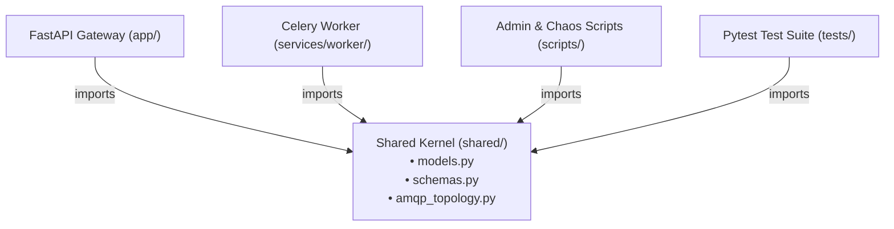

# FastAPI & Celery Service Architecture Standards

This skill defines the directory layout, Clean Architecture / DDD conventions, and container packaging standards for high-reliability distributed systems combining FastAPI and Celery.

---

## 1. Directory Topology & Service Boundaries

Every distributed backend module must maintain clear, decoupled boundaries between ingestion APIs, background workers, shared domain contracts, and container manifests:

```
<project_root>/
├── app/                              # FastAPI Ingestion Gateway (Producer)
│   ├── main.py                       # Lifespan, router registration, health ping
│   ├── dispatcher.py                 # Celery canvas & task dispatch abstractions
│   ├── routes/                       # Domain route handlers (wires.py, health.py)
│   └── middlewares/                  # Modular middleware package (correlation, error_handling)
├── services/                         # Autonomous consumer & simulation services
│   ├── worker/                       # Headless Celery Worker fleet
│   │   ├── celery_app.py             # Celery instance, AMQP configuration, acks_late
│   │   ├── requirements.txt          # Minimal worker dependencies (no uvicorn/fastapi)
│   │   └── tasks/                    # Domain-partitioned tasks (settlement.py, audit.py)
│   └── <partner>_api/                # Standalone partner/bank simulator API (e.g. bank_simulator_api)
│       ├── main.py                   # Simulator endpoints & chaos injection hooks
│       └── requirements.txt          # Minimal simulator dependencies (no Celery/PostgreSQL)
├── shared/                           # Clean Architecture / DDD Shared Kernel
│   ├── models.py                     # SQLAlchemy 2.0 domain persistence entities
│   ├── schemas.py                    # Pydantic v2 request/response and task payload contracts
│   └── amqp_topology.py              # Kombu AMQP 0-9-1 exchanges, queues, and DLX routing
├── docker/                           # Centralized Docker packaging & infra assets
│   ├── Dockerfile.api                # FastAPI Ingestion Gateway container
│   ├── Dockerfile.worker             # Headless Celery Worker container
│   ├── Dockerfile.<service_api>      # Simulator / partner API container
│   └── rabbitmq/                     # Pre-boot broker configuration
│       ├── definitions.json          # Pre-loaded queues, exchanges, and bindings
│       └── rabbitmq.conf             # Broker network and management settings
├── scripts/                          # Chaos testbeds, benchmarks, and maintenance harnesses
├── tests/                            # 4-tier testing hierarchy (unit, integration, e2e, benchmarks)
├── docker-compose.yml                # Multi-container local orchestration
├── init.sql                          # Declarative PostgreSQL relational DDL
├── requirements_api.txt              # FastAPI gateway dependencies
└── requirements_dev.txt              # Development & testing harness dependencies
```

---

## 2. Clean Architecture & Domain-Driven Design (Shared Kernel)

### Unidirectional Dependency Mandate
The Shared Kernel (`shared/`) contains common domain knowledge required across multiple autonomous processes:
1. **Domain Models (`shared/models.py`)**: SQLAlchemy 2.0 ORM mappings of relational tables (`init.sql`), table constraints, and accounting entities.
2. **Domain Schemas (`shared/schemas.py`)**: Pydantic v2 schemas for wire transfer creation, status responses, and Celery task execution payloads.
3. **AMQP Topology (`shared/amqp_topology.py`)**: Kombu declarations for direct exchanges, DLX exchanges, SLA queues, and DLQs.



### Strict Architectural Invariants
* **Ban on Models in `app/`**: Never place domain models (`models.py`) or shared schemas (`schemas.py`) inside `app/`.
  - *Rationale*: If `models.py` resides inside `app/`, headless Celery workers are forced to import from `app` (`from app.models import ...`), coupling worker runtimes to web frameworks, causing circular import risks, and preventing minimal container packaging.
* **Strict Unidirectional Flow**:
  - `app` imports `shared`
  - `services/worker` imports `shared`
  - Neither `services/worker` imports from `app`, nor does `app` import from `services/worker`.
* **Zero-PII Serialization**: Task payloads serialized across AMQP queues (`WireTaskPayload`) must strictly use masked identifiers (`account_mask: "******7890"`), preventing unencrypted financial PII from traversing message brokers.

---

## 3. Centralized Docker Packaging (`docker/`)

All container build manifests and pre-boot infrastructure configurations must be centralized strictly under the top-level `docker/` directory:

1. **Centralized File Naming**:
   - `docker/Dockerfile.api`
   - `docker/Dockerfile.worker`
   - `docker/Dockerfile.<service_api>`
   - `docker/<infra>/` (e.g. `docker/rabbitmq/definitions.json`, `docker/rabbitmq/rabbitmq.conf`)
2. **Clean Root & Service Folders**:
   - Do **NOT** place `Dockerfile.api` in the project root.
   - Do **NOT** place `Dockerfile` inside service subdirectories (`services/worker/Dockerfile`).
3. **Build Context Discipline**:
   - The build context in `docker-compose.yml` remains the project workspace root (`context: .`), allowing Dockerfiles to copy `shared/` alongside service code:
   ```yaml
   api:
     build:
       context: .
       dockerfile: docker/Dockerfile.api

   worker_1:
     build:
       context: .
       dockerfile: docker/Dockerfile.worker

   bank_simulator_api:
     build:
       context: .
       dockerfile: docker/Dockerfile.bank_simulator_api
   ```
4. **Minimal Container Layers**:
   - Headless worker containers copy only `shared/` and `services/worker/`, never bundling `app/` web routes.
   - Service requirements are isolated (`services/worker/requirements.txt`), omitting heavy web servers (`uvicorn`/`fastapi`) from worker pods.
