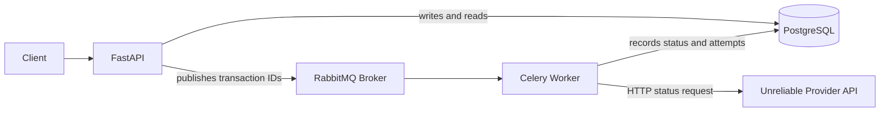
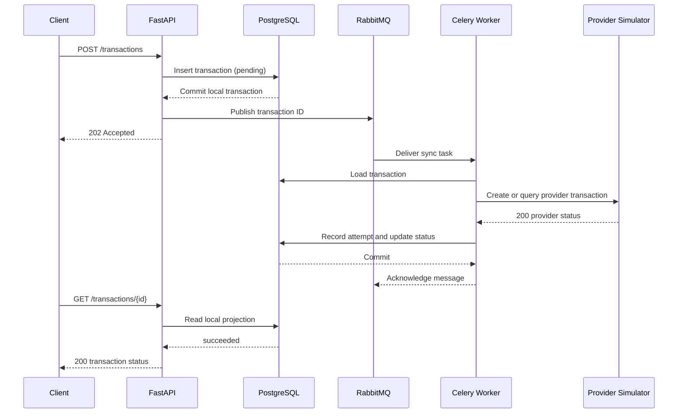
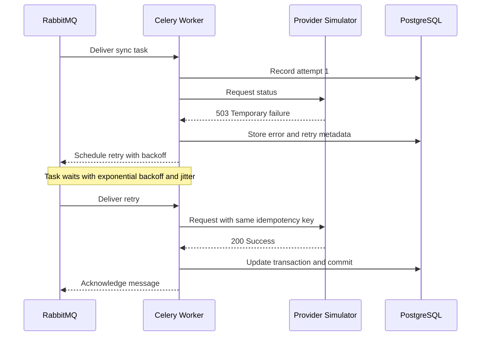
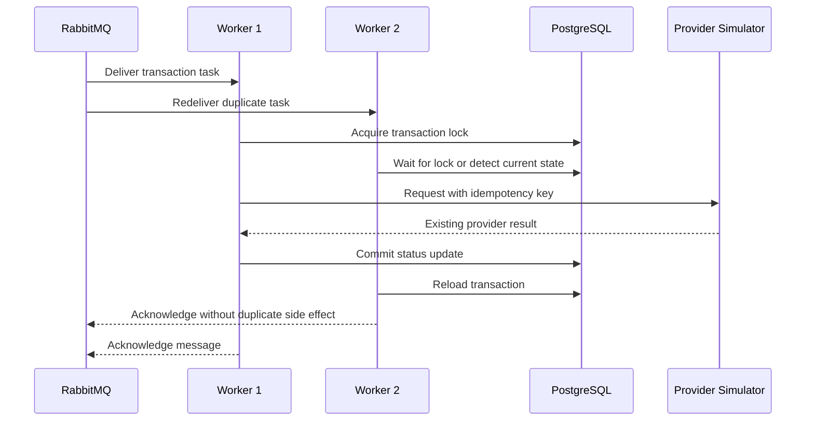

# 01: Reliability and Retries

Build a task that calls an unreliable service and remains correct when the service fails.

## Deliverables

- Bounded retries with exponential backoff and jitter.
- Explicit handling for retryable versus permanent exceptions.
- An idempotency key that prevents duplicate side effects.
- Tests for success, retry exhaustion, worker redelivery, and duplicate delivery.
- A short failure-policy document explaining the delivery guarantee.

## Evidence

Record retry counts, latency, and the behavior after a worker is terminated during execution.

## Project Definition: Resilient Transaction Status Synchronizer

Build a fintech-style service that creates a local transaction record and
asynchronously synchronizes its status with an unreliable external provider.
Do not move real money. The provider is a local fault-injection service that
can return temporary errors, permanent errors, timeouts, and successful
responses.

The central rule is:

> A Celery task may execute more than once, so processing the same transaction
> repeatedly must not create an incorrect result or duplicate side effect.

## Architecture



### Responsibilities

| Component | Responsibility |
| --- | --- |
| FastAPI | Validate requests, create transactions, expose status queries, and return `202 Accepted` for asynchronous work. |
| PostgreSQL | Store accounts, transactions, synchronization attempts, and durable local status. |
| RabbitMQ | Deliver Celery task messages. |
| Celery worker | Load the latest transaction, call the provider, retry transient failures, and commit the local update. |
| Provider simulator | Emulate an external API with deterministic failures and delays. |

The provider owns the external transaction status. PostgreSQL stores the local
projection, audit history, retry information, and application metadata. The
Celery result backend is not the business database.

## Services

### Transaction API

Endpoints:

```text
POST /accounts
POST /transactions
GET  /transactions/{transaction_id}
GET  /transactions?account_id=...&status=...&created_after=...
```

Responsibilities:

- Validate account, amount, currency, and idempotency key.
- Create a local transaction with status `pending`.
- Publish `sync_transaction_status(transaction_id)` after the database commit.
- Return `202 Accepted` with the local transaction ID.
- Read transaction status from PostgreSQL without calling the provider.

### Synchronization Worker

The Celery task must:

1. Receive only the local transaction ID and idempotency key.
2. Load the current transaction from PostgreSQL.
3. Avoid work when the transaction is already in a terminal state.
4. Call the provider using the same idempotency key.
5. Retry timeouts, connection errors, and HTTP `5xx` responses.
6. Mark permanent `4xx` errors as `failed` without retrying.
7. Update the local status in a database transaction.
8. Record each attempt and allow duplicate delivery safely.

### Unreliable Provider Simulator

Provide deterministic test modes:

```text
POST /provider/transactions
GET  /provider/transactions/{provider_transaction_id}

failure_mode=success
failure_mode=temporary    # first two attempts return 503
failure_mode=permanent    # returns 400
failure_mode=timeout      # delays beyond the client timeout
failure_mode=disconnect   # closes the connection
```

The simulator must persist provider transactions and honor the idempotency key
so a retried create request does not create a second provider transaction.

## Data Models

### Account

```text
accounts
--------
id                 UUID primary key
external_reference VARCHAR unique not null
created_at         TIMESTAMP not null
```

### Transaction

```text
transactions
------------
id                       UUID primary key
account_id               UUID foreign key -> accounts.id
idempotency_key          VARCHAR unique not null
provider_transaction_id  VARCHAR unique nullable
amount                   NUMERIC(18, 2) not null
currency                 CHAR(3) not null
status                   VARCHAR not null
provider_status          VARCHAR nullable
sync_attempts            INTEGER not null default 0
last_synced_at           TIMESTAMP nullable
next_retry_at            TIMESTAMP nullable
last_error               TEXT nullable
created_at               TIMESTAMP not null
updated_at               TIMESTAMP not null
```

Suggested local statuses:

```text
pending -> syncing -> succeeded
									 -> failed
									 -> unknown
```

`unknown` represents an ambiguous provider result, such as a timeout after the
provider may already have accepted the request. It should be resolved by
querying the provider with the same idempotency key, not by creating a new
transaction.

### Synchronization Attempt

```text
sync_attempts
-------------
id                       UUID primary key
transaction_id           UUID foreign key -> transactions.id
celery_task_id           VARCHAR not null
attempt_number           INTEGER not null
outcome                  VARCHAR not null
provider_http_status     INTEGER nullable
error_type               VARCHAR nullable
error_message            TEXT nullable
started_at               TIMESTAMP not null
finished_at              TIMESTAMP nullable
```

Add a uniqueness constraint on `(transaction_id, attempt_number)` and an index
on `(status, next_retry_at)` for stale-transaction queries.

## Sequence Diagrams

### Create and synchronize successfully



### Temporary failure and retry



### Duplicate delivery and idempotency
Python 3.11 with libraries like Celery (asynchronous task management)
FastAPI as a web framework for microservices
Django as framework for full-stack services
Airflow for task distribution and management
Redis for caching
PostgreSQL 13,14 as relational database
Google Cloud Platform as main cloud solution


## Completion Checklist

- [ ] API creates local transactions and returns `202 Accepted`.
- [ ] Celery receives IDs rather than ORM objects or complete request payloads.
- [ ] Temporary failures retry with bounded exponential backoff and jitter.
- [ ] Permanent failures do not retry indefinitely.
- [ ] Provider creation is idempotent.
- [ ] Duplicate task delivery is safe.
- [ ] Database updates use commit and rollback handling.
- [ ] Worker termination and redelivery are tested.
- [ ] Metrics include attempts, retry count, duration, and final outcome.
- [ ] The README documents the actual delivery and consistency guarantees.
