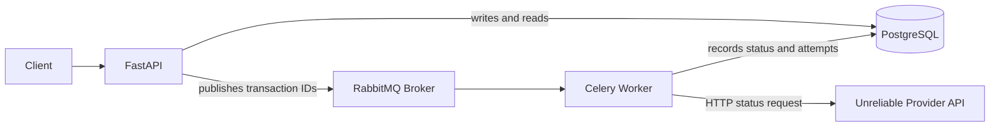
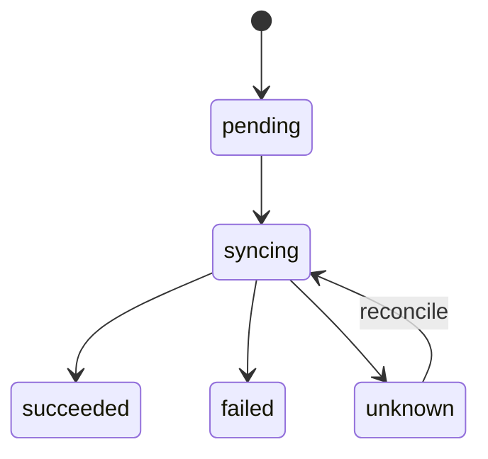
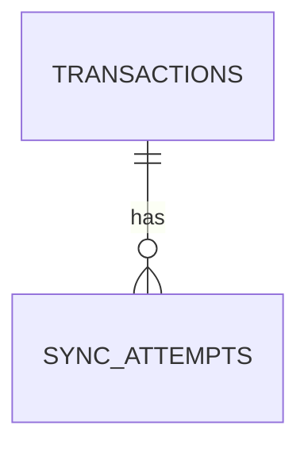
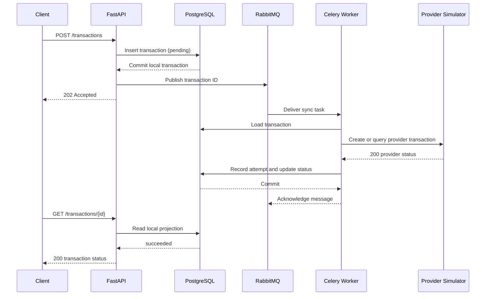
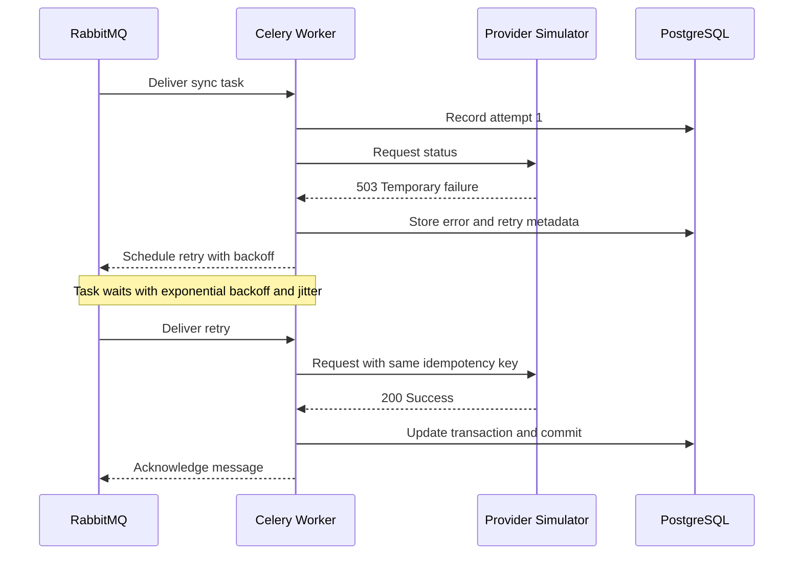
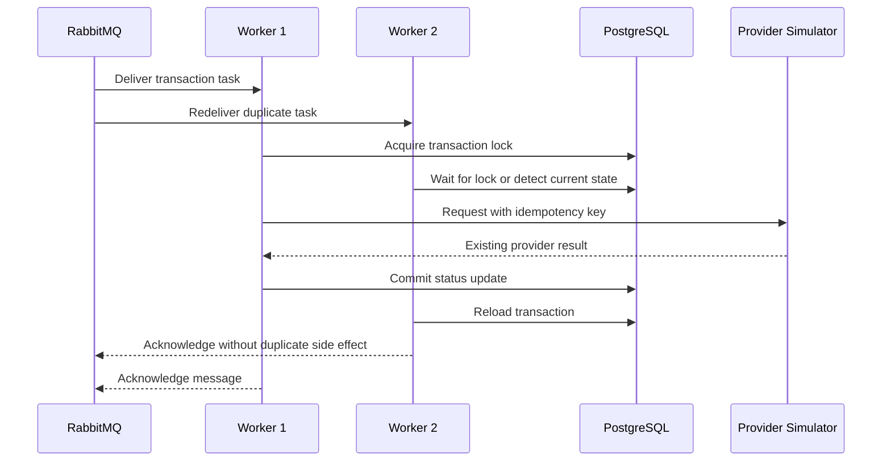

# 01: Reliability and Retries

Build a task that calls an unreliable service and remains correct when the service fails.

## Deliverables

- Bounded retries with exponential backoff and jitter.
- Explicit handling for retryable versus permanent exceptions.
- An idempotency key that prevents duplicate side effects.
- Tests for success, retry exhaustion, worker redelivery, and duplicate delivery.
- A short failure-policy document explaining the delivery guarantee.

## Evidence

Record retry counts, latency, and the behavior after a worker is terminated during execution.

## Project Definition: Resilient Transaction Status Synchronizer

Build a fintech-style service that creates a local transaction record and
asynchronously synchronizes its status with an unreliable external provider.
Do not move real money. The provider is a local fault-injection service that
can return temporary errors, permanent errors, timeouts, and successful
responses.

The central rule is:

> A Celery task may execute more than once, so processing the same transaction
> repeatedly must not create an incorrect result or duplicate side effect.

## Architecture



### Responsibilities

| Component | Responsibility |
| --- | --- |
| FastAPI | Validate requests, create transactions, expose status queries, and return `202 Accepted` for asynchronous work. |
| PostgreSQL | Store accounts, transactions, synchronization attempts, and durable local status. |
| RabbitMQ | Deliver Celery task messages. |
| Celery worker | Load the latest transaction, call the provider, retry transient failures, and commit the local update. |
| Provider simulator | Emulate an external API with deterministic failures and delays. |

The provider owns the external transaction status. PostgreSQL stores the local
projection, audit history, retry information, and application metadata. The
Celery result backend is not the business database.

## Services

### Transaction API

Endpoints:

```text
POST /accounts
POST /transactions
GET  /transactions/{transaction_id}
GET  /transactions?account_id=...&status=...&created_after=...
```

Responsibilities:

- Validate account, amount, the `Idempotency-Key` request header, and that the
	transaction currency matches the account currency.
- Create a local transaction with status `pending`.
- Publish `sync_transaction_status(transaction_id)` after the database commit.
- Return `202 Accepted` with the local transaction ID.
- Read transaction status from PostgreSQL without calling the provider.

### Synchronization Worker

The Celery task must:

1. Receive only the local transaction ID and idempotency key.
2. Load the current transaction from PostgreSQL.
3. Avoid work when the transaction is already in a terminal state.
4. Call the provider using the same idempotency key.
5. Retry timeouts, connection errors, and HTTP `5xx` responses.
6. Mark permanent `4xx` errors as `failed` without retrying.
7. Update the local status in a database transaction.
8. Record each attempt and allow duplicate delivery safely.

### Unreliable Provider Simulator

Provide deterministic test modes:

```text
POST /provider/transactions
GET  /provider/transactions/{provider_transaction_id}

failure_mode=success
failure_mode=temporary    # first two attempts return 503
failure_mode=permanent    # returns 400
failure_mode=timeout      # delays beyond the client timeout
failure_mode=disconnect   # closes the connection
```

The simulator must persist provider transactions and honor the idempotency key
so a retried create request does not create a second provider transaction.

## Data Models

### Account

```text
accounts
--------
id                 UUID primary key
external_reference VARCHAR unique not null
balance            NUMERIC(18, 2) not null default 0
currency           CHAR(3) not null
created_at         TIMESTAMP not null
```

`balance` is a simulated account balance for this exercise; no real money is
moved. Transaction processing must define separately whether the balance is
checked or changed, because provider synchronization alone does not guarantee
that a local balance update is safe.

### Transaction

```text
transactions
------------
id                       UUID primary key
account_id               UUID foreign key -> accounts.id
idempotency_key          VARCHAR unique not null
provider_transaction_id  VARCHAR unique nullable
amount                   NUMERIC(18, 2) not null
currency                 CHAR(3) not null
status                   VARCHAR not null
provider_status          VARCHAR nullable
sync_attempts            INTEGER not null default 0
last_synced_at           TIMESTAMP nullable
next_retry_at            TIMESTAMP nullable
last_error               TEXT nullable
created_at               TIMESTAMP not null
updated_at               TIMESTAMP not null
```

The transaction fields have different purposes and owners:

| Field | Purpose | Owner and lifecycle |
| --- | --- | --- |
| `id` | Identifies the transaction in this application and is used by Celery task messages and API URLs. | Generated by this database when the transaction is created. It never changes. |
| `account_id` | Connects the transaction to the account being charged or updated. | References the local `accounts` row. |
| `idempotency_key` | Identifies one client request so a network retry does not create a second transaction. | Supplied in the `Idempotency-Key` header by the client and reused for retries of the same request. |
| `provider_transaction_id` | Identifies the corresponding transaction in the external provider. | Generated by the provider after successful creation. It remains nullable while the request is pending, failed, or ambiguous. |
| `amount` | Stores the transaction amount. | Supplied by the client and never changed after creation. |
| `currency` | Defines the currency for `amount`. | Supplied by the client and must match the account currency. |
| `status` | Tracks the local synchronization state. | Managed by the API and worker; starts as `pending` and ends in a terminal state. |
| `provider_status` | Stores the latest status reported by the provider. | Updated by the worker and nullable until the provider responds. |
| `sync_attempts` | Counts synchronization attempts. | Incremented by the worker for each delivery or retry. |
| `last_synced_at` | Records the last successful provider synchronization time. | Set by the worker; nullable before the first success. |
| `next_retry_at` | Schedules when a retry may be attempted. | Set by retry handling and cleared when no retry is pending. |
| `last_error` | Preserves the latest synchronization error for diagnosis. | Set by the worker on failure and cleared after successful synchronization. |
| `created_at` | Records when the local transaction was created. | Set by the database and never changed. |
| `updated_at` | Records when the local transaction was last modified. | Set by the application or a database update hook whenever the row changes. |

The client does not need to provide `id`. A typical request looks like this:

```text
POST /transactions
Idempotency-Key: payment-attempt-001
```

The API creates the local `id`, stores the request under the idempotency key,
and passes that same key to the provider. If the client retries the request,
the API returns the existing transaction instead of creating another one. The
provider can then return its own `provider_transaction_id`, which is stored for
later status queries.

Suggested local statuses:



`unknown` represents an ambiguous provider result, such as a timeout after the
provider may already have accepted the request. It should be resolved by
querying the provider with the same idempotency key, not by creating a new
transaction.

### Synchronization Attempt / Retry History

One transaction can have many synchronization attempts. The `transactions`
table stores the current state, while the `sync_attempts` table stores one row
for every provider request, including retries, timeouts, and duplicate task
deliveries:



```text
sync_attempts
-------------
id                       UUID primary key
transaction_id           UUID foreign key -> transactions.id
celery_task_id           VARCHAR not null
attempt_number           INTEGER not null
outcome                  VARCHAR not null
provider_http_status     INTEGER nullable
error_type               VARCHAR nullable
error_message            TEXT nullable
started_at               TIMESTAMP not null
finished_at              TIMESTAMP nullable
```

| Field | Purpose |
| --- | --- |
| `id` | Identifies one synchronization attempt. |
| `transaction_id` | Links the attempt to the local transaction. |
| `celery_task_id` | Identifies the Celery task delivery that made the attempt. |
| `attempt_number` | Orders attempts for the same transaction and prevents duplicate attempt numbers. |
| `outcome` | Records whether the attempt started, succeeded, failed permanently, or will be retried. |
| `provider_http_status` | Stores the provider response status, such as `200`, `400`, or `503`; remains `NULL` when no HTTP response was received. |
| `error_type` | Stores the application or exception type for failed attempts. |
| `error_message` | Stores a diagnostic error message without secrets. |
| `started_at` | Records when the provider request began. |
| `finished_at` | Records when the attempt ended; remains `NULL` while running. |

The database enforces uniqueness on `(transaction_id, attempt_number)` and
indexes `sync_attempts.transaction_id` for history queries. The
`transactions(status, next_retry_at)` index supports stale-transaction and
retry scheduling queries.

## PostgreSQL Setup

Build and start PostgreSQL from this directory:

```text
docker build -f Dockerfile.postgres -t celery-reliability-postgres .
docker run --name celery-reliability-postgres \
	-e POSTGRES_DB=transactions \
	-e POSTGRES_USER=celery \
	-e POSTGRES_PASSWORD=celery-dev-password \
	-p 5432:5432 \
	-d celery-reliability-postgres
```

The initialization script creates the three tables, UUID generation support,
constraints, indexes, and the account/transaction currency check. PostgreSQL
only runs initialization scripts when the data directory is empty.

## Sequence Diagrams

### Create and synchronize successfully



### Temporary failure and retry



### Duplicate delivery and idempotency
Python 3.11 with libraries like Celery (asynchronous task management)
FastAPI as a web framework for microservices
Django as framework for full-stack services
Airflow for task distribution and management
Redis for caching
PostgreSQL 13,14 as relational database
Google Cloud Platform as main cloud solution


## Completion Checklist

- [ ] API creates local transactions and returns `202 Accepted`.
- [ ] Celery receives IDs rather than ORM objects or complete request payloads.
- [ ] Temporary failures retry with bounded exponential backoff and jitter.
- [ ] Permanent failures do not retry indefinitely.
- [ ] Provider creation is idempotent.
- [ ] Duplicate task delivery is safe.
- [ ] Database updates use commit and rollback handling.
- [ ] Worker termination and redelivery are tested.
- [ ] Metrics include attempts, retry count, duration, and final outcome.
- [ ] The README documents the actual delivery and consistency guarantees.
