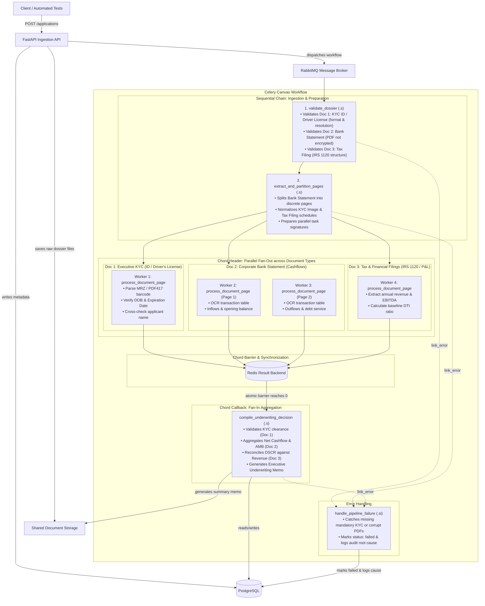
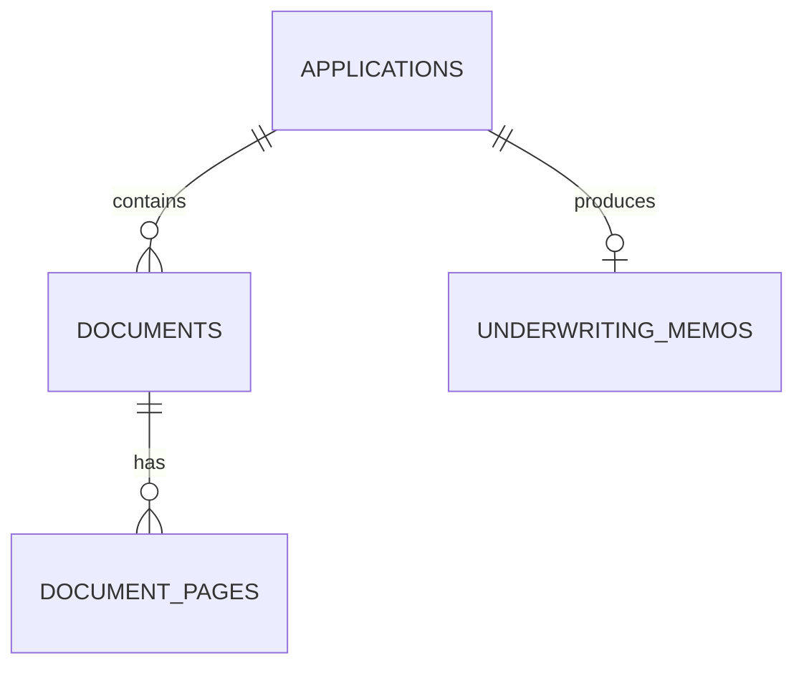
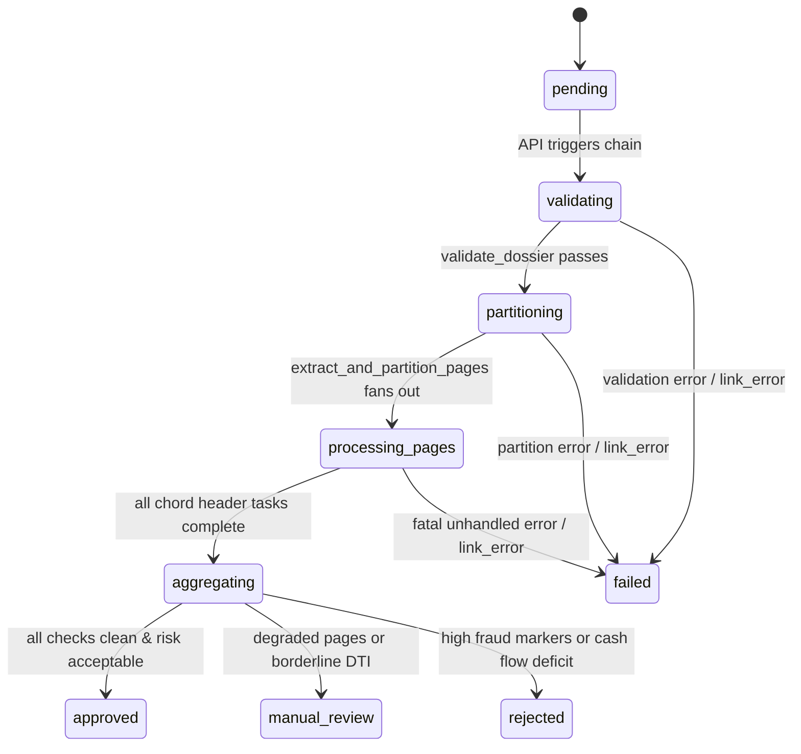
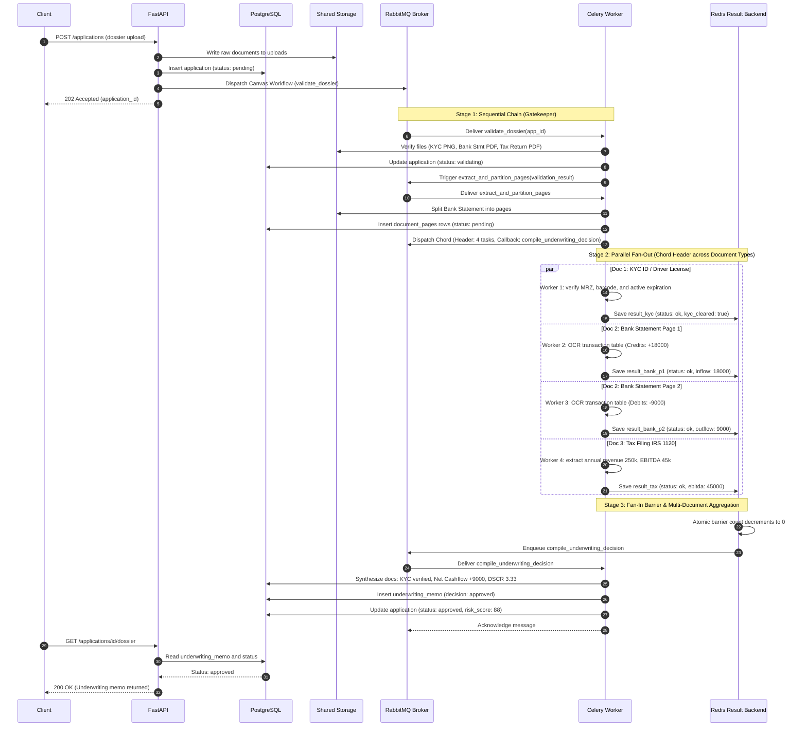
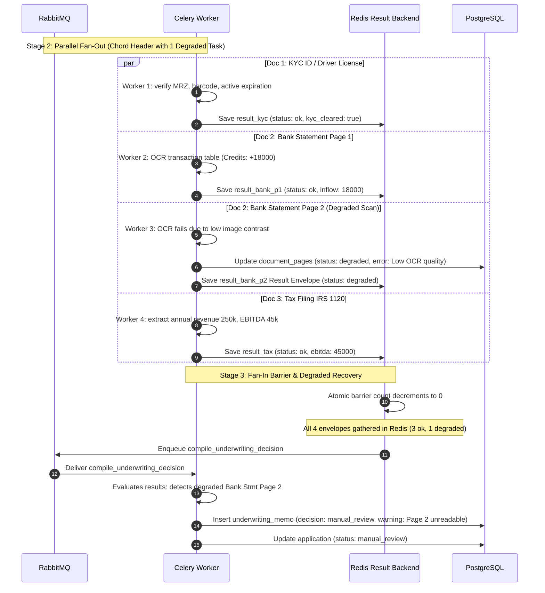
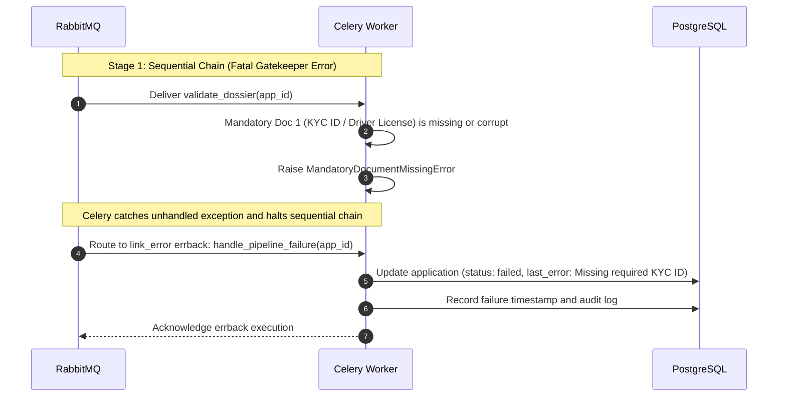

# 02: Workflows

Build a document pipeline using `chain`, `group`, and `chord`.

## Deliverables

- Sequential validation and transformation tasks using `chain` and explicit signature discipline (`.s()` vs `.si()`).
- Parallel processing (fan-out) with aggregation (fan-in) using `group` and `chord`.
- A defined policy for partial failure and callback failure (e.g., `link_error` errbacks and result envelopes to avoid hung chords).
- A dedicated result backend (e.g., Redis) configured for chord synchronization with sensible `result_expires` TTL.
- Tests proving task ordering, fan-out, fan-in, and error behavior.
- JSON-safe task boundaries with no live database or request objects.

## Evidence

Include a workflow diagram and timing comparison between sequential and parallel execution.

## Project Definition: Financial Document & KYC Underwriting Pipeline

Build an asynchronous credit underwriting and compliance intelligence pipeline modeled after commercial lending and corporate spend platforms (e.g., Brex, Ramp, Blend). When an applicant company applies for a commercial credit facility, they submit a multi-document financial dossier containing:
1. **Executive Identity Verification (KYC)**: Passport/Driver's License image.
2. **Corporate Bank Statements**: Multi-page PDF statements detailing operational cash flows.
3. **Tax & Financial Filings**: Annual corporate returns / P&L statements.

Evaluating these documents sequentially creates multi-minute wait times and high customer drop-off. This service ingests the dossier, sequentially validates and unpacks the files, fans out isolated page extraction and fraud checks concurrently across Celery workers, and synchronizes via a fan-in barrier (`chord`) to compile an executive underwriting risk memo.

The central rule is:

> Multi-page financial dossiers must be validated sequentially, fanned out across parallel workers for isolated page/component extraction, and synchronized via a fan-in barrier without passing binary files or database sessions across the message broker.

## Architecture



### Responsibilities

| Component | Responsibility |
| --- | --- |
| **FastAPI** | Validates incoming application requests, stores uploaded raw documents in shared storage, persists the initial application record in PostgreSQL, initiates the Celery Canvas workflow, and returns `202 Accepted` with an application ID. |
| **PostgreSQL** | Stores applications, document metadata, page components, extraction line items, and the final underwriting decision memo. Never stores raw file blobs. |
| **Shared Storage** | Local volume or filesystem mount storing raw PDF/image files and extracted text/redacted artifacts. Celery tasks pass only storage paths and UUIDs. |
| **RabbitMQ** | High-performance message broker delivering Celery task messages and routing workflow queues. |
| **Redis** | Dedicated Celery `result_backend` responsible for atomic countdown barriers in `chord` fan-in, temporary task state storage, and result collection with automatic TTL expiration. |
| **Celery Workers** | Execute the Canvas stages: sequential validation (`chain`), concurrent page/component analysis (`group`), and final metric synthesis (`chord` callback). |

### Task Descriptions & Workflow Stages

| Task Name | Canvas Stage | Signature | Detailed Responsibility |
| --- | --- | --- | --- |
| **`workflow.validate_dossier`** | Sequential Chain (Gatekeeper) | `validate_dossier.s(application_id)` | **Lightweight Manifest & File Check:**<br/>1. Verifies physical file existence on shared storage and checks SHA-256 integrity hashes.<br/>2. Inspects magic bytes (PNG/JPEG for KYC, `%PDF-1.x` for Bank Statement & Tax Filing).<br/>3. Verifies non-encryption (PDFs are not password-locked).<br/>4. Asserts presence of mandatory files (KYC + Bank Statement).<br/>5. Updates DB application status to `validating`. |
| **`workflow.extract_and_partition_pages`** | Sequential Chain (Preparation) | `extract_and_partition_pages.s(validation_result)` | **Document Unpacking & Signature Generation:**<br/>1. Splits multi-page Bank Statement PDF into individual single-page files (`page_1.pdf`, `page_2.pdf`).<br/>2. Registers each page/component row in `document_pages` with status `pending`.<br/>3. Dynamically constructs the Celery `chord` header: creates a `process_document_page.s(page_id)` task for each page across all document types.<br/>4. Returns the chord signature to be executed. |
| **`workflow.process_document_page`** | Chord Header (Parallel Fan-Out) | `process_document_page.s(page_id)` | **Heavy Concurrent Analysis (Specialized by Document Type):**<br/>• **Doc 1 (KYC ID / License):** Extracts MRZ / PDF417 barcode, verifies expiration date > today, checks applicant age $\ge 18$, and verifies name match.<br/>• **Doc 2 (Bank Statement Pages):** Performs OCR on transaction tables, classifies inflow credits vs outflow debits, calculates net page balance change.<br/>• **Doc 3 (Tax Filing Schedules):** Extracts annual revenue, EBITDA, and debt liabilities.<br/>• **Common:** Runs regex PII masking and wraps output in a Result Envelope (`status: 'ok' \| 'degraded'`). |
| **`workflow.compile_underwriting_decision`** | Chord Callback (Fan-In Barrier) | `compile_underwriting_decision.s(page_results, application_id)` | **Multi-Document Synthesis & Underwriting Memo:**<br/>1. Awaits atomic Redis countdown barrier completion across all parallel page tasks.<br/>2. Validates that Executive KYC passed cleanly.<br/>3. Sums total credits/debits across bank statement pages to calculate Average Monthly Balance (AMB) and Net Cashflow.<br/>4. Reconciles Debt Service Coverage Ratio (DSCR) against Tax Return revenue.<br/>5. Inspects for degraded envelopes: if non-critical page degraded $\to$ flags `manual_review`; if clean & risk score $\ge 70 \to$ flags `approved`.<br/>6. Inserts `underwriting_memos` record and updates application to final terminal status. |
| **`workflow.handle_pipeline_failure`** | Error Errback (`link_error`) | `handle_pipeline_failure.si(application_id)` | **Compensating Action & Failure Recovery:**<br/>1. Attached via `.on_error()` on the canvas workflow.<br/>2. If `validate_dossier` or `extract_and_partition_pages` raises an unhandled exception (e.g. missing mandatory KYC or corrupt PDF), Celery routes execution here.<br/>3. Updates `applications` status to `failed`, logs root cause exception in `last_error`, and unblocks caller without orphaned worker jobs. |

### Architectural Decision: Single Gatekeeper Task vs. Parallel Validation

> [!NOTE]
> **Why is `validate_dossier` a single sequential task instead of 3 parallel tasks?**
>
> 1. **Task Granularity & Broker Overhead:**
>    In distributed task systems, publishing a task message to RabbitMQ carries non-zero latency (~5–10 ms for message serialization, network hops, queue acknowledgment, and worker process context switching). Checking file headers and magic bytes takes **< 5 milliseconds total** for all 3 files. Fanning out 3 separate Celery tasks for microsecond checks would spend $90\%$ of the time on broker communication rather than useful CPU work.
>
> 2. **Atomic Manifest Consistency (The Multi-Document Rule):**
>    Underwriting rules require an atomic question: *"Does this application contain BOTH a valid KYC ID AND a Bank Statement?"* A single gatekeeper inspects the combined manifest as a single atomic unit. If validation were split across 3 parallel tasks, Celery would require an extra intermediate `chord` barrier just to assemble the validation verdict before beginning the actual extraction.
>
> 3. **Where Concurrency Yields True ROI:**
>    Concurrency is intentionally reserved for the **heavy, high-latency stage** (`process_document_page`): OCR table extraction, image decoding, regex PII masking, and checksum verification. This is where parallelizing across workers reduces wall-clock execution from 45 seconds down to 6 seconds.

### Project Structure

```text
02_workflows/
├── README.md                   # Project definition, architecture, workflows, and deliverables
├── .env.example                # Environment variables (Postgres, RabbitMQ, Redis)
├── .gitignore                  # Git ignore rules for virtualenv, temporary files, and uploads
├── Dockerfile.api              # FastAPI container definition
├── Dockerfile.worker           # Celery worker container definition
├── Dockerfile.postgres         # Custom PostgreSQL image with initial schemas
├── docker-compose.yml          # Multi-container orchestration (API, Worker, Postgres, RabbitMQ, Redis)
├── init.sql                    # Database DDL (applications, documents, pages, underwriting_memos)
├── pytest.ini                  # Pytest configuration
├── requirements.txt            # Core runtime dependencies (FastAPI, Celery, Redis, SQLAlchemy, Psycopg)
├── requirements-api.txt        # API-specific dependencies
├── requirements_dev.txt        # Development & test dependencies
├── app/                        # FastAPI Ingestion & Query Service
│   ├── __init__.py
│   ├── config.py               # Pydantic environment settings
│   ├── db.py                   # Async database engine & sessionmaker
│   ├── logging_config.py       # JSON structured logging
│   ├── main.py                 # Application factory & lifespan
│   ├── models.py               # SQLAlchemy ORM models
│   ├── routes.py               # API endpoints (/applications, /dossier, /timing)
│   ├── schemas.py              # Pydantic request & response models
│   └── tasks.py                # Celery client dispatching canvas workflows
├── services/
│   └── worker/                 # Celery Worker Service
│       ├── Dockerfile          # Worker image
│       ├── celery_app.py       # Celery configuration (RabbitMQ broker + Redis result_backend)
│       ├── tasks.py            # Canvas tasks (validate_dossier, extract_and_partition, process_page, etc.)
│       └── processors/         # Document domain processors
│           ├── __init__.py
│           ├── kyc_processor.py         # MRZ & identity verification
│           ├── statement_processor.py   # Bank statement transaction ledger parsing
│           └── tax_processor.py         # IRS Form 1120 / P&L parser
├── scripts/
│   ├── generate_fixtures.py    # Generates synthetic test PDF/JPG dossiers
│   └── benchmark.py            # Automated sequential vs parallel timing harness
├── requests/
│   └── requests.rest           # REST Client requests for manual API inspection
└── tests/
    ├── __init__.py
    ├── conftest.py             # Test fixtures & database containers
    ├── test_api.py             # API endpoint tests
    ├── test_canvas_workflows.py # Tests for chain, group, chord, link_error
    ├── test_partial_failure.py # Tests for degraded Result Envelope
    └── fixtures/               # Test datasets & assets
        ├── assets/
        │   └── kyc_specimen_jane_doe.jpg # High-resolution photographic specimen template
        ├── clean_4pages/       # Happy path: KYC ID + 4-page Bank Statement + Tax Filing
        ├── benchmark_16pages/  # Concurrency benchmark: 16-page Bank Statement
        ├── degraded_page2/     # Partial failure: Statement with unreadable Page 2
        └── corrupted/          # Fatal error: Corrupted binary to test link_error
```

---

## Mapping to Deliverables

| Deliverable | Implementation in Pipeline |
| --- | --- |
| **Sequential Tasks (`chain`)** | `validate_dossier` $\to$ `extract_and_partition_pages`. The splitter task requires the validated metadata and checksums of the first task before it can safely partition pages. |
| **Signature Discipline (`.s()` vs `.si()`)** | Mutable `.s()` is used when the extracted page list flows from `extract_and_partition_pages` into the chord header. Immutable `.si()` is used for independent notifications or `link_error` cleanup callbacks that do not accept injected prior results. |
| **Parallel Fan-out (`group`)** | Multi-page bank statements and KYC documents are split into discrete page items. Each page is dispatched as an independent task in a `group`, allowing multiple workers to perform OCR simulation, PII masking, and cashflow extraction concurrently. |
| **Fan-in Aggregation (`chord`)** | The `chord` header tracks all page tasks. Once the last page completes, Celery atomically invokes `compile_underwriting_decision`, passing the aggregated array of page results into the callback. |
| **Partial Failure Policy** | Individual page tasks use **Result Envelopes** (`{"page_id": ..., "status": "ok"|"degraded", "metrics": ...}`). If a supplementary statement page fails OCR, the envelope records a warning and the chord completes with `manual_review` status instead of deadlocking. |
| **Callback & Workflow Error Policy** | Unrecoverable exceptions (e.g., corrupt PDF, storage IO failure) trigger an attached `link_error` errback (`handle_pipeline_failure.si(application_id)`), transitioning the application status to `failed` and unlocking resources. |
| **Dedicated Result Backend (Redis)** | Redis is configured as `result_backend` for chord state management, with `result_expires = 3600` to prevent memory leaks from completed or orphaned chord headers. |
| **JSON-Safe Boundaries** | Task arguments and return values contain strictly JSON-serializable primitives: UUID strings, integers, floats, and storage relative paths. No database ORM models or file streams cross broker boundaries. |
| **Timing Evidence** | A benchmark harness compares pure sequential execution vs. parallel chord execution across varying worker pool concurrency ($C=1, 2, 4, 8$). |

---

## Services & Tasks

### 1. Ingestion API (FastAPI)

Endpoints:
```text
POST /applications
GET  /applications/{application_id}
GET  /applications/{application_id}/dossier
GET  /applications/{application_id}/timing
```

Responsibilities:
- Validate `Idempotency-Key` header, applicant metadata, and uploaded document types (PDF/PNG).
- Save uploaded files to the shared storage volume under `uploads/{application_id}/`.
- Create a local record in `applications` with initial status `pending`.
- Dispatch the Celery workflow: `build_underwriting_workflow(application_id).apply_async()`.
- Return `202 Accepted` with the application ID and tracking URLs.

### 2. Celery Worker Tasks

| Task Name | Stage | Input Signature | Output Envelope |
| --- | --- | --- | --- |
| `workflow.validate_dossier` | Chain (Step 1) | `application_id: str` | `{"application_id": str, "documents": list[dict], "valid": bool}` |
| `workflow.extract_and_partition_pages` | Chain (Step 2) | `validation_result: dict` | `{"application_id": str, "page_ids": list[str]}` |
| `workflow.process_document_page` | Chord Header (Fan-Out) | `page_id: str` | `{"page_id": str, "status": "ok"\|"degraded", "cashflow_inflow": int, "cashflow_outflow": int, "pii_redacted": int, "error": str\|None}` |
| `workflow.compile_underwriting_decision` | Chord Callback (Fan-In) | `page_results: list[dict], application_id: str` | `{"application_id": str, "decision": str, "dscr": float, "amb": int, "risk_score": int, "status": str}` |
| `workflow.handle_pipeline_failure` | Error Errback (`link_error`) | `application_id: str` (via `.si()`) | `{"application_id": str, "status": "failed", "error": str}` |

---

## Data Models



### Applications Table
```text
applications
------------
id                  UUID primary key
company_name        VARCHAR not null
requested_amount    BIGINT not null
currency            CHAR(3) not null default 'USD'
status              VARCHAR not null default 'pending'
decision            VARCHAR nullable
risk_score          INTEGER nullable
created_at          TIMESTAMP not null default now()
updated_at          TIMESTAMP not null default now()
```

### Documents Table
```text
documents
---------
id                  UUID primary key
application_id      UUID foreign key -> applications.id
document_type       VARCHAR not null  -- 'bank_statement', 'tax_return', 'kyc_id'
file_path           VARCHAR not null
file_hash           VARCHAR not null
page_count          INTEGER not null default 0
status              VARCHAR not null default 'pending'
created_at          TIMESTAMP not null default now()
```

### Document Pages Table
```text
document_pages
--------------
id                  UUID primary key
document_id         UUID foreign key -> documents.id
page_number         INTEGER not null
file_path           VARCHAR not null
status              VARCHAR not null default 'pending' -- 'pending', 'processed', 'degraded', 'failed'
inflow_minor_units  BIGINT not null default 0
outflow_minor_units BIGINT not null default 0
pii_detected_count  INTEGER not null default 0
error_message       TEXT nullable
processed_at        TIMESTAMP nullable
```

### Underwriting Memos Table
```text
underwriting_memos
------------------
id                  UUID primary key
application_id      UUID unique foreign key -> applications.id
total_inflow        BIGINT not null
total_outflow       BIGINT not null
net_cash_flow       BIGINT not null
avg_monthly_balance BIGINT not null
dscr_ratio          NUMERIC(5,2) not null
recommendation      VARCHAR not null  -- 'approved', 'manual_review', 'rejected'
degraded_pages_count INTEGER not null default 0
summary_notes       TEXT not null
generated_at        TIMESTAMP not null default now()
```

### State Machine



---

## Failure Policy & Edge Cases

### 1. Partial Failure in Header (Degraded Mode)
* **Problem:** If a Celery task in a chord header raises an unhandled exception, Celery marks that task `FAILURE` and discards the chord callback. The entire workflow stays permanently incomplete.
* **Policy:** Page tasks must catch non-fatal processing errors (e.g. low OCR confidence, non-standard layout, partial scan tear) and return a **Result Envelope**:
  ```python
  return {
      "page_id": page_id,
      "status": "degraded",
      "cashflow_inflow": 0,
      "cashflow_outflow": 0,
      "pii_redacted": 0,
      "error": "OCR low confidence (< 60%)"
  }
  ```
* The Redis chord barrier decrements normally. When `compile_underwriting_decision` runs, it inspects all envelopes: if any page is `degraded`, it records an audit flag and downgrades the application recommendation to `manual_review`.

### 2. Fatal Pipeline Failure (`link_error` Errback)
* **Problem:** If a file is completely corrupted, missing from storage, or a worker suffers an Out-Of-Memory kill during validation/partitioning, the application should not hang in `validating` forever.
* **Policy:** Attach `handle_pipeline_failure.si(application_id)` as `link_error` on the canvas signatures:
  ```python
  workflow = (
      chain(
          validate_dossier.s(application_id),
          extract_and_partition_pages.s(),
          build_chord_barrier.s()
      )
  ).on_error(handle_pipeline_failure.si(application_id))
  ```
* The errback runs with an immutable signature (`.si()`), updates PostgreSQL status to `failed`, records the error traceback in `applications.last_error`, and emits an alert.

### 3. Redis Result Expiration (TTL)
* `result_expires = 3600` is enforced on the Celery configuration.
* Intermediate task results in Redis expire after 1 hour, preventing memory leakage while ensuring sufficient time for long chords to complete.

---

## Sequence Diagrams

### Use Case 1: Normal Processing (Sequential Chain $\to$ Parallel Fan-Out Chord $\to$ Fan-In Callback)



### Use Case 2: Partial Failure (Degraded Page Recovery)



### Use Case 3: Fatal Error & `link_error` Compensation



---

## Benchmarking & Concurrency Evidence

To satisfy the **Evidence** deliverable, the repository includes an automated timing harness comparing:
1. **Pure Sequential Execution**: Running all pre-processing and page tasks sequentially in a single `chain`.
2. **Parallel Chord Execution**: Running page extraction across a concurrent Celery worker pool ($C=4$ or $C=8$).

### Theoretical Speedup
For a dossier with $P$ pages where average page processing time is $t_{\text{page}}$, validation is $t_{\text{val}}$, and aggregation is $t_{\text{agg}}$:
$$\text{Latency}_{\text{sequential}} = t_{\text{val}} + \sum_{i=1}^P t_{\text{page}_i} + t_{\text{agg}}$$
$$\text{Latency}_{\text{parallel}} \approx t_{\text{val}} + \left\lceil \frac{P}{C} \right\rceil \cdot t_{\text{page}} + t_{\text{chord\_barrier}} + t_{\text{agg}}$$

### Benchmark Output Format
The harness records execution logs and produces:
* A markdown timing table comparing wall-clock duration across 4, 8, and 16-page dossiers.
* Speedup ratio calculation ($\text{Speedup} = T_{\text{seq}} / T_{\text{par}}$).
* Worker pool utilization and Redis barrier overhead measurements.

---

## Completion Checklist

- [ ] FastAPI creates applications, stores files in shared storage, and returns `202 Accepted`.
- [ ] Celery messages pass only JSON-safe UUIDs and storage keys; no raw files or ORM models.
- [ ] Sequential pre-processing (`chain`) correctly enforces task ordering (`validate` $\to$ `partition`).
- [ ] Task argument isolation is maintained using `.s()` for piped inputs and `.si()` for fixed calls.
- [ ] Parallel fan-out (`group`) processes pages concurrently across multiple worker processes.
- [ ] Redis result backend coordinates the fan-in barrier (`chord`) and triggers the decision callback.
- [ ] Result envelope pattern allows graceful partial degradation when non-critical pages fail.
- [ ] `link_error` errback reliably captures fatal exceptions, updates DB status, and prevents zombie tasks.
- [ ] Unit and integration tests verify ordering, fan-out, barrier synchronization, and error handling.
- [ ] Benchmark test generates timing comparison demonstrating parallel vs. sequential speedup.
- [ ] Docker Compose stack runs FastAPI, PostgreSQL, RabbitMQ, Redis, and Celery Workers with health checks.
