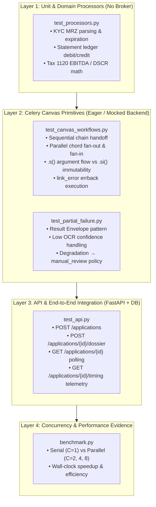

# Module 02: Financial Document & KYC Underwriting Pipeline — Test Plan

This document establishes the test architecture, test cases, invariants, and Test-Driven Development (TDD) matrix for **Module 02: Advanced Celery Workflows** (`chain`, `group`, `chord`, `.s()` vs `.si()`, `link_error`, and Result Envelopes).

---

## 1. Test Architecture & Pytest Hierarchy

---

## 2. Test Matrix & Detailed Scenarios

| Test ID | Test Function / File | Fixture Input | Invariants & Assertions | Expected Outcome |
| :--- | :--- | :--- | :--- | :--- |
| **TC-01: Happy Path Canvas** | `test_canvas_workflows.py::test_happy_path_workflow` | `tests/fixtures/clean_4pages/` | 1. `validate_dossier` registers 3 documents and partitions 4 statement pages in DB. 2. Dispatches `chord` with 6 tasks in parallel header (1 KYC, 1 Tax, 4 Bank Statement pages). 3. All 6 tasks return `ResultEnvelope` with `status="success"`. 4. `aggregate_underwriting_decision` callback receives 6 results, computes DSCR $\ge 1.25$, matches applicant identity, and writes `underwriting_memos` record. | Application `status == "approved"`, Decision `decision == "approved"` |
| **TC-02: Partial Failure (Result Envelope)** | `test_partial_failure.py::test_degraded_statement_page` | `tests/fixtures/degraded_page2/` | 1. Page 2 OCR confidence falls below threshold ($0.32 < 0.70$). 2. Task returns envelope `{"status": "degraded", "confidence": 0.32, ...}` without raising an exception. 3. Chord synchronization barrier resolves cleanly in Redis. 4. Callback detects degraded envelope, flags audit warnings, and routes to underwriter review. | Application `status == "manual_review"` |
| **TC-03: Fatal Error & Compensating Callback** | `test_canvas_workflows.py::test_corrupted_dossier_link_error` | `tests/fixtures/corrupted/` | 1. `validate_dossier` detects malformed PDF bytes and raises `CorruptedDocumentError`. 2. Canvas halts immediately; chord header is **never** dispatched (prevents orphan tasks). 3. `link_error` callback (`handle_workflow_failure.s`) triggers. 4. Application status is set to `failed` and error traceback is stored in DB. | Application `status == "failed"`, `error_message` populated |
| **TC-04: KYC Identity Mismatch (Anti-Fraud)** | `test_partial_failure.py::test_kyc_name_mismatch` | Manifest: `"Mark Davis"` ID: `"Jane Doe"` | 1. KYC processor extracts `"Jane Doe"` from specimen ID card. 2. Cross-checks against applicant name `"Mark Davis"` in application manifest. 3. Returns `ResultEnvelope(status="failed", errors=["KYC name 'Jane Doe' does not match applicant 'Mark Davis'"])`. 4. Callback halts approval and sets application to `declined`. | Application `status == "declined"` |
| **TC-05: Signature Discipline (`.s()` vs `.si()`)** | `test_canvas_workflows.py::test_signature_discipline` | Synthetic tasks | 1. Mutable signature `.s()` automatically injects upstream task results into the callback. 2. Immutable signature `.si()` (e.g. audit logging, status notifications) ignores upstream return values and executes without argument mismatch (`TypeError`). | PASS |
| **TC-06: Domain Processor Math & Parsing** | `test_processors.py` | Fixture files | 1. `StatementProcessor` parses ledger credits/debits and computes correct net monthly cashflow ($+\$32,549.50$). 2. `TaxProcessor` parses IRS 1120 gross revenue, COGS, EBITDA, and computes baseline DSCR ($3.25\times$). 3. `KYCProcessor` extracts name, document number, DOB, and expiration date. | Mathematical & parsed parity |
| **TC-07: Ingestion API Lifecycle** | `test_api.py` | REST requests | 1. `POST /api/v1/applications` returns `201 Created` with UUID. 2. `POST /api/v1/applications/{id}/dossier` launches async workflow. 3. `GET /api/v1/applications/{id}` returns application state, document counts, and memo. 4. `GET /api/v1/applications/{id}/timing` returns stage-by-stage latency telemetry. | All endpoints return HTTP 200/201 with valid schemas |

---

## 3. TDD Execution Sequence

1. **Red Phase (Tests Written & Failing):**
   - Write `tests/conftest.py`, `tests/test_processors.py`, `tests/test_canvas_workflows.py`, `tests/test_partial_failure.py`, and `tests/test_api.py`.
   - Run `pytest 02_workflows/tests/ -v`. Tests fail cleanly because the application and tasks are not yet implemented.
2. **Green Phase (Implementation):**
   - Implement `init.sql` (Postgres schema).
   - Implement `app/models.py`, `app/schemas.py`, `app/db.py`, `app/config.py`.
   - Implement `services/worker/celery_app.py`, `services/worker/processors/`, and `services/worker/tasks.py`.
   - Implement `app/routes.py`, `app/main.py`.
   - Re-run `pytest 02_workflows/tests/ -v` until all test cases pass.
3. **Refactor & Evidence Phase:**
   - Execute `scripts/benchmark.py` to produce serial vs. parallel speedup tables.
   - Run multi-container integration via `docker-compose.yml`.

