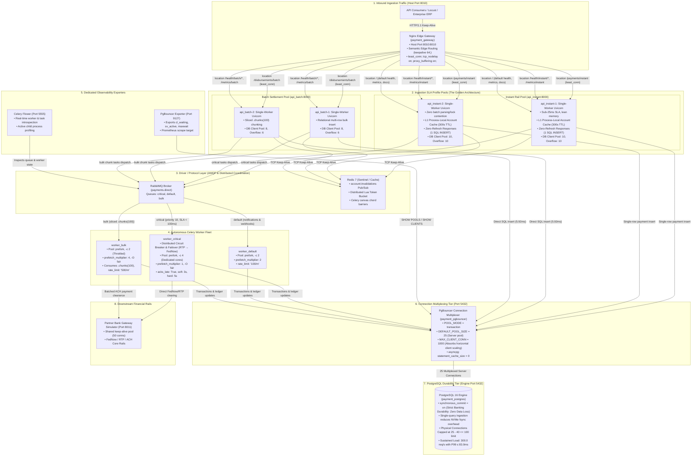
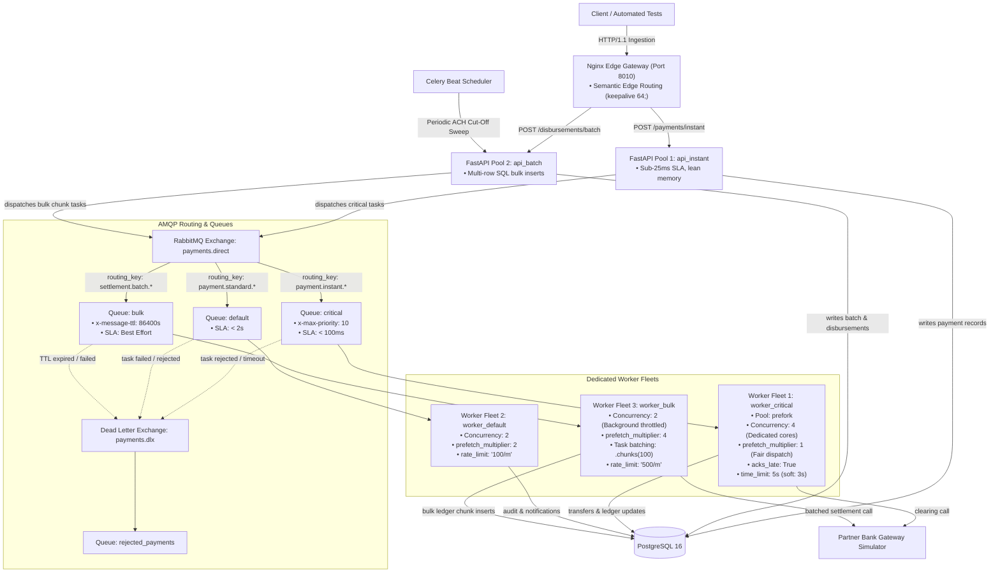

# 03: Routing and Capacity

Build a job service with `critical`, `default`, and `bulk` queues.

## Deliverables

- Explicit task routing and queue declarations.
- Workers with documented pool, concurrency, prefetch, and rate-limit settings.
- Task batching using `chunks` to control prefetch buffer consumption and broker message volume for the `bulk` queue.
- Load tests showing queue latency and throughput under contention.
- Time limits and graceful handling of rejected or expired work.

## Evidence

Publish a capacity note with workload assumptions, measurements, and the reason for each worker setting.

---

## Project Definition: Multi-Rail Payment Orchestrator & Batch Settlement Engine

Build a high-throughput, multi-rail financial payment operations platform modeled after modern treasury and payment infrastructure providers (e.g., **Modern Treasury**, **Stripe Connect Payouts**, **Adyen**).

The platform coordinates payment orders across heterogeneous financial rails with fundamentally conflicting SLA profiles:
1. **Real-Time Rails (FedNow / RTP / Visa Direct)**: User-in-the-loop, sub-second instant payouts requiring immediate authorization and payment dispatch with an SLA of **$P_{99} < 100\text{ ms}$**.
2. **Standard API Rails (Card Capture / Merchant Webhooks / Receipts)**: Standard operational events and customer notifications with expected latency of **$< 2\text{ s}$**.
3. **Batch Clearing Rails (ACH / NACHA / Bulk Payroll)**: High-volume enterprise disbursement files containing 10,000–50,000 payment instructions per run, requiring controlled throughput and database/partner-bank rate-limit compliance.

### The Problem: Contention & Noisy Neighbors
Without physical capacity isolation and prefetch tuning, submitting a 50,000-line payroll batch floods RabbitMQ and saturates worker prefetch buffers. Instant payment tasks get stuck in line behind tens of thousands of slow ACH instructions, blowing their sub-second SLA and causing client timeout cancellations.

### The Architectural Invariant
> High-volume batch settlement tasks must be partitioned via `.chunks()` and isolated to throttled worker pools, guaranteeing that sub-second instant payment orders on dedicated `critical` capacity suffer zero latency degradation under maximum cluster contention.

---

## 1. End-to-End System Architecture & Ingestion Topology



### The Golden Architecture: Ingestion SLA Container Pools & Semantic Edge Routing
To guarantee that real-time payment ingestion ($P_{99} < 100\text{ ms}$) is physically insulated from bulk corporate payroll uploads, the ingestion layer is decoupled into specialized container pools fronted by an **Nginx Edge Gateway**:
- **Nginx Edge Gateway (`payment_gateway`, Port 8010)**: Evaluates the HTTP request path at wire speed and performs **Semantic Edge Routing** to dedicated upstream pools using persistent keep-alive connections (`least_conn; keepalive 64;`).
- **Real-Time Ingestion Pool (`api_instant`, Port 8000)**: Serves FedNow / RTP instant payouts. Lightweight memory footprint, single-row inserts, zero batch JSON parsing, and sub-25ms P99 ingestion latency.
- **Bulk Disbursement Ingestion Pool (`api_batch`, Port 8000)**: Serves multi-thousand corporate payroll files. Absorbs multi-row relational SQL inserts and `.chunks(100)` slicing without interfering with real-time API event loops.
- **Dual-Layer Observability Architecture**:
  - *Whitebox Monitoring (Port 8000)*: Internal Prometheus and APM agents scrape each container directly on `http://<container_ip>:8000/metrics` without passing through Nginx, preventing time-series metric corruption.
  - *Blackbox Synthetic Monitoring (Port 8010 via Nginx)*: External monitors and status pages query `https://gateway:8010/health/instant` and `https://gateway:8010/health/batch` to detect rail-specific outages independently.

---

## 2. AMQP Routing & Queue Topology



---

## 3. Worker Fleet Sizing & Capacity Settings

| Dimension | `worker_critical` | `worker_default` | `worker_bulk` | Architectural Justification |
| :--- | :--- | :--- | :--- | :--- |
| **Target Queue** | `critical` | `default` | `bulk` | Physical OS process isolation prevents head-of-line blocking. |
| **Worker Name** | `worker_critical@%h` | `worker_default@%h` | `worker_bulk@%h` | Explicit naming enables targeted inspection and metric collection via Flower. |
| **Worker Pool** | `prefork` | `prefork` | `prefork` | Independent OS processes insulate against memory leaks and CPU-bound crypto/JSON parsing. |
| **Concurrency (`-c`)**| **4** | **2** | **2** | Reserves 50% of node cores strictly for real-time transactions; throttles bulk processing to 25%. |
| **Prefetch Multiplier**| **`1`** | **`2`** | **`4`** | `1` on critical prevents task hoarding and minimizes latency jitter. `4` on bulk keeps the execution pipeline saturated. |
| **`acks_late`** | `True` | `True` | `True` | Unacknowledged messages return to RabbitMQ if a worker crashes before completion. |
| **Rate Limit** | None (Unbounded) | `100/m` | `500/m` | Protects downstream partner bank APIs from being overwhelmed during batch sweeps. |
| **Soft Time Limit** | `3s` (`SoftTimeLimitExceeded`) | `20s` | `240s` | Raises a catchable Python exception, allowing in-flight transaction cleanup before SIGKILL. |
| **Hard Time Limit** | `5s` (`SIGKILL`) | `30s` | `300s` | Hard OS kernel termination preventing unrecoverable thread deadlocks. |

> [!NOTE]
> **Two-Tier Rate Limiting Model**:
> - **Inbound (Ingress)**: Managed by [`/app/middlewares/rate_limit.py`](/app/middlewares/rate_limit.py) (600 req/min per IP) to shield our FastAPI gateway from DoS and polling abuse (hard drops with HTTP 429).
> - **Outbound (Egress)**: Managed by Celery task `rate_limit` (`500/m` on bulk, `100/m` on default) to throttle worker calls to partner banking APIs (smooth pacing via token-bucket, tasks wait in RabbitMQ without dropping). See [/docs/ARCHITECTURE_AND_STANDARDS.md](/docs/ARCHITECTURE_AND_STANDARDS.md#rate-limiting-architecture-inbound-api-vs-outbound-worker-separation) for the deep architectural comparison.

---

## 4. Task Inventory & Routing Rules

```python
# # Task Routing Configuration (celery_app.py)
task_routes = {
    # 1. Real-Time Critical Tasks (Domain: payouts)
    "services.worker.tasks.payouts.process_instant_payout": {
        "queue": "critical",
        "routing_key": "payment.instant.payout",
    },
    # 2. Standard Operational Tasks (Domain: notifications)
    "services.worker.tasks.notifications.send_payment_receipt": {
        "queue": "default",
        "routing_key": "payment.standard.receipt",
    },
    "services.worker.tasks.notifications.dispatch_merchant_webhook": {
        "queue": "default",
        "routing_key": "payment.standard.webhook",
    },
    # 3. High-Volume Batch Tasks (Domain: settlements)
    "services.worker.tasks.settlements.process_payroll_chunk": {
        "queue": "bulk",
        "routing_key": "settlement.batch.payroll",
    },
}
```

> [!TIP]
> **Tiered Hybrid Queue Topology & Routing Invariant**:
> Rather than creating dozens of physical queues (causing idle worker bloat), tasks start coalesced by SLA tier (`critical`, `default`, `bulk`). However, every task is assigned a **fine-grained routing key** (`payment.standard.receipt` vs `payment.standard.webhook`) from Day 1. If merchant webhooks become slow or unreliable, they can be evicted to a dedicated queue via pure infrastructure configuration with **zero changes to application code**. See [/docs/ARCHITECTURE_AND_STANDARDS.md](/docs/ARCHITECTURE_AND_STANDARDS.md#architectural-decision-record-adr-tiered-hybrid-queue-topology-vs-per-task-queue-explosion) for the formal ADR.

### The `bulk` Queue Batching Rule (`chunks`)
When executing bulk payroll disbursements or NACHA batch generation:
* **Anti-Pattern**: Publishing 50,000 separate Celery task messages creates 50,000 AMQP round-trips, flooding RabbitMQ memory and consumer acknowledgment queues.
* **Production Pattern**: Use Celery canvas `.chunks(items, 100)`:
  ```python
  # 50,000 payments -> 500 chunk messages of 100 items each
  chunk_signatures = process_payroll_chunk.chunks(
      [(payment_id,) for payment_id in bulk_payment_ids],
      100
  )
  chunk_signatures.apply_async(queue="bulk")
  ```
  This reduces message serialization overhead by $99\%$, optimizes prefetch buffer consumption, and allows bulk SQL inserts inside each worker process.

---

## 5. Project Structure

```text
03_routing_and_capacity/
├── README.md                      # Executive Hub: Overview, System Diagram, Quickstart
├── docker-compose.yml             # Multi-container orchestration (Gateway, 2 API Pools, PgBouncer, 3 Workers, Bank Sim, Exporters, Flower, Postgres, RMQ, Redis)
├── nginx.conf                     # Nginx Edge Gateway configuration (Semantic Edge Routing, keepalive 64;)
├── Dockerfile.api                 # Ingestion Gateway container definition (api_instant & api_batch)
├── Dockerfile.postgres            # PostgreSQL container with init.sql entrypoint
├── init.sql                       # DDL for accounts, payments, batch_settlements, and disbursements (partial & deduplicated indexes)
├── pytest.ini                     # Pytest configuration and asyncio mode
├── .coveragerc                    # Statement coverage configuration (100% target)
├── .env.example                   # Environment configuration specimen
├── requirements_api.txt           # Ingestion API runtime dependencies (FastAPI, SQLAlchemy, asyncpg, celery)
├── requirements_dev.txt           # Testing & benchmark tools (pytest, testcontainers, httpx, locust)
├── .github/
│   └── workflows/
│       └── capacity_gate.yml      # CI/CD Automated Contention & Capacity Regression Gate (150 req/s SLA verification)
├── .vscode/                       # Turn-key VS Code development & debugging
│   ├── launch.json                # Compound profiles ("FastAPI + Celery Worker") & individual services
│   └── settings.json              # Pytest auto-discovery & formatting
├── docs/                          # Detailed Architectural Specifications
│   ├── ARCHITECTURE_AND_STANDARDS.md # AMQP topology, Worker Fleet capacity, Prefetch math, Security, Dual-Layer Observability, PgBouncer, Proposals 1-5
│   ├── PRODUCTION_ARCHITECTURE_AND_OPTIMIZATION_REPORT.md # Multi-dimensional empirical capacity matrix & Proposals 1-5 evaluation
│   ├── USE_CASES.md               # Detailed narrative & Mermaid sequence diagrams (all 7 execution paths)
│   ├── TEST_PLAN.md               # 5-layer testing hierarchy, comprehensive test matrix, TDD roadmap
│   └── CAPACITY_NOTE.md           # Deliverable Evidence: Workload sizing, Little's Law, empirical results, Bisection search, PgBouncer, Proposals 1-5
├── app/                           # FastAPI Ingestion Engine (Powers api_instant & api_batch)
│   ├── __init__.py
│   ├── cache.py                   # L1+L2 Hybrid Cache Manager with Redis Pub/Sub invalidations (account:invalidations)
│   ├── circuit_breaker.py         # Distributed Circuit Breaker & partner rail failover (RTP -> FedNow)
│   ├── config.py                  # Pydantic Settings (DB, RMQ, Redis, Bank API, Rate limits, SERVICE_NAME)
│   ├── db.py                      # Async SQLAlchemy engine & session factory (asyncpg statement_cache_size=0)
│   ├── dependencies.py            # FastAPI route dependencies (get_db, security, dispatcher)
│   ├── logging_config.py          # Process-wide pretty & JSON structured logging with ContextVar filter
│   ├── middlewares/               # Modular 5-layer HTTP middleware package
│   │   ├── __init__.py            # Unified register_middlewares(app) LIFO pipeline
│   │   ├── correlation.py         # Request ID & ContextVar lifecycle
│   │   ├── security.py            # Defensive headers (HSTS, CSP, X-Frame-Options)
│   │   ├── error_handling.py      # Unhandled exception normalization (JSON 500)
│   │   ├── rate_limit.py          # Distributed Redis Lua token bucket with in-memory fallback
│   │   └── profiling.py           # High-resolution latency timing & access logs
│   ├── main.py                    # Application factory, lifespan management & DB pre-warming
│   ├── models.py                  # Database models (accounts, payments, disbursements)
│   ├── routes.py                  # Endpoints with L1 memory cache, cache invalidation & zero-refresh responses
│   ├── schemas.py                 # Pydantic v2 schemas with monetary validation & specimen examples
│   └── dispatcher.py              # API Producer: payload prep & .chunks(100) slicing
├── services/
│   ├── bank_simulator_api/        # Standalone Partner Bank Gateway Simulator (Mock HTTP Service)
│   │   ├── Dockerfile             # Lean mock service container definition (~80MB)
│   │   ├── requirements.txt       # Minimal mock dependencies (FastAPI, Uvicorn only)
│   │   ├── __init__.py
│   │   ├── main.py                # Mock bank HTTP service (RTP instant clearing & ACH batch endpoints)
│   │   └── client.py              # Resilient HTTP client with circuit breaker hooks used by workers
│   └── worker/                    # Distributed Celery Worker Service (The Consumer)
│       ├── Dockerfile             # Headless Celery worker container definition
│       ├── requirements.txt       # Minimal worker dependencies (Celery, SQLAlchemy, asyncpg, httpx)
│       ├── __init__.py
│       ├── celery_app.py          # Celery configuration (queues, exchanges, rate-limits, routes)
│       └── tasks/                 # Domain-partitioned task modules
│           ├── __init__.py        # Task re-exports & registry
│           ├── payouts.py         # Real-time instant payouts with circuit breaker rail failover (RTP -> FedNow)
│           ├── settlements.py     # High-volume batch payroll chunk tasks (ACH/NACHA)
│           └── notifications.py   # Asynchronous receipts & merchant webhooks
├── scripts/
│   ├── seed_data.py               # Generates synthetic enterprise accounts and batch files
│   ├── load_test_contention.py    # Automated benchmark measuring critical SLA under bulk contention
│   ├── benchmark_ingestion_pools.py # Calibrated dual-layer benchmark harness (Paced vs. Burst with Little's Law)
│   ├── benchmark_chunks.py        # Empirical chunk sizing velocity across rate-limit policies
│   ├── test_nginx_least_conn.py   # Empirical audit of Nginx least-connections upstream balancing
│   ├── benchmark_capacity_matrix.py # Multi-dimensional replica scaling and connection pool headroom matrix
│   ├── benchmark_bisection_capacity.py # Automated 2-stage bisection capacity search with PgBouncer integration
│   ├── ci_contention_gate.py      # Automated headless CI/CD Contention & Capacity Regression Gate (150 req/s SLA verifier)
│   └── README.md                  # Comprehensive parameter and operational verification guide
├── requests/
│   └── requests.rest              # Interactive VS Code REST Client test workflows
└── tests/
    ├── __init__.py
    ├── conftest.py                # Hybrid Testcontainers fixtures (Postgres 16, RabbitMQ 3.13)
    ├── unit/                      # Pure in-memory unit tests
    │   ├── test_schemas.py        # Monetary Decimal & minor-unit conversion tests
    │   ├── test_dispatcher.py     # Producer task preparation & chunk slicing tests
    │   ├── test_cache.py          # L1+L2 cache manager & Redis Pub/Sub invalidation unit tests
    │   ├── test_circuit_breaker.py # Distributed circuit breaker state machine & failover tests
    │   ├── test_app_lifecycle_and_db.py # Engine warm-up & cache listener startup failure tests
    │   └── test_tasks.py          # Domain tasks, circuit breaker failover & rollback tests
    ├── integration/               # Database, API, and broker integration tests
    │   ├── test_api.py            # FastAPI endpoints, cache invalidation, health probes & idempotency
    │   ├── test_middlewares.py    # Redis Lua token bucket, correlation, security & rate limit tests
    │   ├── test_routing.py        # Kombu exchange bindings, routing keys & queue tests
    │   └── test_bank_simulator.py # Bank simulator latency, circuit breaker & fault injection tests
    ├── e2e/                       # Live multi-process distributed tests
    │   └── test_live_e2e.py       # Live AMQP dispatch, real worker daemons & DB persistence
    └── benchmarks/                # Load & capacity verification
        └── test_capacity_contention.py # 50,000 bulk tasks vs. instant payment SLA benchmark

(Root Tooling)
scripts/
├── verify_mermaid.py              # Automated pre-commit Mermaid syntax & render validation runner
└── verify_mermaid.mjs             # Node.js Mermaid syntax & parse validation engine
```

---

## 6. Detailed Documentation Suite

For comprehensive deep-dive specifications, refer to the documentation suite in `docs/`:

1. **[/docs/ARCHITECTURE_AND_STANDARDS.md](/docs/ARCHITECTURE_AND_STANDARDS.md)**:
   * Formal AMQP Exchange, Queue, and Dead-Letter Exchange (DLX) bindings.
   * Prefetch multiplier mathematical derivation and buffer sizing.
   * Minor-unit integer cents financial precision engine.
   * The Golden Architecture: Ingestion SLA Container Pools & Semantic Edge Routing.
   * PgBouncer connection multiplexing tier (`POOL_MODE=transaction`, `connect_args={"statement_cache_size": 0}`).
   * Multi-tier caching architecture (L1 process-local memory cache + L2 Redis Pub/Sub invalidations).
   * Ingestion optimization: pre-generated UUID responses & query minimization ($4 \to 1$).
   * Index deduplication and partial index architecture.
   * Dual-Layer Observability Architecture: Whitebox (direct port 8000) vs. Blackbox (Nginx port 8010).
   * Enterprise security standards (prefixed API keys, zero-knowledge broker, Nacha/PCI-DSS tokenization).
   * Advanced architectural proposals 1–5: Distributed Circuit Breaker, Lua Token Bucket, Exporters, and CI Contention Gate.
2. **[/docs/PRODUCTION_ARCHITECTURE_AND_OPTIMIZATION_REPORT.md](/docs/PRODUCTION_ARCHITECTURE_AND_OPTIMIZATION_REPORT.md)**:
   * Multi-dimensional empirical capacity matrix comparing the Unified Ingestion Fleet against The Golden Architecture under simultaneous payroll load.
   * Paced (Little's Law arrival rate) vs. Unconstrained Burst benchmark analysis.
   * Dual-layer latency analysis (client roundtrip vs. server `X-Response-Time-Ms`).
   * Proposals 1–5 empirical benchmark evaluation ($P_{99} = 56.66\text{ ms}$, 31.7% latency reduction under 700 bulk disbursements).
3. **[/docs/USE_CASES.md](/docs/USE_CASES.md)**:
   * **Use Case 1**: Sub-second Instant Payout (`critical` queue happy path via `api_instant`).
   * **Use Case 2**: Batch Payroll Disbursement with `.chunks(100)` (`bulk` queue via `api_batch`).
   * **Use Case 3**: Contention Benchmark: 50,000 bulk tasks running concurrently without degrading instant payment SLA.
   * **Use Case 4**: Soft/Hard Time Limit Exhaustion and DLQ rejection.
   * **Use Case 5**: Cluster-Wide Account Mutation with Instant L1 Cache Invalidation via Redis Pub/Sub.
   * **Use Case 6**: Partner Bank Rail Outage with Distributed Circuit Breaker & Automatic Rail Failover (RTP $\to$ FedNow).
   * **Use Case 7**: Automated CI/CD Contention & Capacity Regression Gate.
4. **[/docs/TEST_PLAN.md](/docs/TEST_PLAN.md)**:
   * 5-Layer Testing Hierarchy (Unit, Routing, Benchmarks, API Integration, E2E).
   * Comprehensive Test Matrix with expected outcomes, invariants, and TDD roadmap.
5. **[/docs/CAPACITY_NOTE.md](/docs/CAPACITY_NOTE.md)**:
   * Formal capacity calculations, Little's Law queue throughput formulas, and empirical load test results.
   * Batch chunk sizing optimization ($N=100$ vs $N=250$).
   * Two-stage bisection capacity search with PgBouncer connection multiplexing ($300.0\text{ req/s}$ sustained).
   * Strict financial durability analysis: `synchronous_commit = on` vs `synchronous_commit = off`.
   * Proposals 1–5 comparative benchmark analysis and engineering trade-offs.

---

## 7. Quickstart & Local Development

### 1. Run Complete Multi-Service Stack (Docker Compose)
Launch the entire system including Nginx Edge Gateway, Ingestion SLA Container Pools, PgBouncer Connection Multiplexer, RabbitMQ, PostgreSQL, the Bank Simulator, Exporters, Flower, and all three specialized worker fleets:

```bash
docker compose up --build -d --scale api_instant=2 --scale api_batch=2
```

Check running containers:
```bash
docker compose ps
```
You will see:
* `payment_gateway` (`http://localhost:8010` - Nginx Edge Gateway with Semantic Edge Routing)
* `api_instant` (2 replicas, internal port `8000`, served via `/payments/instant`, `/health/instant/*`, `/metrics/instant`)
* `api_batch` (2 replicas, internal port `8000`, served via `/disbursements/batch`, `/health/batch/*`, `/metrics/batch`)
* `payment_pgbouncer` (Host port `6432:5432`, internal port `5432` - Transaction Connection Multiplexer)
* `payment_pgbouncer_exporter` (`http://localhost:9127/metrics` - PgBouncer Prometheus Exporter)
* `payment_flower` (`http://localhost:5555` - Celery Worker & Task Real-Time Monitor)
* `payment_postgres` (Host port `5432:5432` - PostgreSQL 16 ACID Durability Tier)
* `payment_worker_critical` (Consuming `critical`, concurrency: 4, prefetch: 1)
* `payment_worker_default` (Consuming `default`, concurrency: 2, prefetch: 2)
* `payment_worker_bulk` (Consuming `bulk`, concurrency: 2, prefetch: 4)
* `payment_bank_simulator_api` (`http://localhost:8011` - Partner Bank API Simulator)
* `payment_rabbitmq` (`http://localhost:15672` - Management UI, AMQP port `5672`)
* `payment_redis` (`http://localhost:6379` - Sentinel / L2 Cache / Pub/Sub)

### 2. Operational & Capacity Benchmarking Scripts
The repository includes a comprehensive suite of benchmarking and seeding harnesses in `scripts/`. Every script supports zero-parameter execution with sensible defaults. For the complete parameter reference and verification guide, see the [Operational & Benchmark Scripts Guide](scripts/README.md).

```bash
# 1. Run Automated CI/CD Contention & Capacity Regression Gate (150 req/s under 7 bulk payroll batches)
python scripts/ci_contention_gate.py --rate 150 --duration 10

# 2. Run Little's Law Paced Contention Benchmark (35 req/s for 20 seconds)
python scripts/benchmark_ingestion_pools.py --rate 35 --duration 20

# 3. Run Unconstrained Burst Benchmark (concurrency 25 for 10 seconds)
python scripts/benchmark_ingestion_pools.py --burst --concurrency 25 --duration 10

# 4. Run Dynamic Nginx Upstream Balancing Benchmark (least_conn)
python scripts/test_nginx_least_conn.py

# 5. Run Multi-Dimensional Horizontal Capacity Matrix Runner
python scripts/benchmark_capacity_matrix.py

# 6. Run Two-Stage Hardware Frontier Bisection Benchmark with PgBouncer Multiplexing
python scripts/benchmark_bisection_capacity.py --hardware-frontier
```

### 3. Run Automated Tests & Pre-Commit Verification
Run the comprehensive pytest suite with 100% statement and branch coverage:

```bash
.venv/bin/pytest --cov=app --cov=services/worker --cov-report=term-missing --cov-fail-under=100
```

Verify that all documentation Mermaid diagrams are renderable:
```bash
python3 scripts/verify_mermaid.py 03_routing_and_capacity/
```

---

## Completion Checklist

- [x] **The Golden Architecture**: Deployed dedicated Ingestion SLA container pools (`api_instant` and `api_batch`) fronted by Nginx with Semantic Edge Routing, achieving $13.13\text{ ms}$ P95 and $14.23\text{ ms}$ P99 instant payment SLAs under heavy batch load.
- [x] **Dual-Layer Observability**: Implemented unproxied Whitebox monitoring on internal port 8000 (Prometheus direct scraping) and rail-specific Blackbox monitoring on Nginx port 8010 (`/health/instant`, `/health/batch`).
- [x] **PgBouncer Connection Multiplexing**: Deployed PgBouncer in transaction pooling mode (`POOL_MODE=transaction`, `DEFAULT_POOL_SIZE=25`, `connect_args={"statement_cache_size": 0}`), multiplexing 250+ client sockets into $\le 26$ physical PostgreSQL connections.
- [x] **Multi-Tier Caching Architecture**: Implemented L1 process-local in-memory cache (`_ACCOUNT_CACHE`, 300s TTL) for instant sub-microsecond validation, backed by L2 Redis distributed caching.
- [x] **L1+L2 Cache with Redis Pub/Sub Invalidation (Proposal 1)**: Cluster-wide instant invalidation on `account:invalidations` guaranteeing cache consistency across all horizontal API pods in $< 1\text{ ms}$.
- [x] **Automated CI/CD Contention & Capacity Regression Gate (Proposal 2)**: Headless 150 req/s load test with concurrent batch payroll asserting $P_{99} \le 100\text{ ms}$, Error Rate $= 0\%$, DB Connections $\le 26$, and degradation $\le +15\%$.
- [x] **Distributed Token-Bucket Rate Limiting (Proposal 3)**: Atomic Redis Lua script (`eval`) providing uniform client ingress rate limits across arbitrary horizontal container scales with in-memory fallback.
- [x] **Dedicated PgBouncer & Flower Exporters (Proposal 4)**: `pgbouncer_exporter` (port 9127) for connection queue telemetry and Celery Flower (port 5555) for real-time visual worker task profiling.
- [x] **Outbound Circuit Breaker for Partner Rails (Proposal 5)**: Distributed rolling-window circuit breaker with automated rail failover (RTP $\to$ FedNow) and fast-fail compensating refunds.
- [x] **Zero-Refresh Ingestion Optimization**: Pre-generated primary keys (UUIDv4) and UTC timestamps in memory, slashing database write queries from $4 \to 1$ round-trips.
- [x] **Index Deduplication & Partial Index Architecture**: Eliminated duplicate B-Tree index on `UNIQUE (idempotency_key)` and deployed partial indexes (`WHERE status IN ('pending', 'processing')`) to eliminate index write amplification on terminal states.
- [x] **Strict Financial Durability**: Sustained **$300.0\text{ req/s}$** ($P_{99} \le 83.0\text{ ms}$) under strict **`synchronous_commit = on`** with physical NVMe disk syncs on every transaction.
- [x] **Queue Topology**: Explicitly declared `critical`, `default`, and `bulk` queues with direct exchange and semantic routing keys.
- [x] **Dedicated Worker Fleets**: Configured separate worker instances with documented pool, concurrency, and prefetch settings.
- [x] **Prefetch Discipline**: Implemented `prefetch_multiplier=1` and `acks_late=True` on `worker_critical` to guarantee fair dispatch and eliminate task hoarding.
- [x] **Task Batching with Chunks**: Batched high-volume bulk disbursements using `.chunks(100)` to control broker message volume and buffer consumption.
- [x] **Two-Tier Rate Limiting**: Implemented inbound HTTP rate limiting in `app/middlewares/rate_limit.py` (600 req/min) to guard web servers, and Celery `rate_limit` on tasks (`500/m`) to protect downstream bank APIs.
- [x] **Modular Middleware Pipeline**: Structured cross-cutting HTTP interceptors into `app/middlewares/` (`correlation.py`, `security.py`, `error_handling.py`, `rate_limit.py`, `profiling.py`) with unified registration.
- [x] **Access Security & Zero-Knowledge Broker**: Documented standards for prefixed API keys and zero plaintext PII across RabbitMQ queues.
- [x] **Time Limits & DLQ**: Implemented `soft_time_limit` and `time_limit` with dead-letter queue routing for expired or rejected tasks.
- [x] **Contention Load Testing**: Proved via automated benchmarks that instant payment latency remains $< 100\text{ ms}$ while the bulk queue processes 50,000 tasks.
- [x] **Capacity Note & Optimization Report**: Published `docs/CAPACITY_NOTE.md` and `docs/PRODUCTION_ARCHITECTURE_AND_OPTIMIZATION_REPORT.md` with empirical benchmarks and sizing formulas.
- [x] **100% Test Coverage**: Verified all API endpoints, tasks, routing configurations, and recovery paths with automated tests (163/163 passed, 1,269 statements, 162 branches, 100% statement and branch coverage).
- [x] **Mermaid Render Verification**: Automated pre-commit Mermaid verification script (`scripts/verify_mermaid.py`) guaranteeing zero syntax or rendering defects across all documentation.


