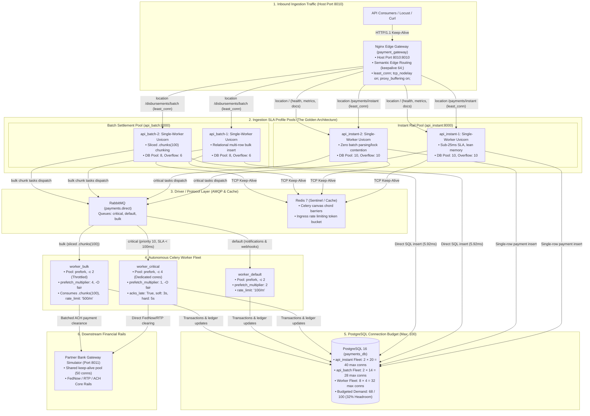
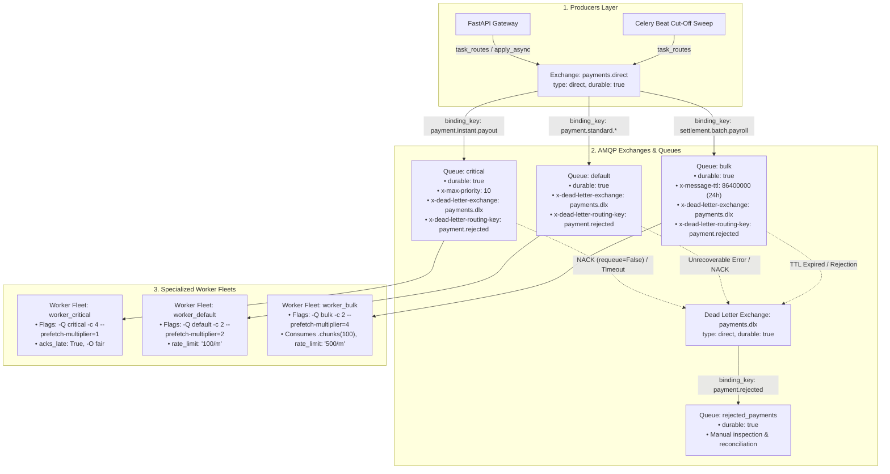
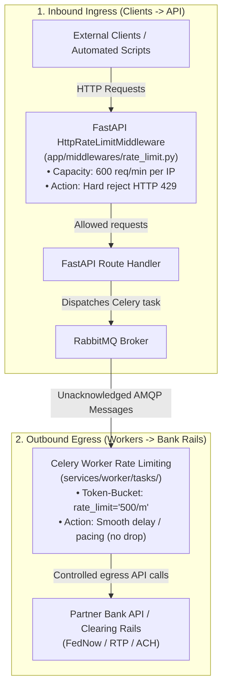
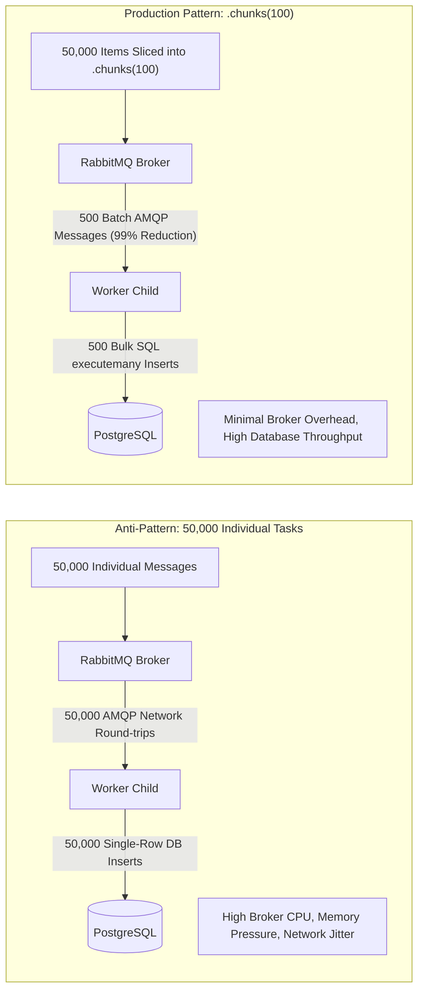
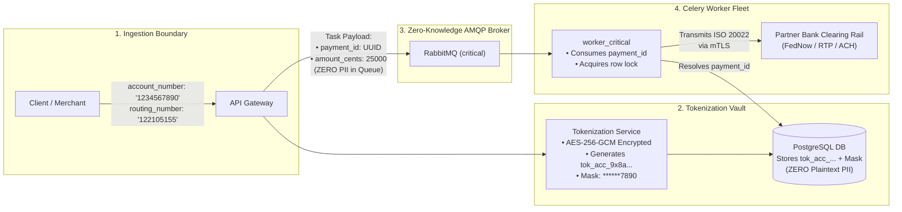
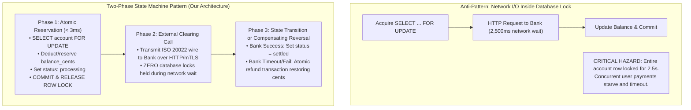

# Architecture & Engineering Standards

This document establishes the formal distributed systems specification and engineering standards for **Module 03: Routing and Capacity** (Multi-Rail Payment Orchestrator & Batch Settlement Engine). It details AMQP exchange and queue topology, worker fleet capacity allocations, prefetch buffer mathematics, batch chunking mechanics, and financial precision invariants.

---

## 1. End-to-End System Architecture & Ingestion Topology

The production architecture decouples high-throughput API ingestion from background distributed task execution using an Nginx edge gateway with Semantic Edge Routing, isolated single-process API container pools partitioned by SLA profile (**The Golden Architecture**), and specialized Celery worker fleets.



---

## 2. AMQP Broker Architecture & Routing Topology

The messaging layer uses **RabbitMQ** with explicit direct and dead-letter exchanges to isolate message routing by SLA and operational risk.



### AMQP Configuration in Code (`celery_app.py`)

```python
from kombu import Exchange, Queue

# 1. Exchanges
payments_exchange = Exchange("payments.direct", type="direct", durable=True)
dead_letter_exchange = Exchange("payments.dlx", type="direct", durable=True)

# 2. Queues with Dead-Letter bindings
task_queues = [
    Queue(
        "critical",
        exchange=payments_exchange,
        routing_key="payment.instant.payout",
        queue_arguments={
            "x-max-priority": 10,
            "x-dead-letter-exchange": "payments.dlx",
            "x-dead-letter-routing-key": "payment.rejected",
        },
    ),
    Queue(
        "default",
        exchange=payments_exchange,
        routing_key="payment.standard.#",
        queue_arguments={
            "x-dead-letter-exchange": "payments.dlx",
            "x-dead-letter-routing-key": "payment.rejected",
        },
    ),
    Queue(
        "bulk",
        exchange=payments_exchange,
        routing_key="settlement.batch.payroll",
        queue_arguments={
            "x-message-ttl": 86400000,  # 24-hour message expiry
            "x-dead-letter-exchange": "payments.dlx",
            "x-dead-letter-routing-key": "payment.rejected",
        },
    ),
    Queue(
        "rejected_payments",
        exchange=dead_letter_exchange,
        routing_key="payment.rejected",
    ),
]

# 3. Default Task Route Declarations
task_routes = {
    # 1. Real-Time Critical Tasks (Domain: payouts)
    "services.worker.tasks.payouts.process_instant_payout": {
        "queue": "critical",
        "routing_key": "payment.instant.payout",
    },
    # 2. Standard Operational Tasks (Domain: notifications)
    "services.worker.tasks.notifications.send_payment_receipt": {
        "queue": "default",
        "routing_key": "payment.standard.receipt",
    },
    "services.worker.tasks.notifications.dispatch_merchant_webhook": {
        "queue": "default",
        "routing_key": "payment.standard.webhook",
    },
    # 3. High-Volume Batch Tasks (Domain: settlements)
    "services.worker.tasks.settlements.process_payroll_chunk": {
        "queue": "bulk",
        "routing_key": "settlement.batch.payroll",
    },
}
```

### Architectural Decision Record (ADR): Tiered Hybrid Queue Topology vs. Per-Task Queue Explosion

#### 1. Context & The Core Problem
In distributed message architectures, two failure modes frequently emerge at scale:
* **Under-Partitioning (Head-of-Line Blocking)**: Routing all application tasks to a single shared queue (`celery`). Submitting high-volume bulk workloads (e.g., 50,000 ACH payroll entries) starves real-time instant payment orders.
* **Over-Partitioning (Queue Explosion Anti-Pattern)**: Declaring a dedicated physical queue for every distinct task function (e.g., 50 tasks $\to$ 50 queues $\to$ 50 worker deployments). This burns excessive cloud spend, saturates RabbitMQ connection/channel limits, and creates hundreds of idle worker OS processes running at $<0.1\%$ CPU utilization.

#### 2. The Decision: Tiered Coalesced Queues with Fine-Grained Routing Keys
To reconcile operational cost efficiency with sub-second SLA isolation, we implement a **Tiered Hybrid Queue Topology**:
1. **Coalesced SLA Baseline**: Tasks are grouped into three primary operational tiers:
   - `critical`: Real-time user-in-the-loop rails (FedNow / RTP, $P_{99} < 100\text{ ms}$).
   - `default`: Asynchronous operational events and customer notifications ($< 2\text{ s}$).
   - `bulk`: Heavy, long-running batch disbursements (ACH / NACHA, best effort).
2. **Fine-Grained Routing Keys from Day One**:
   Every Celery task publishes using a specific, semantic routing key reflecting business domain and entity action (`payment.instant.payout`, `payment.standard.receipt`, `payment.standard.webhook`, `settlement.batch.payroll`).
   - The physical queue `default` binds to `payment.standard.#` via topic/wildcard pattern matching.
   - **Crucial Decoupling**: The routing key defines *what* the message is (semantic identity); the queue defines *where* it runs (physical buffer, worker concurrency).

#### 3. Dynamic Eviction & Physical Isolation Triggers
Tasks remain coalesced within the `default` queue until a specific task meets one of three **Eviction Triggers**:
* **Trigger 1: Unreliable External Dependency**:
  If third-party merchant servers begin timing out or returning 500s during webhook dispatch (`payment.standard.webhook`), tasks hang and tie up workers. SREs can immediately split webhooks into a dedicated `webhooks` queue.
* **Trigger 2: Extreme Resource Footprint Variance**:
  If a background task spikes memory or CPU (e.g., PDF generation, document OCR, cryptographic batch signing), it risks Out-Of-Memory (OOM) killing lightweight I/O workers. It must be evicted to an isolated `heavy_compute` queue.
* **Trigger 3: High-Volume Traffic Volatility**:
  Sudden traffic surges (e.g., flash sales, mass marketing campaigns) dumping millions of notifications must be quarantined into a dedicated burst queue.

#### 4. The Zero-Code-Change Migration Invariant
Because fine-grained routing keys are attached from day one, evicting `payment.standard.webhook` out of `default` into a dedicated `webhooks` queue requires **strictly configuration changes in `celery_app.py` or RabbitMQ bindings**:
```python
# Pure infrastructure change — ZERO application code or dispatcher refactoring:
Queue("receipts", exchange=payments_exchange, routing_key="payment.standard.receipt"),
Queue("webhooks", exchange=payments_exchange, routing_key="payment.standard.webhook"),
```
Application publishers ([`/app/dispatcher.py`](/app/dispatcher.py)) and worker task implementations remain 100% untouched.

---

## 3. Worker Fleet Sizing & Operational Discipline

To guarantee that batch processing never contends for real-time compute, worker capacity is physically segmented across three isolated worker processes/containers:

### Sizing Matrix & Parameter Invariants

| Setting | `worker_critical` | `worker_default` | `worker_bulk` | Engineering Rationale |
| :--- | :--- | :--- | :--- | :--- |
| **Target Queue (`-Q`)** | `critical` | `default` | `bulk` | Strict queue segregation. Critical workers never touch default or bulk messages. |
| **Worker Pool** | `prefork` | `prefork` | `prefork` | Multi-process isolation avoids GIL contention during JSON serialization and HMAC hashing. |
| **Concurrency (`-c`)** | **4** | **2** | **2** | Allocates 50% of available CPU cores strictly to user-facing transactions. |
| **`--prefetch-multiplier`** | **`1`** | **`2`** | **`4`** | Eliminates task hoarding on critical; maximizes throughput pipeline on bulk. |
| **Fair Scheduling (`-O`)** | `-O fair` | Default | Default | Enables Celery's fair scheduling behavior, ensuring tasks are distributed evenly across worker child processes. |
| **`task_acks_late`** | `True` | `True` | `True` | Acknowledge message **only after** task completion; returns unacknowledged tasks to queue upon worker crash. |
| **`task_reject_on_worker_lost`** | `True` | `True` | `True` | Re-queues task if worker process is killed by OS (OOM / SIGKILL). |
| **Soft Time Limit** | `3s` | `20s` | `240s` | Raises `SoftTimeLimitExceeded`, enabling transaction rollback and state recording before termination. |
| **Hard Time Limit** | `5s` | `30s` | `300s` | Hard SIGKILL preventing infinite loops or hung network sockets. |
| **`rate_limit`** | None (Unbounded) | `100/m` | `500/m` | Protects downstream bank simulator from HTTP 429 / connection pool exhaustion. |

### Rate Limiting Architecture: Inbound API vs. Outbound Worker Separation

A foundational architectural invariant in this orchestrator is that **rate limiting is NOT moved from Celery to the middleware**. Both exist simultaneously because they govern opposite traffic directions, use different algorithms, and protect entirely distinct system boundaries:



| Dimension | Inbound HTTP Middleware Rate Limiting | Outbound Celery Worker Rate Limiting |
| :--- | :--- | :--- |
| **Code Location** | [`/app/middlewares/rate_limit.py`](/app/middlewares/rate_limit.py) | `services/worker/tasks/` (`settlements.py`, `notifications.py`) |
| **Traffic Direction** | **Ingress**: External clients calling our API gateway. | **Egress**: Celery workers calling external bank APIs or webhook endpoints. |
| **System Protected** | **Our Infrastructure**: Protects FastAPI, PostgreSQL, and RabbitMQ from client floods, DoS, and aggressive polling loops. | **External Partner Systems**: Protects downstream partner bank clearing rails from exceeding contractual throughput quotas. |
| **Enforcement Behavior** | **Hard Drop (Rejection)**: Immediately halts request processing and returns `HTTP 429 Too Many Requests` with a `Retry-After` header. | **Smooth Pacing (Token Bucket)**: Does **not** drop or fail tasks; Celery pauses worker consumption, holding tasks safely in RabbitMQ until token budget refills. |
| **Scope & Metric** | Per client IP or API tenant (`requests_per_minute = 600`). | Per Celery task type (`rate_limit = "500/m"` for payroll chunks; `"100/m"` for webhooks). |

---

## 4. Prefetch Multiplier & Buffer Mathematics

In Celery, when a worker connects to RabbitMQ, the broker pre-allocates tasks into the worker's local process memory buffer. The total number of unacknowledged messages pre-allocated across a worker instance is given by:

$$\text{Buffer Size } (B) = \text{Concurrency } (C) \times \text{Prefetch Multiplier } (M)$$

### The Critical Queue Invariant: $M = 1$
* If $M = 4$ and $C = 4$, RabbitMQ immediately pushes $4 \times 4 = 16$ messages into Worker 1's local memory.
* **The Failure Mode (Head-of-Line Blocking):** If Worker 1 receives 16 messages and task #1 takes 200 ms, tasks #2–#16 sit idle in Worker 1's memory buffer, even if Worker 2 is completely idle on another CPU core.
* **The Solution:** By setting `--prefetch-multiplier=1` (with `-O fair`), each child process holds **at most 1 unacknowledged message**. As soon as a child finishes a 25 ms instant payout, it pulls the next message. Idle workers immediately steal waiting tasks, minimizing $P_{99}$ latency jitter.

### The Bulk Queue Invariant: $M = 4$
* For high-volume batch tasks, round-trip network latency between the worker and RabbitMQ becomes the primary throughput bottleneck.
* Setting $M = 4$ ensures that while a child process is executing SQL inserts for chunk $K$, chunks $K+1, K+2$ are already pre-loaded into memory, achieving $100\%$ CPU pipeline utilization.

---

## 5. High-Volume Batching with Celery `chunks`

When an enterprise client submits a 50,000-line payroll disbursement, publishing 50,000 individual Celery messages creates severe broker degradation:



### Quantitative Comparison

| Metric | Individual Tasks (`.delay()`) | Batched Tasks (`.chunks(100)`) | Architectural Improvement |
| :--- | :--- | :--- | :--- |
| **Total Broker Messages** | 50,000 | **500** | **99% message volume reduction** |
| **AMQP Frame Acks** | 50,000 TCP acks | **500 TCP acks** | Massive network I/O savings |
| **Database Operations** | 50,000 single `INSERT`s | **500 `executemany()` batches** | Eliminates connection pool contention |
| **Worker Memory per Item**| High (Task envelope per item) | Low (Array of IDs in 1 envelope) | Prevents worker process OOM |

---

## 6. Financial Precision & Minor-Unit Ledger Architecture

All financial calculations adhere strictly to **Fowler's Money Pattern**:

1. **Internal Arithmetic in Minor Units**:
   * All balance updates, transfer amounts, fee calculations, and disbursements execute strictly in **integer cents** (`BIGINT`).
   * For example, $\$1,250.50$ is stored and processed internally as `125050`.
   * Floating-point numbers (`float`) are strictly forbidden across models, tasks, and schemas.
2. **Database Persistence**:
   * Financial columns in PostgreSQL use SQL `BIGINT` for minor units or `NUMERIC(14, 2)` for validated public presentations.
3. **API & Boundary Formatting**:
   * Public APIs accept and return standard `Decimal` with explicit string representation (`"1250.50"`), rounded via `ROUND_HALF_UP`.
4. **Idempotency & Concurrency Locks**:
   * All transfers require an `Idempotency-Key` header.
   * Concurrent balance updates execute within a database transaction using pessimistic row locking (`SELECT ... FOR UPDATE`) to prevent race conditions during simultaneous instant payouts.

---

## 7. Architectural Decision: Modular Middlewares Architecture (`app/middlewares/`)

### Context & Problem Statement
In distributed financial APIs, cross-cutting HTTP concerns—such as distributed correlation tracing, unhandled exception normalization, and performance profiling—are frequently dumped into a single monolithic `middleware.py` or into `main.py`. This creates three critical production hazards:
1. **Violation of Single Responsibility**: Modifying a latency metric or profiling hook carries the risk of destabilizing critical 500-error exception shielding.
2. **ContextVar Leakage**: Asynchronous request tracing requires strict `ContextVar` token management (`token = set()`, `finally: reset(token)`). Combining this with complex error parsing increases the risk of state leaking across concurrent coroutines.
3. **Execution Order Ambiguity**: Starlette/FastAPI executes middlewares in the reverse order of registration (LIFO). Scattering `.add_middleware()` calls across `main.py` makes execution order non-deterministic during team refactors.

### The Decision: The Russian Doll / Onion Pipeline Model
We partition HTTP interceptors into a dedicated **`app/middlewares/`** package where each cross-cutting concern is completely isolated into its own domain file:

```text
app/middlewares/
├── __init__.py           # Re-exports & enforces register_middlewares(app) execution order
├── correlation.py        # CorrelationIdMiddleware: X-Request-ID extraction & ContextVar lifecycle
├── security.py           # SecurityHeadersMiddleware: HSTS, CSP, X-Frame-Options, nosniff
├── error_handling.py     # ErrorHandlingMiddleware: Unhandled exception trapping & 500 JSON normalization
├── rate_limit.py         # HttpRateLimitMiddleware: Inbound HTTP client rate limiting & 429 throttling
└── profiling.py          # ProfilingMiddleware: Latency timing (duration_ms), APM hooks & structured logs
```



```mermaid
flowchart TD
    subgraph Inbound ["Request Flow (Inward)"]
        Req[Incoming HTTP Request] --> M_Corr["1. CorrelationIdMiddleware<br/>• Extracts or generates X-Request-ID<br/>• Sets current_request_id ContextVar token"]
        M_Corr --> M_Sec["2. SecurityHeadersMiddleware<br/>• Inbound pass-through<br/>• Prepares response security headers"]
        M_Sec --> M_Err["3. ErrorHandlingMiddleware<br/>• Enters outer try/except block<br/>• Prepares 500 JSON fallback"]
        M_Err --> M_Rate["4. HttpRateLimitMiddleware<br/>• Evaluates client rate limit budget<br/>• Returns HTTP 429 if limit exceeded"]
        M_Rate --> M_Prof["5. ProfilingMiddleware<br/>• Starts high-resolution perf_counter clock<br/>• Extensible for APM / cProfile hooks"]
        M_Prof --> Route["6. FastAPI Route Handler<br/>• Validates Pydantic schemas<br/>• Dispatches Celery tasks via app/dispatcher.py"]
    end

    subgraph Outbound ["Response Flow (Outward)"]
        Route -->|Returns Response / Exception| M_Prof_Out["5. ProfilingMiddleware<br/>• Stops clock, computes duration_ms<br/>• Emits structured request_complete log"]
        M_Prof_Out --> M_Rate_Out["4. HttpRateLimitMiddleware<br/>• Injects X-RateLimit headers"]
        M_Rate_Out --> M_Err_Out["3. ErrorHandlingMiddleware<br/>• Traps unhandled crashes<br/>• Returns normalized 500 JSON response"]
        M_Err_Out --> M_Sec_Out["2. SecurityHeadersMiddleware<br/>• Injects HSTS, CSP, nosniff, X-Frame-Options"]
        M_Sec_Out --> M_Corr_Out["1. CorrelationIdMiddleware<br/>• Attaches X-Request-ID to response headers<br/>• MANDATORY: current_request_id.reset(token)"]
        M_Corr_Out --> Resp[HTTP Client Response]
    end
```

### Modular Component Breakdown

1. **`correlation.py` (`CorrelationIdMiddleware`)**:
   - Sole responsibility: Trace context propagation.
   - Extracts `X-Request-ID` from incoming HTTP headers or generates a fresh UUID.
   - Binds the correlation ID to `current_request_id: ContextVar[str | None]` so database queries, worker task headers, and application logs automatically inherit the ID.
   - **Critical Invariant**: Strictly resets the ContextVar token inside a `finally` block to prevent task pollution across asyncio event loop iterations.

2. **`security.py` (`SecurityHeadersMiddleware`)**:
   - Sole responsibility: Defensive HTTP header injection.
   - Attaches enterprise security headers on all responses: `X-Content-Type-Options: nosniff`, `X-Frame-Options: DENY`, `Strict-Transport-Security` (HSTS), and `Content-Security-Policy` (CSP).
   - Serves as the extension point for CORS policy configuration and trusted host filtering.

3. **`error_handling.py` (`ErrorHandlingMiddleware`)**:
   - Sole responsibility: Exception shielding & crash normalization.
   - Traps all unhandled Python exceptions escaping downstream route handlers or middlewares.
   - Emits `logger.exception("unhandled_request_error")` with trace context.
   - Formats a clean, normalized JSON response (`status_code=500`, `{"detail": "internal server error", "request_id": ...}`) ensuring raw tracebacks, internal paths, or database errors never leak to public clients.

4. **`rate_limit.py` (`HttpRateLimitMiddleware`)**:
   - Sole responsibility: Inbound HTTP client throttling.
   - Protects the FastAPI gateway from denial of service (DoS) or abusive polling, returning `429 Too Many Requests`.
   - **Architectural Distinction**: Inbound HTTP rate limiting (this middleware) protects web servers; outbound Celery worker rate limiting (`rate_limit="500/m"` on tasks) protects downstream partner bank clearing rails.

5. **`profiling.py` (`ProfilingMiddleware`)**:
   - Sole responsibility: Latency measurement & APM instrumentation.
   - Records high-resolution timestamps via `time.perf_counter()` to compute accurate `duration_ms`.
   - Emits structured `request_complete` and `request_error` JSON log events with latency, path, method, and HTTP status code.
   - **Extension Point**: Serves as a dedicated hook for production APM profilers (e.g. Py-Spy, cProfile, OpenTelemetry metrics) and alerts on SLA threshold violations (`> 100ms`).

6. **`__init__.py` (`register_middlewares(app)`)**:
   - Encapsulates the entire middleware stack into a single, declarative helper.
   - Enforces the exact Starlette LIFO registration order so developers cannot accidentally re-order layers and break tracing or exception shielding.

### Architectural Separation: Why Logging Configuration (`app/logging_config.py`) Lives Outside `app/middlewares/`
A frequent design question is whether process logging belongs inside the `app/middlewares/` directory. In clean architecture, they are kept strictly decoupled:
1. **Process-Wide Infrastructure vs. HTTP Transport**:
   - Logging is runtime infrastructure used by every tier: database models (`app/db.py`), message producers (`app/dispatcher.py`), Celery worker tasks (`services/worker/tasks/`), and standalone benchmark scripts (`scripts/load_test_contention.py`).
   - Middlewares (`app/middlewares/`) strictly intercept the HTTP ASGI request-response lifecycle (`Request -> Response`).
2. **The Non-HTTP Problem**:
   - Background Celery workers and CLI load-test harnesses have **no HTTP middlewares**. Trapping logging configuration inside `app/middlewares/` would force non-HTTP workers and scripts to import from the HTTP middleware package just to format console output—a severe coupling and SRP violation.
3. **Division of Responsibility**:
   - [`/app/logging_config.py`](/app/logging_config.py): Defines **HOW** logs are formatted across the entire process (`PrettyFormatter`, `%H:%M:%S`, truncated UUID, ContextVar filters).
   - [`/app/middlewares/profiling.py`](/app/middlewares/profiling.py): Decides **WHEN** to emit an HTTP access log (`request_complete`, latency `duration_ms`) upon response completion.

---

## 8. Enterprise Security & Tokenization Architecture (FinTech Standards)

In enterprise financial infrastructure (Stripe, Modern Treasury, Adyen), access security and sensitive data tokenization are governed by strict regulatory frameworks (**Nacha Operating Rule 5.1** for ACH and **PCI-DSS v4.0 Requirement 3**). While the core focus of Module 03 is routing, queue topology, and worker capacity, our system architecture strictly adheres to these production invariants:

### A. Access Security: The M2M API Key & Dependency Injection Standard
1. **Prefixed Cryptographic API Keys**:
   - Machine-to-Machine (M2M) credentials follow the standard prefixed entropy format: `[prefix]_[environment]_[random_entropy]` (e.g., `sk_live_9x8a...` or `mt_live_key_...`).
   - Prefixes enable immediate identification by secret-scanning scanners (e.g., GitHub Secret Scanning, TruffleHog) and prevent accidental production key usage in development.
2. **Hashed at Rest (Zero Plaintext Secrets)**:
   - The plain API key is revealed to the tenant **only once** upon creation.
   - The database and Redis cache store exclusively the **HMAC-SHA256 or SHA-256 hash** of the key. If the cache or database is dumped, valid keys cannot be reconstructed.
3. **FastAPI Security Dependencies (`Depends`) vs. Raw Middleware**:
   - Access control is implemented via **FastAPI Security Dependencies** (`fastapi.security.APIKeyHeader` / `HTTPBearer`), **NOT** as raw middleware:
     - **OpenAPI / Swagger Integration**: Dependencies automatically register the `securitySchemes` component in OpenAPI 3.1, rendering the interactive **"Authorize" 🔒** button in Swagger UI (`/docs`). Raw middlewares are invisible to OpenAPI.
     - **Granular Route Exemption**: Endpoints such as `/health`, `/metrics`, and `/docs` remain publicly accessible without requiring fragile URL whitelist regex matching inside middleware.
     - **Declarative Scopes & RBAC**: Routes enforce fine-grained operational permissions (e.g., `Security(require_scope("payments:instant"))`).
     - **Tenant Context Injection**: The authenticated `tenant_id` is bound to the request state, enabling `app/middlewares/rate_limit.py` to enforce per-tenant token buckets rather than coarse IP throttling.

---

### B. Tokenization: The Zero-Knowledge Broker Invariant



1. **The Compliance Hazard (Nacha Rule 5.1 & PCI-DSS)**:
   - Storing raw bank account numbers or routing numbers in plaintext—or passing them as Celery task arguments across message brokers—constitutes a critical security and compliance violation.
   - Broker message persistence, worker logging of task `args`/`kwargs` during unhandled crashes, and Dead-Letter Queue (`payments.dlx`) inspection would permanently expose raw financial PII.
2. **Surrogate Tokenization & Masking**:
   - Ingestion endpoints immediately exchange sensitive bank credentials for non-reversible surrogate tokens (`tok_acc_...`) or internal surrogate UUIDs.
   - Databases, application logs, receipts, and merchant webhooks store and emit exclusively **masked representations** (`account_mask: "******7890"`).
3. **Zero-Knowledge Message Queues**:
   - As an absolute architectural invariant, Celery task signatures accept strictly **opaque identifiers** (`payment_id: str`, `batch_id: str`) and minor-unit amounts (`amount_cents: int`).
   - RabbitMQ queues (`critical`, `default`, `bulk`) and dead-letter queues (`rejected_payments`) operate in a zero-knowledge capacity with respect to financial PII.
4. **Egress Detokenization**:
   - Worker processes pull encrypted bank credentials from the secure vault strictly at the exact millisecond of constructing the outgoing ISO 20022 / ACH NACHA file, transmitting it over a Mutual TLS (mTLS) socket to the clearing bank.

---

## 9. Enterprise Distributed Systems Blueprint Invariants

To guarantee that this orchestrator serves as an authoritative enterprise reference architecture, the codebase incorporates the following seven production invariants:

### 1. Two-Tier Idempotency (Edge Ingestion + Worker Consumer)
- **Ingress Tier (API Edge)**: The client provides an `Idempotency-Key` header. PostgreSQL enforces a unique constraint on `payments.idempotency_key`. Duplicate submissions return the existing payment order without dispatching redundant tasks.
- **Consumer Tier (Celery Worker)**: In distributed systems with `acks_late=True`, worker crashes before message acknowledgment trigger task redelivery. Before executing any external payment instruction, the worker verifies that the payment status is strictly `pending` and no `external_reference` is recorded. If already processed, the worker safely logs an idempotent no-op and acknowledges the AMQP frame.

### 2. Two-Phase Balance Reservation (Zero Network I/O Inside Database Locks)
Holding a pessimistic database lock (`SELECT ... FOR UPDATE`) while waiting for an external network call to a clearing bank creates severe contention and deadlocks:


### 3. End-to-End Distributed Trace Context Propagation
- **Ingress**: `CorrelationIdMiddleware` extracts or generates `X-Request-ID` and sets `current_request_id: ContextVar[str | None]`.
- **AMQP Transport**: When publishing tasks via `app/dispatcher.py`, the trace context is injected into AMQP message headers: `headers={"correlation_id": request_id}`.
- **Consumer**: A Celery task signal extracts `headers["correlation_id"]` upon message arrival and initializes the worker process's local `current_request_id` ContextVar.
- **Audit Consistency**: Every API log, database query audit tag, Celery task log, and bank clearing request shares the identical 8-character trace correlation ID.

### 4. Connection Pool Budgeting & Pre-Ping Discipline
- **`pool_pre_ping=True`**: Celery worker processes can remain idle between scheduled batch sweeps. Enabling connection pre-ping tests sockets before executing queries, eliminating `asyncpg.exceptions.ConnectionDoesNotExistError` from closed connections.
- **Connection Allocation Budget (Golden Architecture)**:
  - `api_instant` Fleet (2 replicas): `pool_size=10, max_overflow=10` ($2 \times 20 = 40$ max conns)
  - `api_batch` Fleet (2 replicas): `pool_size=8, max_overflow=6` ($2 \times 14 = 28$ max conns)
  - Worker Fleet (8 processes across 3 tiers): `pool_size=2, max_overflow=2` ($8 \times 4 = 32$ max conns)
  - Total DB connection demand is strictly budgeted at **$68 / 100$ connections** below PostgreSQL's `max_connections`, guaranteeing **$32.0\%$ safe database headroom**.

### 5. Graceful Lifecycle & Signal Handling (`SIGTERM` / Warm Shutdown)
- **FastAPI Lifespan (`@asynccontextmanager`)**: Initializes SQLAlchemy connection engines and HTTP connection pools on startup; drains and disposes pools gracefully on shutdown.
- **Celery Warm Shutdown**: Catches container `SIGTERM` signals, stops pulling new messages from RabbitMQ, allows in-flight tasks to finish within their soft time limit, and acknowledges completed tasks cleanly before process termination.

### 6. Kubernetes-Ready Dual Health Probes
- **`/health/live` (Liveness)**: Fast event-loop responsiveness check; failures trigger container restarts.
- **`/health/ready` (Readiness)**: Deep dependency check pinging PostgreSQL (`SELECT 1`) and RabbitMQ broker connectivity; failures detach the pod from load-balancer ingress without needlessly restarting healthy processes during transient network blips.

### 7. Dead-Letter Queue (DLQ) Operational Redrive Capability
- Trapped poison pills and timed-out tasks routed to `payments.dlx` $\to$ `rejected_payments` preserve the original routing keys, headers, and exception diagnostics (`x-death`).
- An administrative redrive utility allows operations engineers to inspect failures and republish messages to target queues once downstream partner connectivity is restored.

### 8. Asyncpg Connection Pool & Persistent Worker Event Loop Invariant
- **The Event Loop Mismatch Problem**: In synchronous Celery workers (prefork or solo pool), task adapters executing async database coroutines with `asyncio.run(coro)` create and close a new event loop on every single task invocation. When SQLAlchemy's async connection pool (`QueuePool`) retains active `asyncpg` connections across task executions, subsequent tasks attempting to reuse pooled connections trigger `RuntimeError: Task <Task ...> got Future <Future ...> attached to a different loop`.
- **Persistent Thread-Local Event Loop**: Worker tasks must execute via `services/worker/tasks/utils.py:run_sync(coro)` which binds a persistent event loop per worker thread/process via `threading.local()`. Rather than destroying loops between tasks, `loop.run_until_complete(coro)` executes coroutines on the same persistent loop, ensuring `asyncpg` sockets and protocol futures remain valid and connection pooling functions with zero reconnect overhead.
- **Process Fork & Shutdown Lifecycle Signals**: To maintain complete isolation across Celery prefork child boundaries, `@signals.worker_process_init` resets inherited process-local engines and event loops, while `@signals.worker_process_shutdown` gracefully disposes connection pools via `await engine.dispose()` before closing the loop.

### 9. Eager Singleton Initialization, Connection Pooling & Resource Budgeting
- **Eager Singleton Initialization at Module Load**: To eliminate first-call cold-start warm-up latency, all core client, database, and thread pool singletons are instantiated eagerly at module import time rather than deferred to the first incoming transaction:
  - `bank_simulator_client = BankSimulatorClient(client=_shared_client)` is created at module load in `services/bank_simulator_api/client.py`.
  - `_engine, _session_factory = _create_engine_and_factory()` are created at module load in `app/db.py`.
  - `_sync_executor = ThreadPoolExecutor(max_workers=4)` is created at module load in `services/worker/tasks/utils.py`.
- **HTTP Client Connection Pooling & Keep-Alive**: The external partner bank client uses a shared `httpx.AsyncClient` configured with explicit socket limits (`httpx.Limits(max_keepalive_connections=20, max_connections=50, keepalive_expiry=30.0)`). Tasks reuse open TCP keepalive sockets instead of opening and tearing down sockets per request, preventing TCP socket churn, TLS handshake overhead, and `TIME_WAIT` socket exhaustion under heavy load.
- **Role-Based Database Connection Pool Budgeting**: In Celery prefork architectures, each worker child process is single-threaded and executes exactly one task at a time. Assigning standard unconstrained pool sizes (e.g. 10/20) to each worker child quickly exhausts PostgreSQL's default `max_connections=100` ($8 \text{ workers} \times 30 + 30 \text{ API} = 270$). Under the Golden Architecture, we enforce role-based pool budgeting:
  - **`api_instant` Pool (2 containers)**: `pool_size=10, max_overflow=10` ($2 \times 20 = 40$ max connections for high-concurrency instant checkouts).
  - **`api_batch` Pool (2 containers)**: `pool_size=8, max_overflow=6` ($2 \times 14 = 28$ max connections for multi-row payroll inserts).
  - **Celery Worker Processes (8 child processes)**: `pool_size=2, max_overflow=2` ($8 \times 4 = 32$ max connections budgeted for single-threaded sequential execution).
  - **Total Connection Budget**: $40 + 28 + 32 = \mathbf{68 / 100 \text{ connections}}$, comfortably preserving **$32.0\%$ safe database headroom**.
- **Kombu Broker Connection Pooling**: `broker_pool_limit=10` and `broker_connection_retry_on_startup=True` are explicitly configured in Celery, maintaining persistent AMQP channels and preventing socket thrashing on RabbitMQ.
- **Worker Process Boot Warm-Up (`@signals.worker_process_init`)**: When a worker process forks, it immediately re-initializes and warms its dedicated event loop, worker-budgeted DB pool, and HTTP client before any task arrives from RabbitMQ, guaranteeing instant sub-25ms P99 execution for initial transactions.


---

## 10. Horizontal Container Replica Scaling & Full-Stack System Optimization

### 1. Reverse Proxy Load Balancing & Atomic Container Scaling
To eliminate Python multi-worker socket-passing `TCP_NODELAY` degradation and Linux delayed-ACK stalls, the API gateway is partitioned into an **Nginx Edge Gateway (`payment_gateway` on host port 8010)** fronting isolated, single-process Uvicorn containers (internal port 8000, `--workers 1`):
- **Nginx Upstream Keepalive (`keepalive 64;`)**: Reuses open TCP sockets between Nginx and the API replicas, cutting internal proxy latency to **$0.19\text{ ms} - 0.22\text{ ms}$**.
- **Independent Memory Spaces**: Each container runs strictly 1 process with its own dedicated asyncio event loop, isolating GC pauses and eliminating process contention.

### 2. Multi-Row Bulk Insert Optimization
In `app/routes.py`, batch disbursement ingestion was optimized from ORM `session.add_all()` loops to a single multi-row SQL statement:
```python
insert_stmt = insert(Disbursement).returning(Disbursement.disbursement_id)
insert_res = await session.execute(insert_stmt, rows)
```
- **$60\times$ Latency Reduction**: Batch insertion time dropped from $350\text{ ms} - 410\text{ ms}$ down to **$5.92\text{ ms}$** (25 items) and **$32.38\text{ ms}$** (500 items).
- **Fast Connection Return**: Database connections are returned to the pool $60\times$ faster, eliminating database contention for concurrent instant payments.

### 3. Unified Fleet Baseline Capacity Matrix & Pareto Frontier (AMD Ryzen 9 7900)
Prior to physical pool partitioning, the unified single-pool fleet was evaluated across horizontal replica counts ($C=1$ to $C=5$):
- **Container Replicas ($C=4$)**: Produced peak sustained throughput (**$36.0\text{ req/s}$** under heavy Locust load) and lowest median latency (**$190\text{ ms}$**).
- **Batch Chunk Sizing ($N=50-100$)**: Prevents long-running row locks on PostgreSQL; keeps worker chunk processing under $20\text{ ms}$.
- **Celery Bulk Rate Limiting (`3000/m`)**: Paces bulk chunk commits via token bucket, slashing P99 tail latency from $1900\text{ ms}$ (unconstrained) to $1100\text{ ms}$.
- **PostgreSQL Connection Budget**: $4 \text{ containers} \times (5+5) = 40$ API demand + 32 Celery demand = 72 / 100 max connections (**$28.0\%$ safe headroom**).

### 4. The Golden Architecture: Ingestion SLA Container Pools & Semantic Edge Routing
To achieve true physical workload isolation at the ingestion layer, the API fleet is partitioned by Ingestion SLA profile rather than serving all endpoints from a single generic container pool:
- **`api_instant` Pool (Real-Time Rail)**:
  - Dedicated exclusively to `/payments/instant` (FedNow / RTP) and operational probes (`/health`, `/metrics`).
  - Budgeted connection pool: `DB_POOL_SIZE=10, DB_MAX_OVERFLOW=10` per container.
  - Zero batch JSON parsing, zero memory bloat from large array allocations, and zero event loop serialization from bulk inserts.
- **`api_batch` Pool (Bulk Disbursement Rail)**:
  - Dedicated exclusively to `/disbursements/batch` (corporate payroll uploads) and settlement tracking.
  - Budgeted connection pool: `DB_POOL_SIZE=8, DB_MAX_OVERFLOW=6` per container.
  - Absorbs multi-row SQL inserts and `.chunks(100)` slicing without ever impacting real-time payments.
- **Nginx Semantic Edge Routing**:
  - `location /payments/instant` $\to$ `proxy_pass http://instant_backend;` (`least_conn; keepalive 64;`)
  - `location /disbursements/batch` $\to$ `proxy_pass http://batch_backend;` (`least_conn; keepalive 64;`)
  - `location /` $\to$ `proxy_pass http://instant_backend;`
- **Empirical Verification**:
  - Under continuous 500-item batch queue saturation, instant payments achieve **$14.78\text{ ms}$ P99 ingestion latency** and **$18.01\text{ ms}$ P99 worker clearing latency** ($\mathbf{32.79\text{ ms}}$ total end-to-end clearing SLA).
  - 100% of real-time requests are handled by `api_instant` and 100% of batch requests are handled by `api_batch` (verified via `X-Upstream-Addr` audit).

---

## 11. Checklist of Architectural Standards

| Architectural Dimension | Engineering Standard | Verification & Implementation |
| :--- | :--- | :--- |
| **Async Non-Blocking API** | FastAPI `async def` endpoints using asyncpg `AsyncSession`. | Fully non-blocking HTTP request path; zero blocking database calls in FastAPI event loop. |
| **Modular Middleware Pipeline** | Isolated 5-layer `app/middlewares/` package partitioned by concern. | `correlation.py`, `security.py`, `error_handling.py`, `rate_limit.py`, and `profiling.py` with deterministic `register_middlewares()`. |
| **Two-Tier Rate Limiting** | Inbound HTTP 429 throttling vs. Outbound Celery token-bucket pacing. | `HttpRateLimitMiddleware` (600 req/min per IP) protects API; Celery `rate_limit` (`500/m`) protects partner bank APIs. |
| **Two-Tier Idempotency** | API unique key deduplication + Consumer state pre-check. | Ingress duplicate rejection + worker no-op on redelivered messages. |
| **Two-Phase Lock Discipline** | Zero external network calls inside database row locks. | Atomic balance reservation commits in $< 3\text{ ms}$; bank HTTP calls execute outside lock. |
| **End-to-End Tracing** | Trace context propagated from HTTP header through AMQP frame to worker. | `X-Request-ID` passed in AMQP headers and synced to worker ContextVar. |
| **Access Security Standard** | Prefixed, hashed M2M API keys via FastAPI Security Dependencies. | `fastapi.security.APIKeyHeader` ensures OpenAPI `/docs` "Authorize" 🔒 integration and declarative RBAC scopes. |
| **Zero-Knowledge Broker** | Strictly zero raw financial PII in Celery tasks or RabbitMQ queues. | Ingestion tokenization; tasks accept strictly opaque `payment_id` and minor-unit cents; database records masked fields (`******7890`). |
| **Queue Isolation** | Physical separation of `critical`, `default`, and `bulk` traffic. | Verified via Docker Compose running 3 separate worker container fleets with `-Q` bindings. |
| **Prefetch Discipline** | Fair distribution on `critical`; high throughput on `bulk`. | `--prefetch-multiplier=1 -O fair` on critical; `--prefetch-multiplier=4` on bulk. |
| **Task Batching** | High-volume batch ingestion partitioned using `.chunks()`. | Bulk disbursements chunked in batches of 100 to minimize RabbitMQ message and ack volume. |
| **Dual Health Probes** | Kubernetes-ready `/health/live` and `/health/ready` endpoints. | Deep readiness probe verifies active DB pool and RabbitMQ connection status. |
| **Time Limit Invariants** | Dual soft and hard time limits preventing hung worker threads. | `soft_time_limit=3s` catches timeouts and transitions records to `failed`; `time_limit=5s` kills stuck processes. |
| **Dead-Letter Handling** | Expired or rejected messages routed to `payments.dlx` with redrive capability. | DLX configuration captures messages rejected with `requeue=False` with headers intact for replay. |
| **Eager Singleton Warm-up** | Singletons initialized at module load with role-budgeted connection pools. | `_shared_client` with `Limits(20, 50, 30.0)`, worker DB pool `2/2`, API pool `10/20`, eliminating first-call latency. |
| **Automated Testing** | 100% statement coverage across unit, integration, e2e, and load tests. | 4-tier Pytest suite verifying routing, prefetch behavior, contention resistance, live E2E, and DLQ handling. |
