# Module 03: Routing and Capacity — Test Plan

This document establishes the test architecture, test cases, invariants, and Test-Driven Development (TDD) matrix for **Module 03: Routing and Capacity** (Multi-Rail Payment Orchestrator & Batch Settlement Engine).

---

## 1. Test Architecture & Pytest Hierarchy

```mermaid
flowchart TD
    subgraph L1["Layer 1: Unit & Task Logic (Pure In-Memory)"]
        T1["test_unit_tasks.py<br/>• Minor-unit integer cents arithmetic<br/>• Chunk partitioning logic<br/>• Task exception mapping & envelope formatting"]
    end

    subgraph L2["Layer 2: AMQP Routing & Queue Verification"]
        T2["test_routing.py<br/>• Exchange bindings (payments.direct, payments.dlx)<br/>• Routing key matching (payment.instant.*, settlement.batch.*)<br/>• Dead-letter configuration on queues"]
    end

    subgraph L3["Layer 3: Contention & Capacity Benchmarks"]
        T3["test_capacity_contention.py<br/>• 50,000 Bulk tasks vs. Instant payout latency<br/>• Prefetch multiplier buffer verification (M=1 vs M=4)<br/>• Worker starvation & fair dispatch assertions"]
        T4["test_time_limits.py<br/>• SoftTimeLimitExceeded catch & rollback<br/>• Hard time limit SIGKILL recycle<br/>• Dead-letter queue (rejected_payments) capture"]
    end

    subgraph L4["Layer 4: API & Integration Tests (tests/integration/)"]
        T5["test_api.py<br/>• POST /payments/instant (202 Accepted + SLA)<br/>• POST /disbursements/batch (chunked submission)<br/>• GET /metrics/queues (RabbitMQ management inspection)"]
        T6["test_middlewares.py<br/>• CorrelationId ContextVar lifecycle & cleanup<br/>• SecurityHeadersMiddleware (HSTS/CSP)<br/>• ErrorHandlingMiddleware 500 JSON shielding<br/>• HttpRateLimitMiddleware 429 throttling<br/>• ProfilingMiddleware duration_ms timing"]
    end

    subgraph L5["Layer 5: Live Distributed E2E Tests (tests/e2e/)"]
        T7["test_live_e2e.py<br/>• Live AMQP message dispatch across RabbitMQ 3.13<br/>• Real worker daemon subprocesses (-Q critical, -Q bulk)<br/>• Live bank_simulator_api HTTP clearing over network<br/>• Full lifecycle async polling to settled/cleared states"]
    end

    subgraph L6["Layer 6: Edge Gateway & Ingestion SLA Pool Verification"]
        T8["nginx.conf & benchmark_ingestion_pools.py<br/>• Semantic edge routing (/payments/instant -> api_instant:8000)<br/>• Upstream isolation headers (X-Upstream-Addr)<br/>• Dual-level health probes (port 8000 direct vs. port 8010 per-service)<br/>• Zero event-loop Head-Of-Line blocking under batch load"]
    end

    L1 --> L2 --> L3 --> L4 --> L5 --> L6
```

---

## 2. Test Matrix & Detailed Scenarios

| Test ID | Test Function / File | Fixtures / Input | Invariants & Assertions | Expected Outcome |
| :--- | :--- | :--- | :--- | :--- |
| **TC-01: Instant Payout Routing** | `test_routing.py::test_instant_payout_routes_to_critical` | Payment payload: `$150.00` | 1. Dispatches `process_instant_payout`. 2. Inspects Kombu delivery info: target queue must be strictly `"critical"`. 3. Routing key must match `"payment.instant.payout"`. | Message routed to `critical` queue |
| **TC-02: Default Queue Routing** | `test_routing.py::test_receipt_routes_to_default` | Receipt payload | 1. Dispatches `send_payment_receipt`. 2. Target queue must be strictly `"default"`. 3. Does not contend for `critical` worker capacity. | Message routed to `default` queue |
| **TC-03: Bulk Queue Batching via Chunks** | `test_routing.py::test_payroll_chunk_batching` | 1,000 disbursement IDs, `chunk_size=100` | 1. Generates chunked signature `.chunks(ids, 100)`. 2. Asserts exactly 10 AMQP messages created (not 1,000). 3. All 10 chunk messages route to `"bulk"` queue. | 10 chunk messages on `bulk` queue |
| **TC-04: Contention Invariant (Zero Starvation)** | `test_capacity_contention.py::test_critical_sla_under_bulk_load` | 500 bulk chunks enqueued + 10 instant payouts | 1. Saturate `bulk` queue with 500 tasks. 2. Fire 10 concurrent instant payouts on `critical`. 3. Measure instant payout $P_{99}$ latency. 4. Assert $P_{99} < 100\text{ ms}$ despite 100% bulk worker utilization. | **SLA maintained ($< 100\text{ ms}$)**, zero starvation |
| **TC-05: Prefetch Buffer Discipline** | `test_capacity_contention.py::test_prefetch_multiplier_fairness` | 2 critical workers, 10 instant tasks | 1. Send 10 tasks to `critical` queue with `prefetch_multiplier=1`. 2. Worker 1 handles slow task (100ms). 3. Worker 2 must immediately consume waiting tasks. 4. Asserts no tasks are hoarded in Worker 1's local memory buffer. | Fair task distribution across workers |
| **TC-06: Soft Time Limit Rollback** | `test_time_limits.py::test_soft_time_limit_handled` | Hang bank simulator ($> 3.0\text{ s}$) | 1. Worker executes `process_instant_payout` (`soft_time_limit=3s`). 2. Task intercepts `SoftTimeLimitExceeded`. 3. DB transaction rolls back account lock. 4. Payment status set to `timed_out` with error diagnostic. | DB lock released, status `timed_out` |
| **TC-07: Dead-Letter Queue (DLQ) Routing** | `test_time_limits.py::test_rejected_message_lands_in_dlq` | Rejected task message | 1. Task executes `basic_reject(requeue=False)`. 2. RabbitMQ routes message to `payments.dlx`. 3. Message arrives in `rejected_payments` queue with headers intact. | Message present in `rejected_payments` |
| **TC-08: Minor Unit Financial Precision** | `test_unit_tasks.py::test_minor_unit_ledger_math` | Transactions with cents: `$12.33` + `$87.67` | 1. Internal math calculates $1233 + 8767 = 10000$ cents. 2. Zero IEEE 754 float drift ($100.00000000001$ strictly impossible). 3. Account balance reflects exact $\$100.00$. | Exact integer arithmetic |
| **TC-09: Two-Tier Rate Limiting** | `test_capacity_contention.py::test_bulk_rate_limiting` | 50 bulk tasks, `rate_limit="500/m"` | 1. Measure Celery task dispatch interval. 2. Worker token-bucket limiter enforces maximum 500 tasks per minute. 3. Inbound middleware throttles abusive clients at 600 req/min with HTTP 429. | Celery smooth pacing + Inbound HTTP 429 |
| **TC-10: Idempotent Payment Ingestion** | `test_api.py::test_duplicate_idempotency_key` | Repeated `Idempotency-Key` | 1. First `POST /payments/instant` returns `202 Accepted` with new UUID. 2. Immediate duplicate `POST` returns same payment ID. 3. Only one Celery task is dispatched to RabbitMQ. | Single task dispatched, HTTP 200/202 |
| **TC-11: Modular Middleware Pipeline** | `test_middlewares.py::test_middleware_execution_order` | HTTP requests to test endpoints | 1. Verify `X-Request-ID` attached and ContextVar reset on completion. 2. Verify defensive headers (HSTS, CSP, nosniff, DENY). 3. Verify unhandled crashes normalized to JSON 500. 4. Verify high-resolution latency logged with `duration_ms`. | Complete 5-layer pipeline verified |
| **TC-12: Producer Dispatcher Slicing** | `test_dispatcher.py::test_chunk_slicing_and_routing` | 1,000 disbursement records | 1. API dispatcher slices items into batches of 100. 2. Publishes chunk signatures to `bulk` queue without loading worker task modules into API process. | Clean producer separation & exact chunk counts |
| **TC-13: Live Multi-Process Distributed E2E** | `test_live_e2e.py::test_live_instant_payout_and_batch` | Live RabbitMQ + Celery Worker daemons | 1. Submit instant payout $\to$ verifies real AMQP dispatch, live worker execution, bank clearing, and final settled polling. 2. Submit batch $\to$ verifies parallel chunk execution across live worker pool. | Full distributed execution verified |
| **TC-14: Ingestion SLA Pool Isolation (Nginx Semantic Edge Routing)** | `scripts/benchmark_ingestion_pools.py` / `nginx.conf` | HTTP requests to `http://localhost:8010/payments/instant` and `http://localhost:8010/disbursements/batch` | 1. Inspect Nginx response header `X-Upstream-Addr`. 2. Assert `/payments/instant` routes strictly to `api_instant:8000` upstream. 3. Assert `/disbursements/batch` routes strictly to `api_batch:8000` upstream. 4. Assert zero cross-pool contamination between instant and batch pools. | 100% physical upstream segregation verified |
| **TC-15: Dual-Level Health Probes & Per-Service Edge Observability** | `nginx.conf` / Container Healthchecks | Internal container probe `http://localhost:8000/health/liveness`, Edge probes `http://localhost:8010/health/instant/liveness`, `http://localhost:8010/health/batch/liveness`, `/metrics/instant`, `/metrics/batch` | 1. Internal container port 8000 returns direct container state (Whitebox APM / Docker). 2. Nginx edge rewrites `/health/instant/*` $\to$ `/health/*` on `api_instant` and `/health/batch/*` $\to$ `/health/*` on `api_batch`. 3. Response JSON includes specific `service: "payment_api_instant"` vs `service: "payment_api_batch"` and active DB pool metrics. | Both monitoring layers (Whitebox direct & Blackbox edge) operational without false-green blind spots |
| **TC-16: Calibrated Ingestion SLA Benchmark (Paced vs. Burst)** | `scripts/benchmark_ingestion_pools.py` | 50 concurrent instant payouts ($150.00$) at 200 req/s arrival rate (Little's Law pacing) against background 500-disbursement batch submissions | 1. Measure instant payout ingestion latency under clean baseline. 2. Measure instant payout ingestion latency during active batch ingestion. 3. Assert $P_{99}$ degradation is $< 5\text{ ms}$ (virtually $0\%$). 4. Assert $P_{99} < 35\text{ ms}$ total gateway ingestion time. | Zero ingestion event-loop head-of-line blocking; instant SLA fully preserved |

---

## 3. TDD Execution Sequence

### Phase 1: Red Phase (Tests Authored First)
1. Author `tests/conftest.py` setting up Hybrid Testcontainers (PostgreSQL 16 + RabbitMQ 3.13 with Management).
2. Author `tests/test_routing.py`, `tests/test_time_limits.py`, and `tests/test_capacity_contention.py`.
3. Run `pytest tests/` $\to$ All tests fail cleanly as queue definitions and tasks are not yet wired.

### Phase 2: Green Phase (Implementation)
1. Configure `services/worker/celery_app.py` with Kombu exchanges, queues, DLX, and routes.
2. Implement `app/models.py` (ACID schema) and `init.sql`.
3. Implement domain-partitioned tasks in `services/worker/tasks/` (`payouts.py`, `settlements.py`, `notifications.py`, `__init__.py`).
4. Implement `app/dispatcher.py` (API producer layer) and `app/routes.py` with FastAPI endpoints.
5. Register `app/middlewares/` pipeline (`correlation`, `security`, `error_handling`, `rate_limit`, `profiling`) via `register_middlewares(app)`.
6. Run `pytest tests/` $\to$ All unit, routing, middleware, and time-limit tests pass.

### Phase 3: Benchmark & Evidence Phase
1. Execute `scripts/load_test_contention.py` measuring queue latency under 50,000 bulk tasks.
2. Record metrics in `docs/CAPACITY_NOTE.md`.
3. Verify 100% statement coverage via `pytest --cov`.

### Phase 4: Golden Architecture Ingestion SLA Calibration & Observability Validation
1. Author `nginx.conf` with least-connection upstream balancing, TCP nodelay, keepalive pools, and semantic path routing.
2. Implement per-service edge observability paths (`/health/instant/*`, `/health/batch/*`, `/metrics/instant`, `/metrics/batch`) with transparent upstream path rewriting to eliminate false-green monitoring blind spots.
3. Configure dual container pools in `docker-compose.yml` (`api_instant` and `api_batch`) with role-budgeted PostgreSQL connection pools (20 max for instant, 14 max for batch).
4. Run `scripts/benchmark_ingestion_pools.py` to empirically verify zero event-loop head-of-line blocking under sustained batch load.
5. Document architectural decisions and benchmarks in `docs/PRODUCTION_ARCHITECTURE_AND_OPTIMIZATION_REPORT.md`.

