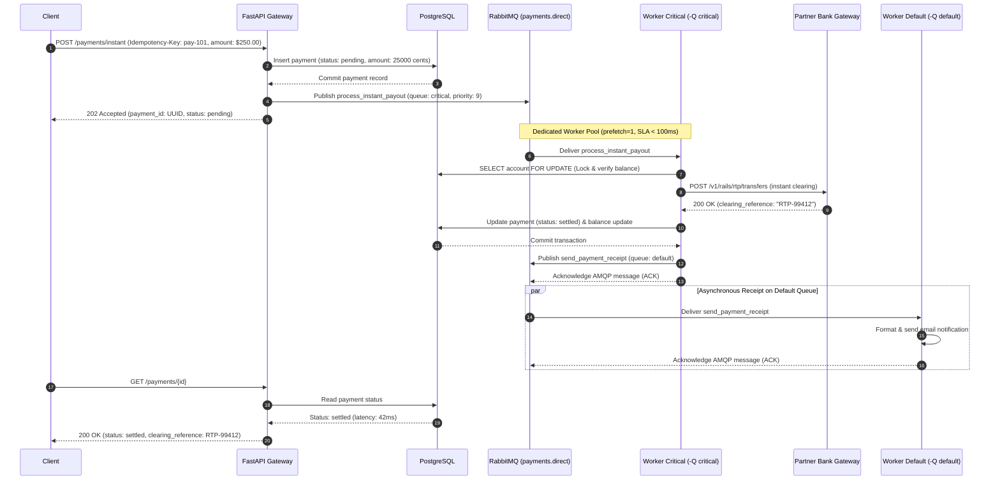
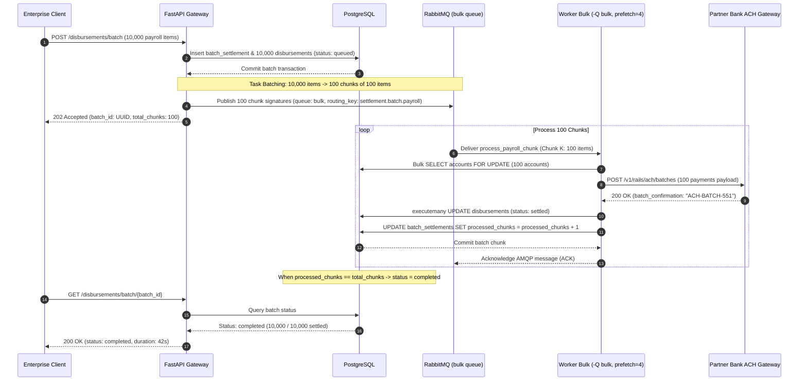
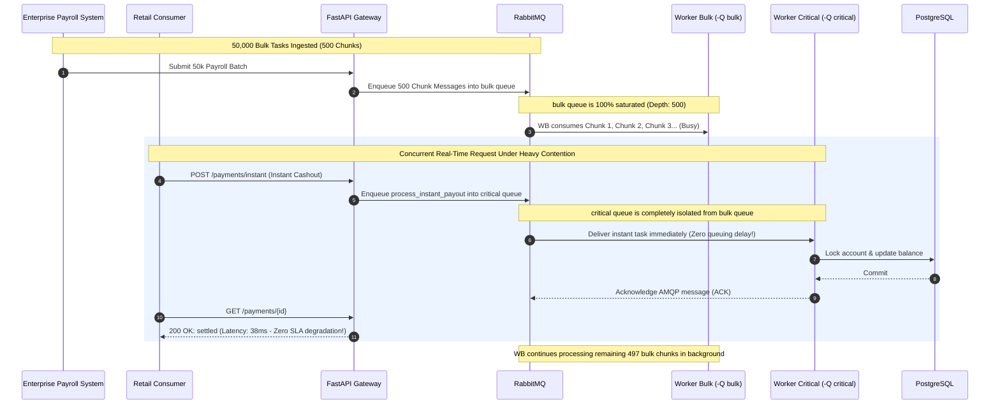
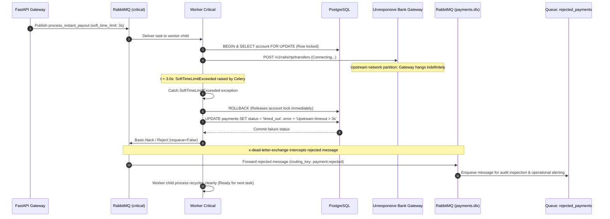

# Use Cases & Sequence Diagrams

This document details the primary end-to-end execution paths for the Multi-Rail Payment Orchestrator, illustrating task routing, worker queue bindings, contention isolation, and fault recovery.

---

## Use Case 1: Sub-Second Instant Payout (`critical` Queue Happy Path)

### Business Context
A gig worker taps "Cash Out Now" to receive funds immediately via FedNow / RTP / Visa Direct. The transaction must execute end-to-end with an SLA of $P_{99} < 100\text{ ms}$.

### Execution Flow
1. Client issues `POST /payments/instant` with an `Idempotency-Key` header and payment payload.
2. The FastAPI Gateway creates an initial payment record in PostgreSQL with status `pending`.
3. The API publishes `process_instant_payout` to exchange `payments.direct` with routing key `payment.instant.payout`.
4. RabbitMQ routes the message directly into the `critical` queue.
5. `worker_critical` (configured with `prefetch_multiplier=1` and `-O fair`) pulls the task immediately.
6. The worker acquires a row lock on the user's account, validates available minor-unit integer cents balance, and calls the Partner Bank Gateway.
7. The partner bank confirms fund clearance in $25\text{ ms}$.
8. The worker updates the payment status to `settled`, deducts balance, records the ledger entry, commits the database transaction, and acknowledges the AMQP message.
9. An asynchronous receipt task `send_payment_receipt` is published to the `default` queue so notification I/O does not block the real-time rail.
10. The client polls `GET /payments/{id}` or receives a websocket event confirming `settled` within $45\text{ ms}$ total elapsed time.



---

## Use Case 2: Batch Payroll Disbursement with `.chunks(100)` (`bulk` Queue)

### Business Context
At 5:00 PM, an enterprise client uploads a monthly payroll run containing 10,000 disbursement instructions. The system must process all disbursements before midnight without degrading database performance or flooding the message broker.

### Execution Flow
1. Client submits `POST /disbursements/batch` with 10,000 employee payout instructions.
2. The API persists a master `batch_settlements` record and inserts 10,000 records in `disbursements` with status `queued`.
3. Instead of publishing 10,000 separate Celery messages, the application partitions the 10,000 disbursement IDs into **100 chunks of 100 items** using `.chunks(100)`:
   ```python
   process_payroll_chunk.chunks([(item_id,) for item_id in disbursement_ids], 100).apply_async(queue="bulk")
   ```
4. RabbitMQ receives only **100 compact messages** on the `bulk` queue instead of 10,000 individual task envelopes.
5. `worker_bulk` (configured with `prefetch_multiplier=4`) consumes chunks sequentially.
6. For each chunk of 100 items, the worker:
   - Performs a bulk SQL balance check across recipient accounts.
   - Executes a batched clearing call to the partner bank's bulk ACH endpoint.
   - Issues a single SQL `executemany()` to update all 100 records to `settled`.
   - Atomically increments the batch processed counter in PostgreSQL.
7. The worker acknowledges the chunk message.
8. Once all 100 chunks complete, the master batch status transitions to `completed`.



---

## Use Case 3: System Under Contention (Bulk Saturation vs. Instant Payouts)

### Business Context
While `worker_bulk` is actively processing 50,000 pending disbursements (500 chunk messages saturating the `bulk` queue), a retail customer requests an instant FedNow payout. The system must prove **zero starvation** and maintain an SLA of $< 100\text{ ms}$.

### Execution Flow & Contention Proof
1. **The Contention State:** The `bulk` queue has 500 chunk messages waiting. `worker_bulk` processes chunks at maximum capacity ($C=2$, `prefetch_multiplier=4`).
2. A retail user triggers an instant payout via `POST /payments/instant`.
3. The task routes to the `critical` queue.
4. Because `worker_critical` is an **isolated process fleet** that only consumes from `-Q critical`, its worker processes are completely unaffected by the 500 messages queuing in `bulk`.
5. With `prefetch_multiplier=1`, `worker_critical` immediately takes the new instant payout message off the wire without waiting for any bulk task.
6. The instant payout completes in **$38\text{ ms}$**, proving that physical queue separation and prefetch tuning completely eliminate head-of-line blocking.



---

## Use Case 4: Downstream Timeout, `soft_time_limit`, and DLQ Rejection

### Business Context
During an instant payment dispatch, the downstream partner bank's clearing rail hangs due to an upstream network partition. The system must catch the timeout before the client times out, gracefully release database locks, and reject the message to the **Dead-Letter Exchange (`payments.dlx`)**.

### Execution Flow
1. Client requests an instant payout.
2. The task is routed to `worker_critical` (`soft_time_limit=3s`, `time_limit=5s`).
3. The worker acquires the row lock on the user's account and issues an HTTP call to the partner bank gateway.
4. The partner bank hangs. At $t = 3.0\text{ s}$, the Python runtime raises `celery.exceptions.SoftTimeLimitExceeded`.
5. The task catches `SoftTimeLimitExceeded`:
   - Executes an explicit database rollback, releasing the row lock on the user's account.
   - Updates the payment status in PostgreSQL to `timed_out` with `error_reason="Upstream partner bank timeout exceeding 3000ms"`.
   - Rejects the AMQP message using `self.retry()` exhaustion or `reject(requeue=False)`.
6. RabbitMQ intercepts the rejected message and routes it to `payments.dlx` via `x-dead-letter-exchange`.
7. The dead-letter exchange routes the message into the `rejected_payments` queue for automated alerting and audit review.
8. The worker child process remains healthy and immediately resumes processing subsequent transactions without being terminated by kernel SIGKILL.



