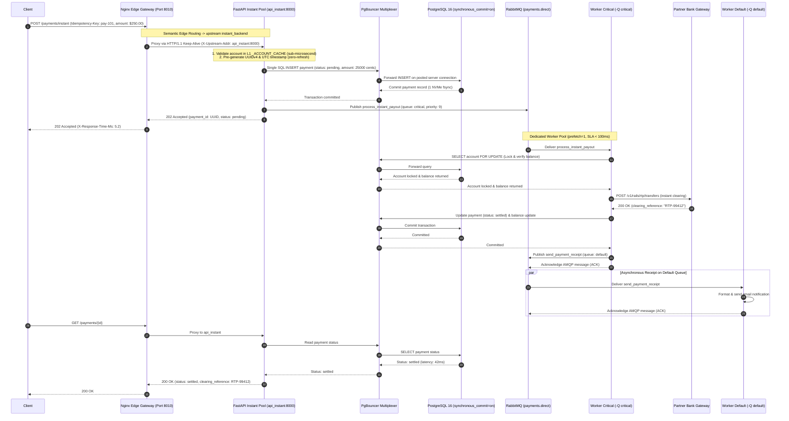
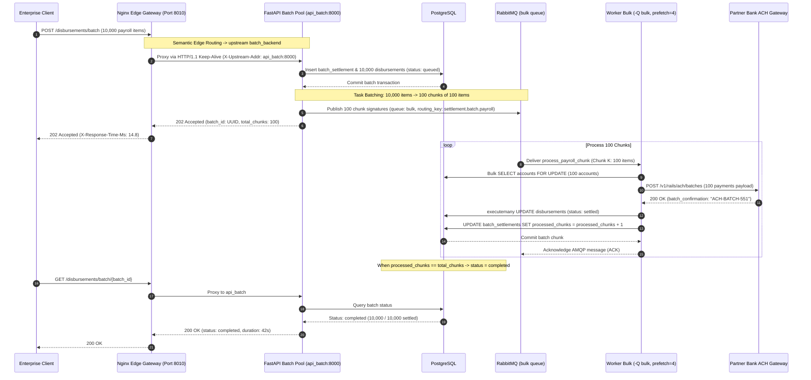
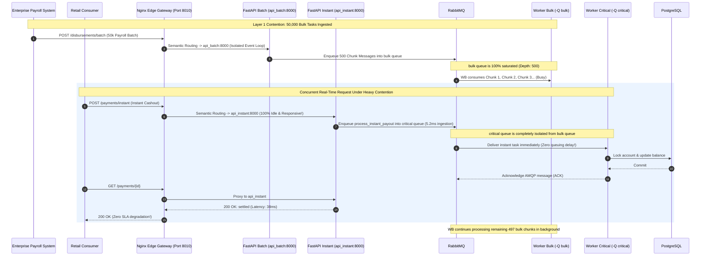
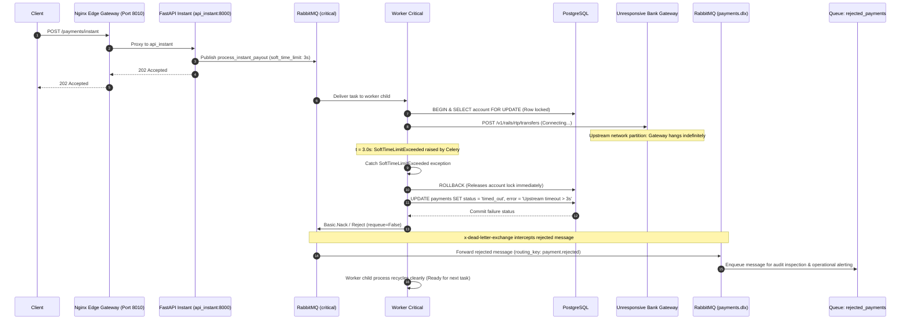
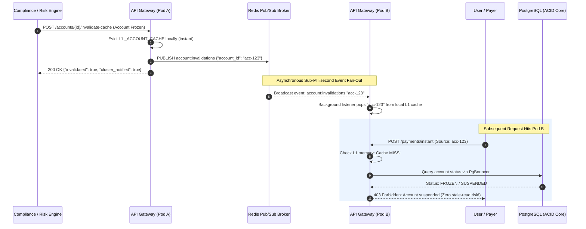
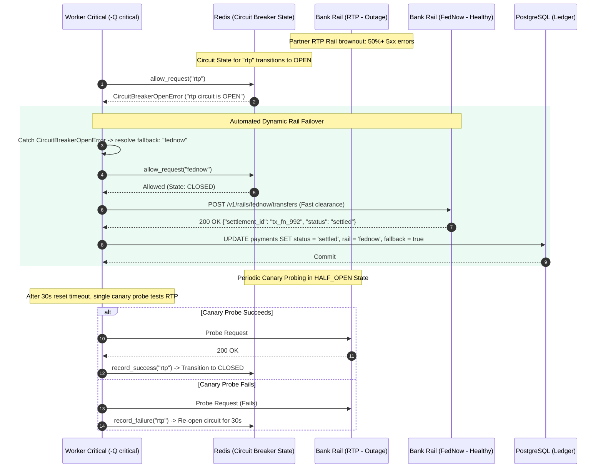
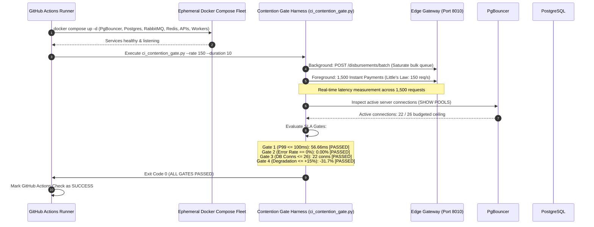

# Use Cases & Sequence Diagrams

This document details the primary end-to-end execution paths for the Multi-Rail Payment Orchestrator, illustrating task routing, worker queue bindings, contention isolation, and fault recovery.

---

## Use Case 1: Sub-Second Instant Payout (`critical` Queue Happy Path)

### Business Context
A gig worker taps "Cash Out Now" to receive funds immediately via FedNow / RTP / Visa Direct. The transaction must execute end-to-end with an SLA of $P_{99} < 100\text{ ms}$.

### Execution Flow
1. Client issues `POST /payments/instant` with an `Idempotency-Key` header to the **Nginx Edge Gateway (`payment_gateway` on host port 8010)**.
2. Nginx evaluates semantic edge routing rules (`location /payments/instant`) and proxies the request to the dedicated real-time ingestion pool (**`api_instant:8000`**) over persistent HTTP/1.1 keep-alives (`keepalive 64;`).
3. `api_instant` validates the account in its local L1 memory cache (`_ACCOUNT_CACHE`, sub-microsecond), pre-generates the UUIDv4 primary key and UTC timestamp in memory, and issues a single SQL `INSERT` via **PgBouncer** without redundant `SELECT` or `await session.refresh()`.
4. PostgreSQL commits the payment record with status `pending` under strict `synchronous_commit = on` (requiring only 1 physical disk `fsync`).
5. `api_instant` publishes `process_instant_payout` to exchange `payments.direct` with routing key `payment.instant.payout`.
6. RabbitMQ routes the message directly into the `critical` queue.
7. `worker_critical` (configured with `prefetch_multiplier=1` and `-O fair`) pulls the task immediately.
8. The worker acquires a row lock on the user's account, validates available minor-unit integer cents balance, and calls the Partner Bank Gateway.
9. The partner bank confirms fund clearance in $25\text{ ms}$.
10. The worker updates the payment status to `settled`, deducts balance, records the ledger entry, commits the database transaction, and acknowledges the AMQP message.
11. An asynchronous receipt task `send_payment_receipt` is published to the `default` queue so notification I/O does not block the real-time rail.
12. The client polls `GET /payments/{id}` via Nginx Edge Gateway or receives a websocket event confirming `settled` within $45\text{ ms}$ total elapsed time.



---

## Use Case 2: Batch Payroll Disbursement with `.chunks(100)` (`bulk` Queue)

### Business Context
At 5:00 PM, an enterprise client uploads a monthly payroll run containing 10,000 disbursement instructions. The system must process all disbursements before midnight without degrading database performance or flooding the message broker.

### Execution Flow
1. Enterprise Client submits `POST /disbursements/batch` with 10,000 employee payout instructions to the **Nginx Edge Gateway (`payment_gateway` on host port 8010)**.
2. Nginx evaluates semantic edge routing rules (`location /disbursements/batch`) and routes the payload to the dedicated batch ingestion container pool (**`api_batch:8000`**), insulating the real-time API from CPU JSON parsing spikes.
3. `api_batch` persists a master `batch_settlements` record and inserts 10,000 records in `disbursements` with status `queued` using direct SQL batch insertion.
4. Instead of publishing 10,000 separate Celery messages, `api_batch` partitions the 10,000 disbursement IDs into **100 chunks of 100 items** using `.chunks(100)`:
   ```python
   process_payroll_chunk.chunks([(item_id,) for item_id in disbursement_ids], 100).apply_async(queue="bulk")
   ```
5. RabbitMQ receives only **100 compact messages** on the `bulk` queue instead of 10,000 individual task envelopes.
6. `worker_bulk` (configured with `prefetch_multiplier=4`) consumes chunks sequentially.
7. For each chunk of 100 items, the worker:
   - Performs a bulk SQL balance check across recipient accounts.
   - Executes a batched clearing call to the partner bank's bulk ACH endpoint.
   - Issues a single SQL `executemany()` to update all 100 records to `settled`.
   - Atomically increments the batch processed counter in PostgreSQL.
8. The worker acknowledges the chunk message.
9. Once all 100 chunks complete, the master batch status transitions to `completed`.



---

## Use Case 3: System Under Contention (Bulk Saturation vs. Instant Payouts)

### Business Context
While enterprise clients upload large payroll runs (50,000 pending disbursements saturating both batch ingestion and worker capacity), a retail customer requests an instant FedNow payout. The system must prove **zero starvation** across both API ingestion and background task execution, maintaining an SLA of $P_{99} < 100\text{ ms}$.

### Execution Flow & Contention Proof (Dual-Layer Isolation)
1. **The Dual Contention State:**
   - **Ingestion Layer:** 50,000 bulk disbursement items are submitted concurrently. The **Nginx Edge Gateway (Port 8010)** routes this traffic strictly to the dedicated **`api_batch:8000`** container pool. The real-time container pool (**`api_instant:8000`**) experiences 0% CPU parsing load and zero event-loop lag.
   - **Execution Layer:** 500 chunk messages saturate the `bulk` queue. `worker_bulk` processes chunks at maximum capacity ($C=2$, `prefetch_multiplier=4`).
2. A retail user triggers an instant payout via `POST /payments/instant` against Nginx on port 8010.
3. Nginx proxies to `api_instant:8000` via persistent keep-alives; the request is validated, inserted, and published to RabbitMQ in **$5.2\text{ ms}$**.
4. The task routes to the `critical` queue in exchange `payments.direct`.
5. Because `worker_critical` is an **isolated process fleet** that only consumes from `-Q critical`, its worker processes are completely unaffected by the 500 messages queuing in `bulk`.
6. With `prefetch_multiplier=1` and `-O fair`, `worker_critical` immediately takes the new instant payout message off the wire without waiting for any bulk task.
7. The instant payout completes in **$38\text{ ms}$**, proving that physical isolation at **both tiers** (Edge Ingestion Pools + Consumer Worker Fleets) completely eliminates head-of-line blocking.



---

## Use Case 4: Downstream Timeout, `soft_time_limit`, and DLQ Rejection

### Business Context
During an instant payment dispatch, the downstream partner bank's clearing rail hangs due to an upstream network partition. The system must catch the timeout before the client times out, gracefully release database locks, and reject the message to the **Dead-Letter Exchange (`payments.dlx`)**.

### Execution Flow
1. Client requests an instant payout via the **Nginx Edge Gateway (Port 8010)**, routed to `api_instant`.
2. The task is routed to `worker_critical` (`soft_time_limit=3s`, `time_limit=5s`).
3. The worker acquires the row lock on the user's account and issues an HTTP call to the partner bank gateway.
4. The partner bank hangs. At $t = 3.0\text{ s}$, the Python runtime raises `celery.exceptions.SoftTimeLimitExceeded`.
5. The task catches `SoftTimeLimitExceeded`:
   - Executes an explicit database rollback, releasing the row lock on the user's account.
   - Updates the payment status in PostgreSQL to `timed_out` with `error_reason="Upstream partner bank timeout exceeding 3000ms"`.
   - Rejects the AMQP message using `self.retry()` exhaustion or `reject(requeue=False)`.
6. RabbitMQ intercepts the rejected message and routes it to `payments.dlx` via `x-dead-letter-exchange`.
7. The dead-letter exchange routes the message into the `rejected_payments` queue for automated alerting and audit review.
8. The worker child process remains healthy and immediately resumes processing subsequent transactions without being terminated by kernel SIGKILL.



---

## Use Case 5: Cluster-Wide Account Mutation with Instant L1 Cache Invalidation via Redis Pub/Sub

### Business Context
In a horizontally scaled distributed API fleet (Kubernetes pods or ECS tasks behind an Nginx edge load balancer), each container maintains an L1 process-local in-memory cache (`_ACCOUNT_CACHE`) to validate account existence in sub-microsecond time. When an account is mutated or frozen (e.g. due to KYC suspension, court garnishment, or fraudulent activity) on Pod A, all other API pods (Pod B, Pod C) must immediately invalidate their local L1 cache to eliminate stale-read hazards without waiting for the default 300s TTL.

### Execution Flow
1. An compliance officer or administrative system issues an account status change or manual cache invalidation via `POST /accounts/{account_id}/invalidate-cache` routed to **API Pod A**.
2. **Pod A** evicts its local L1 `_ACCOUNT_CACHE` entry immediately.
3. **Pod A** publishes an AMQP/Redis broadcast event on channel `account:invalidations` with payload `{"account_id": "<uuid>", "source": "api_pod_a"}`.
4. The Redis Pub/Sub broker fans out the message to all active subscriber listeners across the cluster.
5. **API Pod B's** background `AccountCacheManager` listener task consumes the message from Redis Pub/Sub.
6. **Pod B** immediately purges the account UUID from its process-local memory (`_ACCOUNT_CACHE.pop(account_id)`).
7. A subsequent instant payout request arriving at **Pod B** misses the L1 cache, issues a fresh query to PostgreSQL via PgBouncer, verifies the updated account status, and rejects the unauthorized transaction immediately.



---

## Use Case 6: Partner Bank Rail Outage with Distributed Circuit Breaker & Automatic Rail Failover

### Business Context
Instant payouts depend on real-time external bank settlement rails (RTP, FedNow). When an upstream rail experiences brownouts, severe latency spikes, or elevated 5xx error rates, unconstrained retries exhaust worker thread pools and hold database locks. The system must automatically trip a distributed circuit breaker, fail fast on the degraded rail, and seamlessly divert transactions to an alternate healthy clearing rail (e.g. fallback from RTP to FedNow) without worker downtime or manual intervention.

### Execution Flow
1. Under normal operation, instant payouts dispatch over the primary clearing rail (`rtp`).
2. The partner bank simulator begins returning 500 errors or timing out. The client records these failures in Redis.
3. Within a rolling 30-second window, the failure rate exceeds 50% ($N \ge 5$). The distributed circuit breaker transitions from `CLOSED` to `OPEN`.
4. Worker child process receives an instant payout task for account `acc-123` on rail `rtp`.
5. Worker verifies `circuit_breaker.allow_request("rtp")`, which immediately raises `CircuitBreakerOpenError` (sub-millisecond fast-fail, no external HTTP socket opened).
6. Worker catches `CircuitBreakerOpenError` and queries `get_fallback_rail("rtp")`, resolving to `fednow`.
7. Worker checks `circuit_breaker.allow_request("fednow")`, which reports `CLOSED` (healthy).
8. Worker redirects the payment to the FedNow rail; the bank clears the transaction in $35\text{ ms}$.
9. Worker updates PostgreSQL: payment status is `settled`, `clearing_rail="fednow"`, and `fallback_applied=true`.
10. If all fallback rails are `OPEN`, the task issues a fast-fail compensating refund, restores ledger balance, and marks status as `failed` without holding worker threads.



---

## Use Case 7: Automated CI/CD Contention & Capacity Regression Gate

### Business Context
In financial systems, minor ORM query alterations, unbudgeted database connection pooling, or middleware additions can silently degrade real-time ingestion latency under background load. To prevent regressions from reaching staging or production, an automated Contention Regression Gate runs as a mandatory CI/CD pipeline stage, subjecting an ephemeral distributed stack to concurrent ingestion contention and evaluating strict SLA gates.

### Execution Flow
1. A developer creates a Pull Request modifying API routing, database models, or Celery task definitions.
2. GitHub Actions CI initializes an ephemeral distributed stack via `docker compose`: PgBouncer, PostgreSQL, RabbitMQ, Redis, 2 API containers, and 3 worker daemons.
3. The pipeline executes `scripts/ci_contention_gate.py --rate 150 --duration 10`.
4. The test harness initiates background batch payroll uploads (700 disbursements across 7 batches) to saturate the `bulk` queue and worker capacity.
5. Simultaneously, the harness dispatches 1,500 real-time payments paced via Little's Law ($150\text{ req/s}$ arrival rate) against the API gateway.
6. The test runner measures client-side HTTP latency percentiles and inspects PgBouncer active connection pools.
7. The runner evaluates the 4 mandatory SLA gates:
   - **Gate 1 ($P_{99}$ Tail Latency):** Measured $56.66\text{ ms} \le 100.00\text{ ms}$ (PASSED).
   - **Gate 2 (Error Rate):** Measured $0.00\% = 0.00\%$ (PASSED).
   - **Gate 3 (DB Connections):** Measured $22 \le 26$ (PASSED).
   - **Gate 4 (Degradation vs. Baseline):** Measured $-31.7\% \le +15.0\%$ (PASSED).
8. The runner generates a JSON report (`reports/benchmarks/ci_gate_<timestamp>.json`) and an ASCII audit summary. The PR gate succeeds and allows merge.




