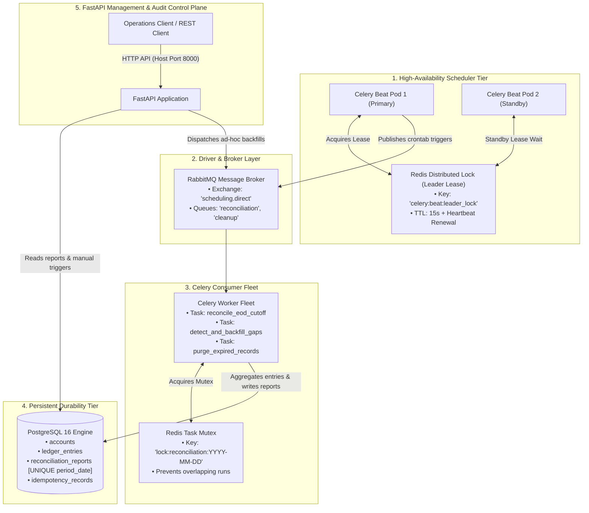
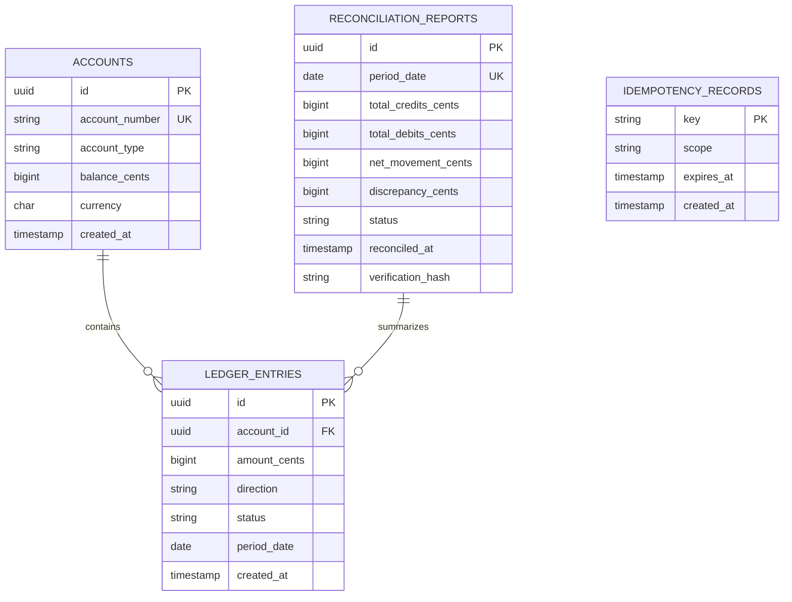
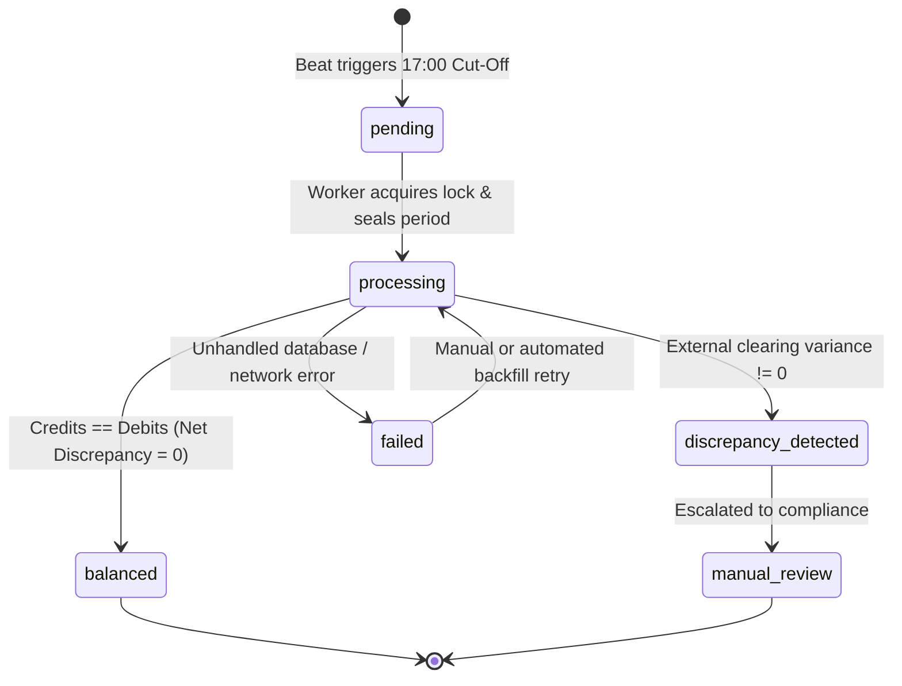
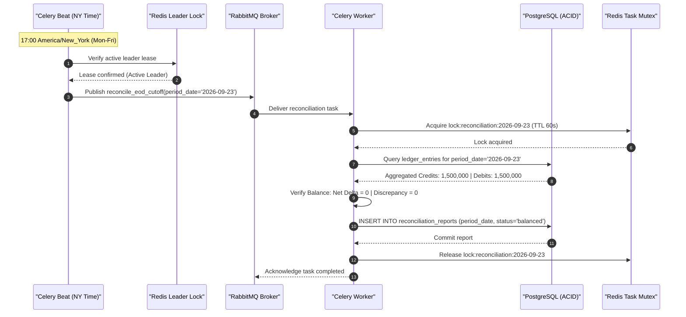
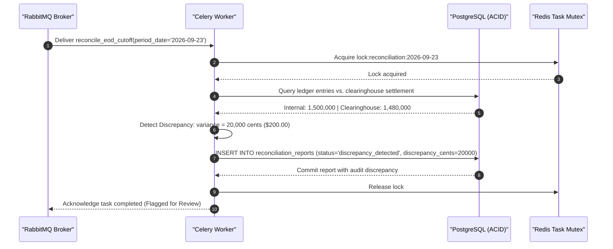
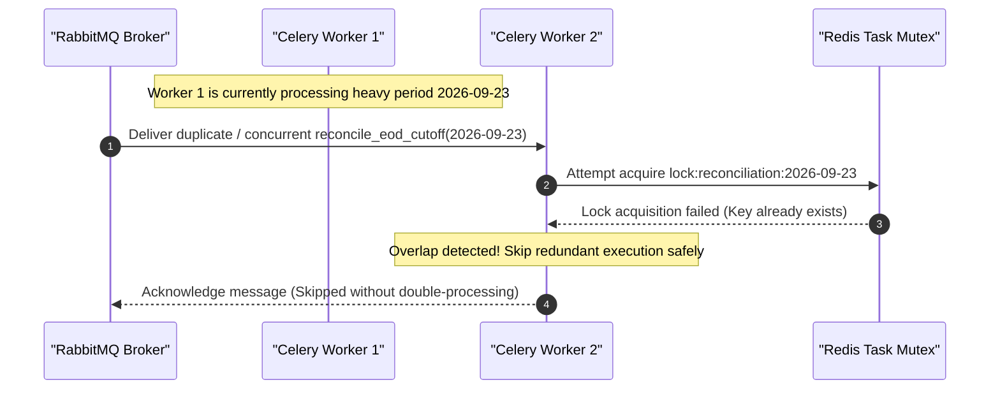
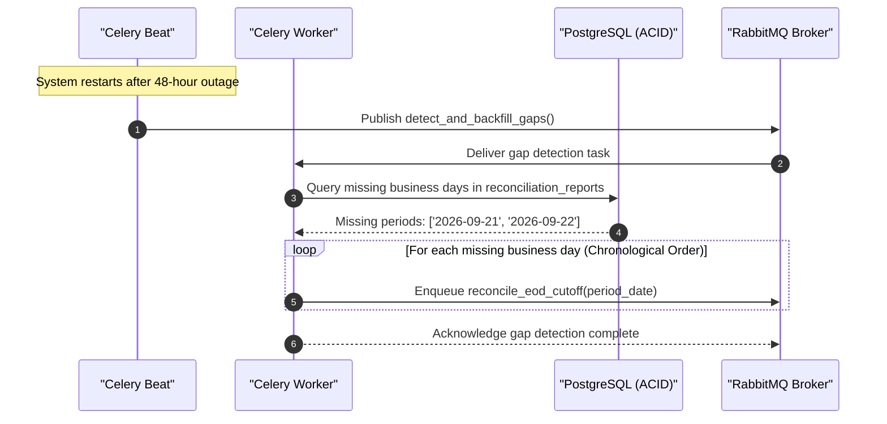
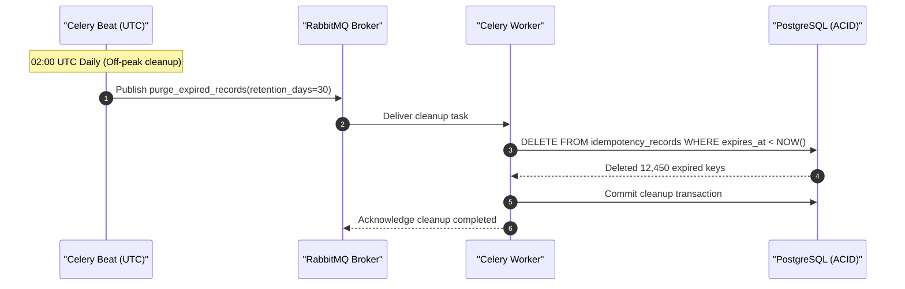

# 04: Scheduling

Build a scheduled reporting and cleanup service with Celery Beat.

## Deliverables

- Periodic tasks with explicit timezone behavior.
- Idempotent report generation for each reporting period.
- A lock or durable uniqueness strategy for multiple Beat instances.
- Tests for missed schedules, duplicate delivery, and overlapping runs.

## Evidence

Document the scheduler deployment model and how you detect and recover from missed work.

---

## Project Definition: End-of-Day (EOD) Banking Cut-Off & Ledger Reconciliation Engine

Build a mission-critical financial scheduling and reconciliation service modeled after modern corporate banking platforms, treasury ledger systems, and payment institutions (e.g., **Stripe Treasury**, **Modern Treasury**, **Federal Reserve Fedwire/ACH Services**).

In commercial banking and fintech infrastructure, ledger accounts cannot remain open indefinitely. Every financial institution enforces an **End-of-Day (EOD) cut-off window**:
1. At **17:00 America/New_York** on banking days (Monday through Friday), the active business transaction ledger is sealed for the date `YYYY-MM-DD`.
2. All debits and credits posted prior to 17:00 are aggregated into an immutable financial period snapshot.
3. The internal ledger aggregates are cross-reconciled against simulated external clearinghouse settlement records.
4. An idempotent **Daily Reconciliation Report** is generated and signed with cryptographic totals.
5. In addition to daily financial closing, the scheduler executes automated **missed-period gap backfilling** after unexpected system downtime and runs a **nightly data retention cleanup** to purge expired idempotency keys and stale audit data.

### The Central Architectural Invariants
> 1. Financial scheduling must respect legal banking market timezones (`America/New_York`) across Daylight Saving Time (EST/EDT) boundaries without drift.
> 2. Daily reconciliation reports must be strictly idempotent: running repeatedly for the same business date must re-verify ledger balance without creating duplicate reports or double-counting transactions.
> 3. Redundant Celery Beat instances must coordinate via distributed locks to guarantee exactly-once schedule dispatching in multi-pod deployments.
> 4. Overlapping runs for the same reporting window must be blocked, and missed cut-offs after downtime must be detected and backfilled sequentially.

---

## 1. System Architecture

### Component Responsibilities

| Component | Responsibility |
| :--- | :--- |
| **Celery Beat (Leader-Elected)** | Evaluates periodic cron expressions in `America/New_York` timezone; acquires a distributed Redis leader lease to prevent redundant task dispatching across multi-replica deployments. |
| **RabbitMQ** | Delivers scheduled and ad-hoc task messages to specialized worker queues (`reconciliation`, `cleanup`). |
| **Celery Worker** | Consumes periodic triggers, acquires per-period execution locks, freezes ledger periods, aggregates minor-unit credits/debits, and generates reconciliation reports. |
| **PostgreSQL 16** | Stores double-entry ledger entries, accounts, signed daily reconciliation reports (enforcing `UNIQUE (period_date)`), and idempotency tracking records. |
| **Redis 7** | Acts as the Celery result backend, coordinates distributed Beat leader election (`celery:beat:leader_lock`), and manages task-level concurrency mutexes (`lock:reconciliation:{period_date}`). |
| **FastAPI** | Exposes operational REST endpoints for inspecting historical reconciliation reports, auditing unclosed period gaps, triggering manual backfills, and health checks. |

---

## 2. Deliverables Mapping

| Deliverable | Implementation in System |
| :--- | :--- |
| **Explicit Timezone & DST Behavior** | • Celery Beat configured with `timezone = "America/New_York"`. • Cut-off crontab: `crontab(hour=17, minute=0, day_of_week='mon-fri')`. • In EDT (Summer), fires at 21:00 UTC. In EST (Winter), fires at 22:00 UTC. Zero hour-drift across DST boundaries. • Database timestamps and internal storage remain strictly UTC. |
| **Idempotent Report Generation** | • Daily reports keyed by business date `YYYY-MM-DD`. • Database enforces `UNIQUE (period_date)`. • Re-running for an already-reconciled period performs an in-place verification update rather than creating duplicate entries. |
| **Durable Beat Uniqueness / Leader Lock** | • Multi-instance Beat protection using Redis atomic lease (`SET NX EX`) with periodic TTL renewal. • If the primary Beat instance terminates, standby Beat takes over within 15 seconds without duplicate dispatching. |
| **Overlapping Run Protection** | • Worker task acquires a Redis mutex `lock:reconciliation:{period_date}` with fencing token. • If a previous reconciliation is still processing, subsequent triggers gracefully defer or skip execution rather than colliding. |
| **Missed Schedule & Downtime Backfill** | • Scheduled heartbeat & startup detector queries PostgreSQL for unclosed business days between `last_reconciled_date` and `today`. • Sequentially dispatches missing daily reconciliation tasks in chronological order. |
| **Periodic Data Cleanup** | • Nightly cleanup task: `crontab(hour=2, minute=0)` in UTC. • Purges expired idempotency keys and transient audit logs older than the configured retention threshold (e.g. 30 days). |

---

## 3. Data Models & State Machine

### Reconciliation Report State Machine

---

## 4. Sequence Diagrams (All Execution Paths)

### Path 1: Happy Path EOD Cut-off & Balanced Reconciliation

### Path 2: Discrepancy Detected During Clearing Reconciliation

### Path 3: Overlapping Run Prevention (Task Mutex)

### Path 4: Missed Schedule & Downtime Backfill Recovery

### Path 5: Nightly Idempotency & Audit Data Cleanup

---

## 5. Scheduler Deployment Model & High Availability

In containerized and orchestrated environments (e.g. Kubernetes, Docker Compose):
1. **The Multi-Beat Problem**: Running multiple Celery Beat replicas for high availability leads to duplicate crontab dispatches unless a leader election mechanism coordinates them.
2. **Distributed Leader Lease Strategy**:
   - Each Beat pod attempts to acquire a Redis lease (`SET celery:beat:leader_lock <pod_id> NX EX 15`).
   - The primary instance runs a background heartbeat thread renewing the lease every 5 seconds.
   - If the active Beat pod crashes or loses network connectivity, the lease expires after 15 seconds.
   - The standby Beat pod acquires the lease and assumes scheduler duties with zero manual intervention.

---

## Completion Checklist

- [ ] Celery Beat crontab scheduled in `America/New_York` timezone for 17:00 cut-off.
- [ ] Explicit handling of Daylight Saving Time (EDT vs EST) verified by automated tests.
- [ ] Database unique constraint `UNIQUE (period_date)` enforces idempotent report generation.
- [ ] Re-running a completed period performs verification update without duplicate records.
- [ ] Redis distributed leader lock ensures single-active scheduler across multiple Beat instances.
- [ ] Redis task mutex prevents overlapping executions for the same reporting period.
- [ ] Gap detection task identifies missing past business days and sequentially triggers backfills.
- [ ] Nightly scheduled task purges expired idempotency records.
- [ ] FastAPI control plane exposes endpoints to inspect reports, trigger backfills, and seed test data.
- [ ] Pytest suite achieves 100% statement and branch coverage with Testcontainers.
- [ ] All Mermaid architectural diagrams validated with `python3 scripts/verify_mermaid.py`.
