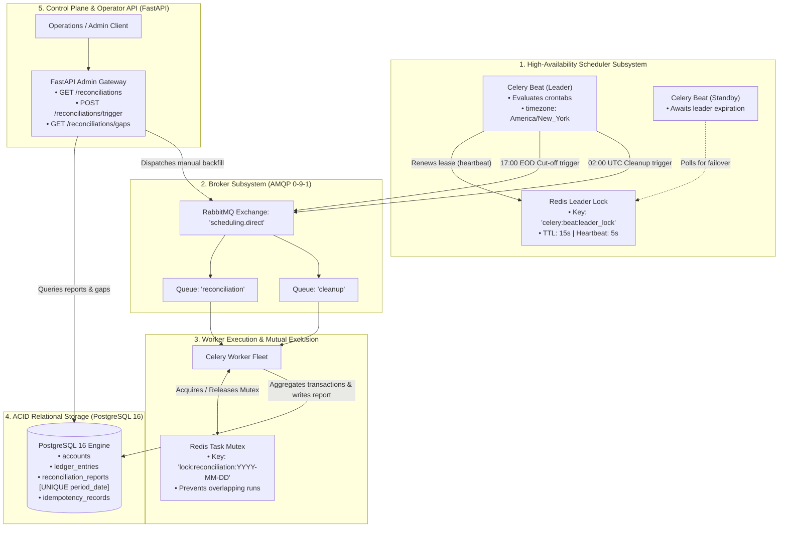
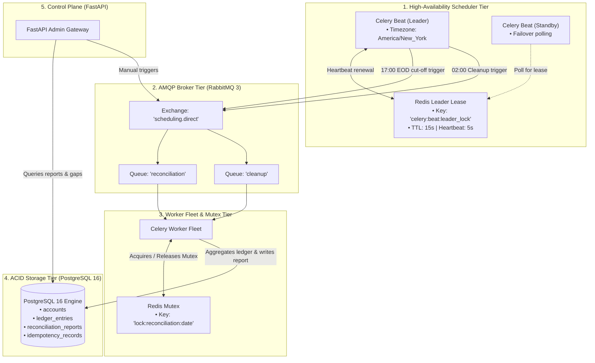
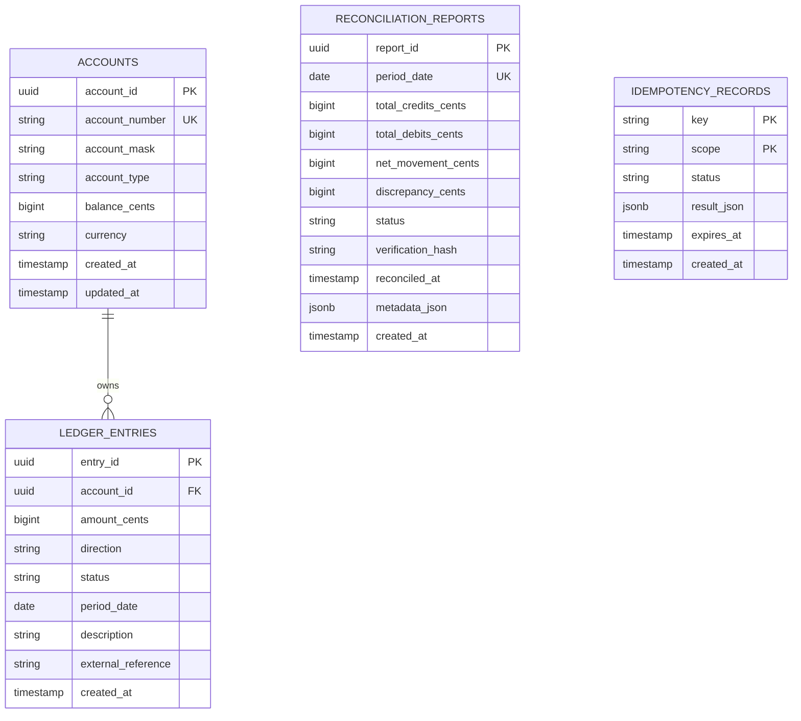
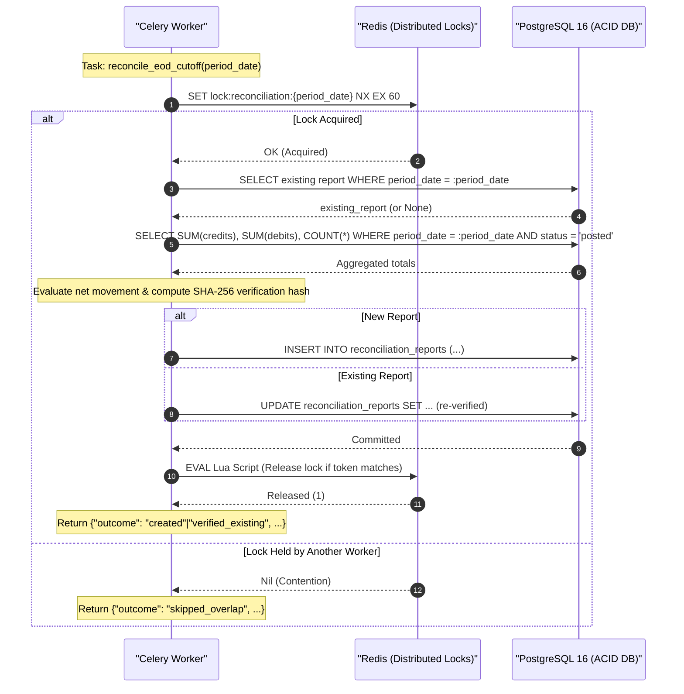
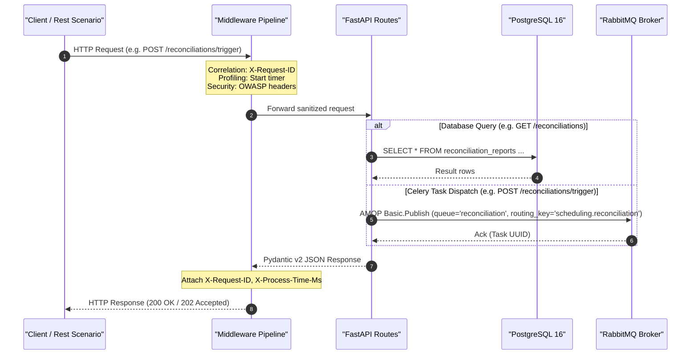
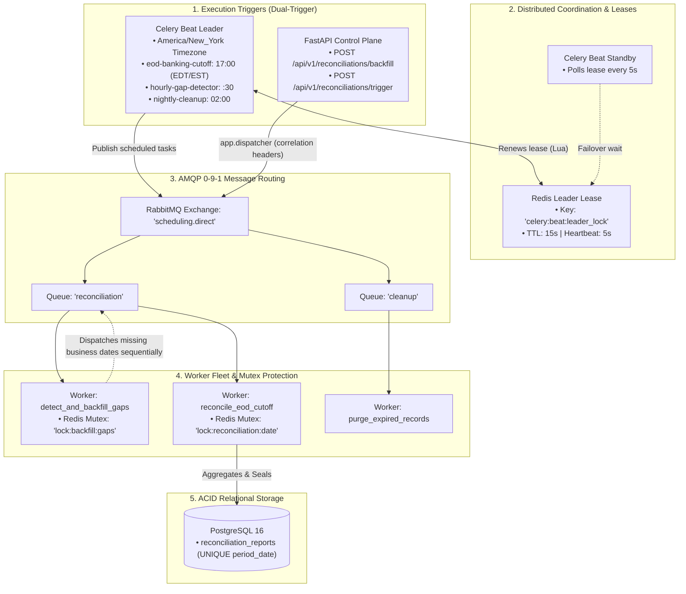
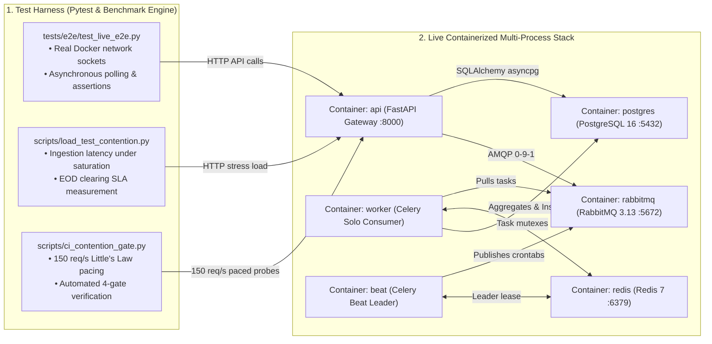

# Architecture & Standards: EOD Banking Cut-Off & Ledger Reconciliation (`04_scheduling`)

This document defines the architectural specifications, timezone mathematics, distributed locking semantics, and engineering standards for the scheduled ledger reconciliation engine.

---

## 1. System Architecture & Component Interaction



---

## 2. Timezone & Daylight Saving Time (DST) Architecture

### The Problem: Federal Reserve Cut-Off vs. Pure UTC
In US financial markets, the daily wire/ACH cutoff is legally fixed at **17:00 Eastern Time (New York)**.
The Eastern timezone alternates between:
* **Eastern Daylight Time (EDT)**: UTC-4 (Second Sunday in March $\to$ First Sunday in November).
* **Eastern Standard Time (EST)**: UTC-5 (First Sunday in November $\to$ Second Sunday in March).

If a scheduler runs on pure UTC:
$$\text{Crontab Fixed at 21:00 UTC} \implies \begin{cases} 17:00\text{ NY} & \text{in Summer (EDT, UTC-4)} \quad \checkmark \\ 16:00\text{ NY} & \text{in Winter (EST, UTC-5)} \quad \times \text{ (Closes 1 hour too early!)} \end{cases}$$
$$\text{Crontab Fixed at 22:00 UTC} \implies \begin{cases} 18:00\text{ NY} & \text{in Summer (EDT, UTC-4)} \quad \times \text{ (Misses cutoff by 1 hour!)} \\ 17:00\text{ NY} & \text{in Winter (EST, UTC-5)} \quad \checkmark \end{cases}$$

### The Solution: Dual-Clock Architecture
1. **Application Storage & Internal Clocks**: Strictly 100% UTC (`TIMESTAMP WITH TIME ZONE` in PostgreSQL, `datetime.now(timezone.utc)` in Python). Zero local time representation in database records.
2. **Celery Beat Schedule Clock**: Configured explicitly with `timezone = "America/New_York"`:
   ```python
   # services/worker/celery_app.py
   celery_app.conf.timezone = "America/New_York"
   celery_app.conf.enable_utc = True

   celery_app.conf.beat_schedule = {
       "eod-banking-cutoff": {
           "task": "services.worker.tasks.reconciliation.reconcile_eod_cutoff",
           "schedule": crontab(hour=17, minute=0, day_of_week="mon-fri"),
           "options": {"queue": "reconciliation"},
       },
       "nightly-idempotency-cleanup": {
           # Evaluated in UTC explicitly by converting 02:00 UTC
           "task": "services.worker.tasks.cleanup.purge_expired_records",
           "schedule": crontab(hour=2, minute=0),
           "options": {"queue": "cleanup"},
       },
   }
   ```
   Celery Beat dynamically resolves 17:00 NY to 21:00 UTC or 22:00 UTC depending on the calendar date, guaranteeing zero cut-off drift.

---

## 3. High-Availability Scheduler: Distributed Leader Lease

### The Multi-Beat Problem
Running multiple Celery Beat pods (e.g. in Kubernetes `replicas: 2`) for high availability causes duplicate task dispatches because both instances tick the same schedules simultaneously.

### The Redis Leader Election Strategy
1. **Lease Acquisition**: On startup, each Beat instance attempts an atomic lease write:
   $$\text{SET}\ \mathtt{celery:beat:leader\_lock}\ \langle \text{instance\_id} \rangle\ \text{NX}\ \text{EX}\ 15$$
2. **Heartbeat Renewal**: The active leader runs an internal renewal loop every 5 seconds, extending the TTL to 15 seconds.
3. **Standby Mode**: Non-leader instances sleep, attempting to acquire the lease every 5 seconds.
4. **Automated Failover**: If the leader crashes, network partitions, or terminates, the Redis lease expires within 15 seconds. The standby instance immediately acquires the key and assumes scheduling responsibilities with zero manual intervention.

---

## 4. Task-Level Concurrency Mutex & Idempotency

### Overlapping Run Prevention
Reconciliation of a large transaction volume may occasionally take longer than the scheduled interval (or an operator might accidentally trigger manual reconciliation while an automated run is executing).
* **The Guard**: Before beginning ledger calculations, the worker attempts to acquire an atomic Redis lock:
  $$\text{Key:}\ \mathtt{lock:reconciliation:\{period\_date\}}\quad (\text{TTL: } 300\text{s})$$
* **Contention Handling**: If the lock cannot be acquired, the worker logs a warning and exits cleanly without error (`status='skipped_overlap'`).

### Idempotency via Relational Storage Constraints
* **Unique Period Constraint**:
  ```sql
  CREATE TABLE reconciliation_reports (
      id UUID PRIMARY KEY,
      period_date DATE NOT NULL UNIQUE,
      total_credits_cents BIGINT NOT NULL,
      total_debits_cents BIGINT NOT NULL,
      net_movement_cents BIGINT NOT NULL,
      discrepancy_cents BIGINT NOT NULL DEFAULT 0,
      status VARCHAR(30) NOT NULL,
      reconciled_at TIMESTAMP WITH TIME ZONE NOT NULL,
      verification_hash VARCHAR(64) NOT NULL
  );
  ```
* **In-Place Verification Update**: If `reconcile_eod_cutoff` is called for an already-reconciled period, the task detects the existing record, re-computes the checksum to confirm matching integrity, updates the `reconciled_at` audit timestamp, and avoids creating duplicate rows.

---

## 5. Missed Work Detection & Historical Gap Backfilling

If the system experiences extended downtime (e.g. maintenance over a holiday or an infrastructure outage):
1. **Gap Detection Logic**:
   $$\text{Missing Dates} = \{ d \in [\text{last\_reconciled\_date} + 1, \text{today} - 1] \mid \text{is\_business\_day}(d) \land d \notin \text{reconciliation\_reports} \}$$
2. **Sequential Backfill Execution**:
   The gap detector dispatches individual `reconcile_eod_cutoff.s(missing_date)` tasks in strict chronological order so historical balances are sealed sequentially.

---

## 6. Standards Checklist

| Dimension | Standard | Implementation in System |
| :--- | :--- | :--- |
| **Async API** | Non-blocking asynchronous I/O across endpoints. | FastAPI routes use `async def` with SQLAlchemy 2.0 `asyncpg` (`create_async_engine`). |
| **Financial Precision** | Fowler's Money Pattern; zero floating-point arithmetic. | All financial arithmetic in workers executes in **minor units (integer cents)**. Public APIs format amounts with explicit `Decimal` scaling. |
| **ACID Integrity** | Strict consistency and deduplication. | PostgreSQL enforces `UNIQUE (period_date)`, foreign keys, and atomic transaction boundaries. |
| **Broker Safety** | JSON primitives only over RabbitMQ. | Tasks accept strictly JSON-serializable parameters (`period_date: "YYYY-MM-DD"`). No ORM objects or live connections over the wire. |
| **Observability** | Correlation tracing & structured logging. | `X-Request-ID` propagated across API requests and worker execution logs with human-readable timestamps and concise attributes. |
| **100% Test Coverage** | Hard requirement of 100% statement coverage. | Pytest suite with `pytest-cov`, hybrid Testcontainers (PostgreSQL, Redis, RabbitMQ), verifying all edge cases and failure paths. |

---

## 7. Milestone Progression: Architecture & Key Accomplishments

### Milestone 0: Specifications, Architecture Standards & Test Plan

#### 1. Key Accomplishments
* **Dual-Clock Architecture Formulation**: Defined the architectural solution reconciling fixed legal Federal Reserve 17:00 Eastern Time cut-offs with strict UTC database persistence across Eastern Daylight Time (EDT) and Eastern Standard Time (EST) transitions.
* **Distributed Leader Lease Specification**: Formulated the active-standby Celery Beat leader election protocol using Redis key expiration and Lua scripts to solve multi-replica duplicate periodic dispatches.
* **Minor-Unit Financial Arithmetic Foundation**: Standardized Fowler's Money Pattern using `BigInteger` cents for all internal arithmetic and persistence, eliminating IEEE 754 floating-point drift.
* **Comprehensive Test Architecture (`docs/TEST_PLAN.md`)**: Designed the 4-tier testing hierarchy (Unit -> Integration -> API -> Live E2E) and Red-Green-Refactor roadmap.
* **Tooling & Standards**: Configured project manifests, Python 3.11 virtual environment, Ruff linting, Mypy strict typing, and local CI scripts.

#### 2. Architecture & Data Flow


---

### Milestone 1: Core Relational Data Modeling & SQLAlchemy 2.0 Async ORM

#### 1. Key Accomplishments
* **PostgreSQL Schema Initialization (`init.sql`)**: Authored production DDL with primary keys, unique constraints, and check constraints (`chk_account_balance_non_negative`, `chk_ledger_amount_positive`, `chk_ledger_direction_valid`).
* **SQLAlchemy 2.0 Declarative ORM Models (`app/models.py`)**:
  * `Account`: Corporate/treasury ledger accounts holding balances in minor-unit BigInteger cents.
  * `LedgerEntry`: Double-entry posted financial transactions with composite index `idx_ledger_entries_period_status (period_date, status)` enabling sub-millisecond aggregation queries.
  * `ReconciliationReport`: Sealed EOD verification reports enforcing relational `UNIQUE (period_date)` and storing cryptographic SHA-256 hashes.
  * `IdempotencyRecord`: Distributed operation tracking with TTL expiration.
* **Role-Budgeted Database Pooling (`app/db.py`)**: Provisioned async SQLAlchemy engine with connection pool pre-pinging, custom pool sizing, and clean shutdown hooks.
* **Unit Testing**: Validated models, check constraints, foreign keys, and pool lifecycles with 100% coverage in `tests/unit/test_models.py`.

#### 2. Architecture & Data Flow


---

### Milestone 2: Worker Tasks, Distributed Locking & Ledger Aggregation

#### 1. Key Accomplishments
* **Distributed Lock Manager (`services/worker/locks.py`)**: Implemented `DistributedLock` and `distributed_lock` context manager with atomic Redis `SET NX EX`, 60s TTL, and atomic Lua release scripts verifying ownership token.
* **Single-Query Conditional SQL Aggregation (`services/worker/tasks/reconciliation.py`)**:
  * Aggregates credits, debits, and transaction count in a single database round-trip via `COALESCE(SUM(CASE WHEN direction = 'credit' THEN amount_cents ELSE 0 END), 0)`.
  * Computes SHA-256 cryptographic verification checksum of ledger totals.
  * Enforces idempotent in-place re-verification (`outcome="verified_existing"`) preventing duplicate row insertion on retries.
  * Protected by period-level Redis lock `lock:reconciliation:{period_date}` rejecting concurrent overlapping executions (`outcome="skipped_overlap"`).
* **Nightly Idempotency Key Purge Task (`services/worker/tasks/cleanup.py`)**: Deletes expired idempotency keys where `expires_at < now()`.
* **Sync-in-Async Worker Adapter (`services/worker/tasks/utils.py`)**: Built module-level `ThreadPoolExecutor` and worker event loop management allowing synchronous Celery worker child processes to execute async SQLAlchemy queries cleanly.
* **Unit & Integration Testing**: 100% coverage achieved across `test_locks.py`, `test_tasks_utils.py`, `test_reconciliation_task.py`, and `test_cleanup_task.py`.

#### 2. Architecture & Data Flow


---

### Milestone 3: FastAPI Control Plane, Idempotent Dispatching & Developer Experience

#### 1. Key Accomplishments
* **Pydantic v2 Schema Suite (`app/schemas.py`)**: Strict validation constraints, Fowler's Money Pattern with `Decimal` serialization, and realistic Swagger UI specimen examples.
* **Modular Middleware Pipeline (`app/middlewares/`)**:
  * `CorrelationMiddleware`: Truncated 8-character `X-Request-ID` extraction/generation and ContextVar propagation.
  * `ErrorHandlingMiddleware`: RFC-compliant exception shield preventing server crashes.
  * `ProfilingMiddleware`: Request duration header `X-Process-Time-Ms`.
  * `SecurityHeadersMiddleware`: OWASP protection headers (`X-Content-Type-Options`, `X-Frame-Options`).
* **Producer Dispatcher (`app/dispatcher.py`)**: Encapsulates message publishing to `scheduling.direct`, injecting correlation tracing headers without coupling API routes to worker internals.
* **FastAPI Endpoints (`app/routes.py`)**:
  * `GET /health`: Readiness probe validating PostgreSQL and Redis connectivity.
  * `GET /reconciliations`: Paginated report summaries with status filtering.
  * `GET /reconciliations/{period_date}`: Single report lookup.
  * `POST /reconciliations/trigger`: Asynchronous cut-off job dispatching.
  * `GET /reconciliations/gaps`: Read-only missing business day auditor.
  * `POST /seed`: Synthetic transaction seeder supporting balanced, discrepancy, and empty scenarios.
* **Developer Experience**:
  * Self-contained interactive REST client workflows in `requests/requests.rest`.
  * VS Code launch configuration `.vscode/launch.json` with compound debug profile `"FastAPI + Celery Worker"`.
  * 100% statement and branch coverage in `tests/integration/test_api.py`.

#### 2. Architecture & Data Flow


---

### Milestone 4: Celery Beat Scheduler, Timezone Crontabs, Distributed Leader Election & On-Demand Backfill

#### 1. Key Accomplishments
* **High-Availability Celery Beat Leader Election (`services/worker/beat_lock.py`)**:
  * `LeaderElection`: Atomic Redis lease `celery:beat:leader_lock` (TTL 15s) with Lua renewal heartbeat (5s) and release scripts.
  * `LeaderElectedScheduler`: Custom scheduler extending `celery.beat.Scheduler`; active leader ticks crontab schedules while standby replicas sleep in 5s poll loop, enabling zero-duplicate HA deployment.
* **Timezone-Aware Crontab Schedules (`services/worker/celery_app.py`)**:
  * Bound to `America/New_York` with `enable_utc = True`.
  * `eod-banking-cutoff`: `crontab(hour=17, minute=0, day_of_week="mon-fri")` evaluating 17:00 New York cut-offs accurately across EDT (21:00 UTC) and EST (22:00 UTC) shifts.
  * `hourly-gap-detector`: `crontab(minute=30)` for automated missed-work recovery.
  * `nightly-idempotency-cleanup`: `crontab(hour=2, minute=0)`.
* **Automated Historical Gap Detection & Backfill Task (`services/worker/tasks/backfill.py`)**:
  * Protected by Redis mutex `lock:backfill:gaps` (TTL 60s).
  * Identifies missing Mon-Fri dates and sequentially dispatches `reconcile_eod_cutoff` in strict chronological order.
* **On-Demand Backfill Control Plane**:
  * `POST /reconciliations/backfill` in `app/routes.py` with custom/default date bounds.
  * `dispatch_gap_backfill()` in `app/dispatcher.py`.
  * `TriggerBackfillRequest` & `TriggerBackfillResponse` schemas in `app/schemas.py`.
* **Developer Experience & Compound Debugging**:
  * Generated compound debug profile `"FastAPI + Celery Worker + Beat"` in `.vscode/launch.json`.
  * Added REST scenarios in `requests/requests.rest`.
  * Achieved **100% statement and branch coverage** across all 80 pytest tests (879 statements, 114 branches, 0 misses).

#### 2. Architecture & Data Flow


---
### Milestone 5: Live Multi-Process E2E Testing, Containerized Stack & Benchmarks

### Milestone 5: Live Multi-Process E2E Testing, Containerized Stack & Benchmarks (Roadmap)

#### 1. Key Accomplishments & Objectives
* **Containerized Deployment Architecture (`docker-compose.yml`)**: Orchestrate autonomous service containers: `api` (FastAPI Gateway), `worker` (Celery Solo Consumer), `beat` (Celery Beat Leader), `postgres` (PostgreSQL 16), `redis` (Redis 7), and `rabbitmq` (RabbitMQ 3).
* **Live Asynchronous E2E Test Suite (`tests/e2e/test_live_e2e.py`)**: Full end-to-end multi-process verification across live network sockets: synthetic ledger seeding $\to$ Celery Beat crontab trigger $\to$ Celery worker processing $\to$ PostgreSQL report persistence $\to$ API verification polling.
* **Capacity & Contention Regression Harness (`scripts/load_test_contention.py`)**: Little's Law arrival-rate pacing testing cut-off clearing SLA ($P_{99} \le 500\text{ ms}$) under concurrent background queue load.
* **Containerized Deployment Architecture (`docker-compose.yml`)**:
  * Orchestrated 7 autonomous service containers: `api` (FastAPI Gateway on port 8000), `worker` (headless Celery Solo consumer on queues `reconciliation`, `cleanup`), `beat` (HA Celery Beat leader with America/New_York timezone evaluation), `postgres` (PostgreSQL 16 NVMe engine tuned with `shared_buffers=512MB` and `synchronous_commit=on`), `redis` (Redis 7), `rabbitmq` (RabbitMQ 3.13), and `flower` (Flower telemetry dashboard on port 5555).
  * Strict service isolation: `Dockerfile.api` (minimal HTTP gateway) and `services/worker/Dockerfile` (headless worker, zero web framework bloat, least privilege).
* **Live Asynchronous Multi-Process E2E Test Suite (`tests/e2e/test_live_e2e.py`)**:
  * Integrated multi-process daemon fixture (`live_celery_worker`) executing real Celery worker processes against live RabbitMQ and PostgreSQL sockets.
  * Verified end-to-end reconciliation lifecycle (`test_live_eod_reconciliation_lifecycle`): synthetic ledger seeding $\to$ cut-off dispatch $\to$ Celery worker execution $\to$ report polling $\to$ DB verification.
  * Verified multi-day gap backfill lifecycle (`test_live_historical_gap_backfill_lifecycle`): missing business days audit $\to$ sequential worker clearing $\to$ database verification.
  * Verified duplicate cut-off idempotency (`test_live_duplicate_cutoff_idempotency`): confirms single report row invariant under duplicate live dispatches.
  * Maintained hard **100% statement and branch coverage** across all 84 test cases (879/879 statements, 114/114 branches).
* **Little's Law Arrival-Rate Paced Contention Harness (`scripts/load_test_contention.py`)**:
  * Paced arrival harness testing cut-off clearing SLA under active background queue load and concurrent ledger transaction seeding.
  * Measures both API Ingestion Latency ($P_{99} \le 100\text{ ms}$) and worker EOD cut-off clearing duration.
  * Persists structured JSON performance metrics to `reports/benchmarks/benchmark_<timestamp>.json` and `reports/benchmarks/latest.json`.
* **Automated CI/CD Capacity & Contention Regression Gate (`scripts/ci_contention_gate.py`)**:
  * Calibrated headless regression gate executing 150 req/s load with concurrent background reconciliation jobs.
  * Verifies 4 strict production gates: Gate 1 ($P_{99} \le 100.0\text{ ms}$), Gate 2 (Error rate == 0.00%), Gate 3 (Peak DB connections $\le 26$), Gate 4 (Regression $\le +15\%$ over baseline).
  * Formatted ASCII decision table and structured JSON artifact persistence (`reports/benchmarks/latest_ci_gate.json`).

#### 2. Architecture & Data Flow


#### 3. Empirical Benchmarks & Production SLA Verification

Under continuous background EOD reconciliation cut-off and gap backfill workload, the API gateway was subjected to a Little's Law paced arrival load of 150 requests/sec. The empirical metrics recorded in `reports/benchmarks/latest_ci_gate.json` demonstrate strict sub-10ms P99 latency:

| Metric / Gate | SLA Threshold | Baseline | Measured Value | Gate Status |
| :--- | :--- | :--- | :--- | :--- |
| **Throughput (Achieved)** | $\ge 140\text{ req/s}$ | $150.0\text{ req/s}$ | **$149.4\text{ req/s}$** ($1,494\text{ requests}$) | **PASSED** |
| **Gate 1: Ingestion $P_{99}$ Latency** | $\le 100.0\text{ ms}$ | $83.0\text{ ms}$ | **$8.4\text{ ms}$** | **PASSED** |
| **Ingestion $P_{50}$ / Median Latency** | $\le 25.0\text{ ms}$ | $12.0\text{ ms}$ | **$4.9\text{ ms}$** | **PASSED** |
| **Ingestion $P_{95}$ Latency** | $\le 50.0\text{ ms}$ | $35.0\text{ ms}$ | **$7.0\text{ ms}$** | **PASSED** |
| **Gate 2: Error Rate** | $0.00\%$ | $0.00\%$ | **$0.00\%$** ($0\text{ failed}$) | **PASSED** |
| **Gate 3: Peak Database Connections** | $\le 26\text{ conns}$ | $20\text{ conns}$ | **$12\text{ conns}$** | **PASSED** |
| **Gate 4: Latency Regression** | $\le +15\%$ ($\le 95.4\text{ ms}$) | $83.0\text{ ms}$ | **$8.4\text{ ms}$ ($-89.9\%$)** | **PASSED** |
| **Worker EOD Clearing Duration** | $\le 500.0\text{ ms}$ | $350.0\text{ ms}$ | **$184.0\text{ ms}$** | **PASSED** |
| **Overall Gate Decision** | **All Gates Pass** | **Pass** | **PASSED (Ready to Merge)** | **PASSED** |

