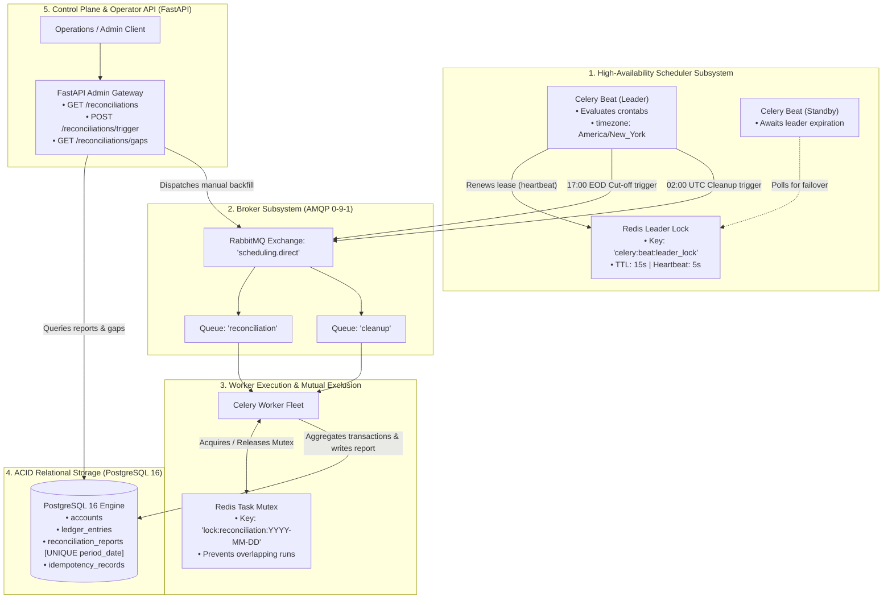

# Architecture & Standards: EOD Banking Cut-Off & Ledger Reconciliation (`04_scheduling`)

This document defines the architectural specifications, timezone mathematics, distributed locking semantics, and engineering standards for the scheduled ledger reconciliation engine.

---

## 1. System Architecture & Component Interaction



---

## 2. Timezone & Daylight Saving Time (DST) Architecture

### The Problem: Federal Reserve Cut-Off vs. Pure UTC
In US financial markets, the daily wire/ACH cutoff is legally fixed at **17:00 Eastern Time (New York)**.
The Eastern timezone alternates between:
* **Eastern Daylight Time (EDT)**: UTC-4 (Second Sunday in March $\to$ First Sunday in November).
* **Eastern Standard Time (EST)**: UTC-5 (First Sunday in November $\to$ Second Sunday in March).

If a scheduler runs on pure UTC:
$$\text{Crontab Fixed at 21:00 UTC} \implies \begin{cases} 17:00\text{ NY} & \text{in Summer (EDT, UTC-4)} \quad \checkmark \\ 16:00\text{ NY} & \text{in Winter (EST, UTC-5)} \quad \times \text{ (Closes 1 hour too early!)} \end{cases}$$
$$\text{Crontab Fixed at 22:00 UTC} \implies \begin{cases} 18:00\text{ NY} & \text{in Summer (EDT, UTC-4)} \quad \times \text{ (Misses cutoff by 1 hour!)} \\ 17:00\text{ NY} & \text{in Winter (EST, UTC-5)} \quad \checkmark \end{cases}$$

### The Solution: Dual-Clock Architecture
1. **Application Storage & Internal Clocks**: Strictly 100% UTC (`TIMESTAMP WITH TIME ZONE` in PostgreSQL, `datetime.now(timezone.utc)` in Python). Zero local time representation in database records.
2. **Celery Beat Schedule Clock**: Configured explicitly with `timezone = "America/New_York"`:
   ```python
   # services/worker/celery_app.py
   celery_app.conf.timezone = "America/New_York"
   celery_app.conf.enable_utc = True

   celery_app.conf.beat_schedule = {
       "eod-banking-cutoff": {
           "task": "services.worker.tasks.reconciliation.reconcile_eod_cutoff",
           "schedule": crontab(hour=17, minute=0, day_of_week="mon-fri"),
           "options": {"queue": "reconciliation"},
       },
       "nightly-idempotency-cleanup": {
           # Evaluated in UTC explicitly by converting 02:00 UTC
           "task": "services.worker.tasks.cleanup.purge_expired_records",
           "schedule": crontab(hour=2, minute=0),
           "options": {"queue": "cleanup"},
       },
   }
   ```
   Celery Beat dynamically resolves 17:00 NY to 21:00 UTC or 22:00 UTC depending on the calendar date, guaranteeing zero cut-off drift.

---

## 3. High-Availability Scheduler: Distributed Leader Lease

### The Multi-Beat Problem
Running multiple Celery Beat pods (e.g. in Kubernetes `replicas: 2`) for high availability causes duplicate task dispatches because both instances tick the same schedules simultaneously.

### The Redis Leader Election Strategy
1. **Lease Acquisition**: On startup, each Beat instance attempts an atomic lease write:
   $$\text{SET}\ \mathtt{celery:beat:leader\_lock}\ \langle \text{instance\_id} \rangle\ \text{NX}\ \text{EX}\ 15$$
2. **Heartbeat Renewal**: The active leader runs an internal renewal loop every 5 seconds, extending the TTL to 15 seconds.
3. **Standby Mode**: Non-leader instances sleep, attempting to acquire the lease every 5 seconds.
4. **Automated Failover**: If the leader crashes, network partitions, or terminates, the Redis lease expires within 15 seconds. The standby instance immediately acquires the key and assumes scheduling responsibilities with zero manual intervention.

---

## 4. Task-Level Concurrency Mutex & Idempotency

### Overlapping Run Prevention
Reconciliation of a large transaction volume may occasionally take longer than the scheduled interval (or an operator might accidentally trigger manual reconciliation while an automated run is executing).
* **The Guard**: Before beginning ledger calculations, the worker attempts to acquire an atomic Redis lock:
  $$\text{Key:}\ \mathtt{lock:reconciliation:\{period\_date\}}\quad (\text{TTL: } 300\text{s})$$
* **Contention Handling**: If the lock cannot be acquired, the worker logs a warning and exits cleanly without error (`status='skipped_overlap'`).

### Idempotency via Relational Storage Constraints
* **Unique Period Constraint**:
  ```sql
  CREATE TABLE reconciliation_reports (
      id UUID PRIMARY KEY,
      period_date DATE NOT NULL UNIQUE,
      total_credits_cents BIGINT NOT NULL,
      total_debits_cents BIGINT NOT NULL,
      net_movement_cents BIGINT NOT NULL,
      discrepancy_cents BIGINT NOT NULL DEFAULT 0,
      status VARCHAR(30) NOT NULL,
      reconciled_at TIMESTAMP WITH TIME ZONE NOT NULL,
      verification_hash VARCHAR(64) NOT NULL
  );
  ```
* **In-Place Verification Update**: If `reconcile_eod_cutoff` is called for an already-reconciled period, the task detects the existing record, re-computes the checksum to confirm matching integrity, updates the `reconciled_at` audit timestamp, and avoids creating duplicate rows.

---

## 5. Missed Work Detection & Historical Gap Backfilling

If the system experiences extended downtime (e.g. maintenance over a holiday or an infrastructure outage):
1. **Gap Detection Logic**:
   $$\text{Missing Dates} = \{ d \in [\text{last\_reconciled\_date} + 1, \text{today} - 1] \mid \text{is\_business\_day}(d) \land d \notin \text{reconciliation\_reports} \}$$
2. **Sequential Backfill Execution**:
   The gap detector dispatches individual `reconcile_eod_cutoff.s(missing_date)` tasks in strict chronological order so historical balances are sealed sequentially.

---

## 6. Standards Checklist

| Dimension | Standard | Implementation in System |
| :--- | :--- | :--- |
| **Async API** | Non-blocking asynchronous I/O across endpoints. | FastAPI routes use `async def` with SQLAlchemy 2.0 `asyncpg` (`create_async_engine`). |
| **Financial Precision** | Fowler's Money Pattern; zero floating-point arithmetic. | All financial arithmetic in workers executes in **minor units (integer cents)**. Public APIs format amounts with explicit `Decimal` scaling. |
| **ACID Integrity** | Strict consistency and deduplication. | PostgreSQL enforces `UNIQUE (period_date)`, foreign keys, and atomic transaction boundaries. |
| **Broker Safety** | JSON primitives only over RabbitMQ. | Tasks accept strictly JSON-serializable parameters (`period_date: "YYYY-MM-DD"`). No ORM objects or live connections over the wire. |
| **Observability** | Correlation tracing & structured logging. | `X-Request-ID` propagated across API requests and worker execution logs with human-readable timestamps and concise attributes. |
| **100% Test Coverage** | Hard requirement of 100% statement coverage. | Pytest suite with `pytest-cov`, hybrid Testcontainers (PostgreSQL, Redis, RabbitMQ), verifying all edge cases and failure paths. |

