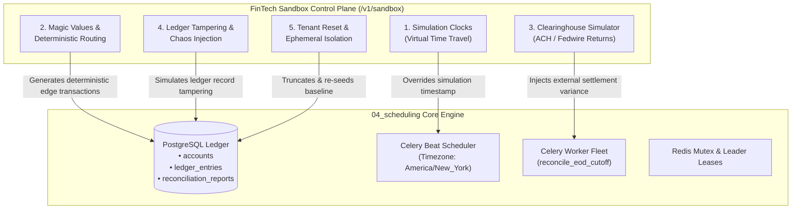
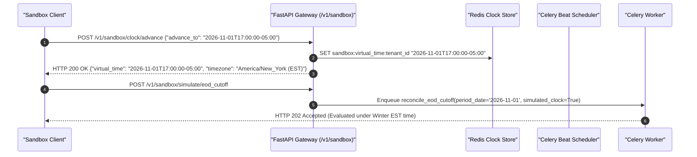
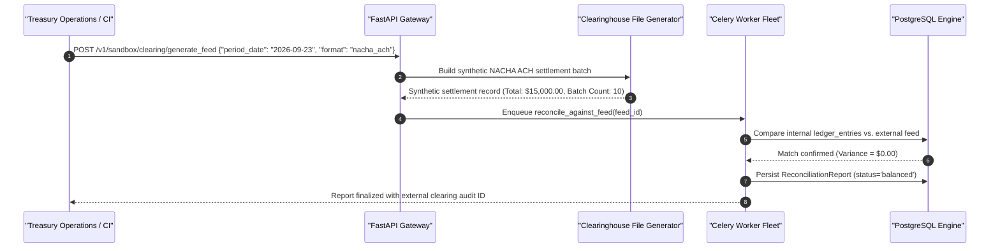
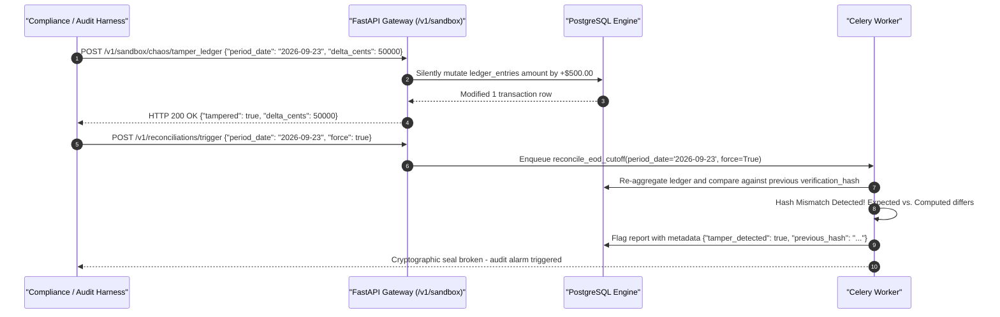

# FinTech Sandbox Standards & Architectural Proposals

This document outlines standard sandbox design patterns used in tier-1 financial technology institutions (e.g., **Stripe Treasury**, **Modern Treasury**, **Increase**, **Lithic**, **Plaid**) and proposes concrete architectural extensions for the `04_scheduling` ledger reconciliation platform.

---

## 1. Executive Summary

In commercial banking, corporate treasury, and clearinghouse integrations, client applications and developer teams cannot safely validate operational logic, edge cases, or disaster recovery in live production ledgers. 

While the current `04_scheduling` engine provisions a synthetic transaction seeder (`POST /seed`) and manual cut-off trigger (`POST /reconciliations/trigger`), enterprise FinTech platforms implement dedicated **Sandbox Simulation Subsystems** that allow developers to:
1. **Manipulate Time**: Warp business dates and test end-of-day cut-off windows without waiting for real-world wall-clock schedules.
2. **Trigger Deterministic Edge Cases**: Use magic numbers and payload tags to induce clearinghouse discrepancies, return codes, and network timeouts predictably.
3. **Simulate Partner Clearing Feeds**: Ingest simulated Fedwire, NACHA ACH, and ISO 20022 clearing files.
4. **Isolate and Reset State**: Cleanly purge test transactions and restore baseline ledger accounts on demand.
5. **Inject Ledger Chaos**: Intentionally tamper with posted transactions to test cryptographic SHA-256 seal verification.

---

## 2. Proposal 1: Virtual Time Travel & Simulation Clocks (`TestClock`)

### The Problem
The daily Federal Reserve / ACH cut-off is legally fixed at 17:00 America/New_York. In automated testing and customer sandbox environments, developers cannot wait 24 hours for Celery Beat's cron to trigger tomorrow's EOD cut-off, nor can they wait across Daylight Saving Time shifts (November/March) to verify calendar transitions.

### Proposed Architecture (Stripe `TestClock` Model)
Implement a scoped simulation clock subsystem enabling callers to simulate any arbitrary banking timestamp:

### Key Capabilities
* **`POST /api/v1/sandbox/clock`**: Create or inspect a virtual clock.
* **`POST /api/v1/sandbox/clock/advance`**: Fast-forward simulation time by $N$ seconds or jump directly to upcoming cut-off deadlines.
* **Header-Based Override**: Allow automated CI integration tests to inject `X-Simulation-Time: 2026-07-15T17:00:00-04:00` for deterministic per-request evaluation.

---

## 3. Proposal 2: Deterministic Magic Values & Clearing Codes

### The Problem
Testing failure modes (e.g. Fedwire return codes, clearinghouse variance, or network timeouts) currently requires manually calculating and passing `clearing_variance_cents`. In large integration suites, developers need self-documenting, deterministic triggers.

### Proposed Architecture (Stripe & Modern Treasury Magic Numbers)
Establish standardized magic numbers in `POST /seed` and transaction ingestion:

| Magic Cent Amount | Domain Scenario Triggered | Simulated Clearinghouse Behavior |
| :--- | :--- | :--- |
| **`$XX.00`** (e.g. `$1,500.00`) | Standard Happy Path | Clears cleanly with $0.00$ variance $\implies$ `status = 'balanced'`. |
| **`$XX.01`** (e.g. `$1,500.01`) | ACH Return `R01` (Insufficient Funds) | External clearinghouse returns transaction $\implies$ induces variance $\delta = \text{amount}$. |
| **`$XX.02`** (e.g. `$1,500.02`) | ACH Return `R02` (Account Closed) | External clearinghouse rejects account $\implies$ triggers compliance alert. |
| **`$XX.03`** (e.g. `$1,500.03`) | Wire Cut-Off Delay | Simulated partner network latency ($> 30\text{s}$) to test worker timeout handling. |
| **`$XX.99`** (e.g. `$1,500.99`) | Clearing Settlement Discrepancy | Injects automated \$200.00 discrepancy $\implies$ `status = 'discrepancy_detected'`. |

### Magic External References
* `REF_FORCE_TIMEOUT`: Causes synthetic clearinghouse client to simulate an `HTTP 504 Gateway Timeout`.
* `REF_FORCE_MUTEX_DELAY`: Instructs worker to hold the Redis task lock for 5 seconds to test concurrent lock contention (`outcome = 'skipped_overlap'`).

---

## 4. Proposal 3: External Clearinghouse Feed Simulator & Ingestion

### The Problem
In real-world institutional banking, reconciliation occurs against external settlement files transmitted overnight via SFTP or AS2 (e.g., Federal Reserve Fedwire files, NACHA ACH settlement entries, or BAI2 / CAMT.053 bank statement feeds).

### Proposed Architecture
Provide a simulated clearinghouse feed generator:

### Standard File Formats
1. **NACHA ACH Files**: Standard 94-character fixed-width batch settlement records.
2. **BAI2 / CAMT.053**: Standard corporate treasury balance and transaction reporting format.
3. **Fedwire Message Format**: Tagged message blocks (`{1510}`, `{2000}`, `{3400}`).

---

## 5. Proposal 4: Ledger Chaos & Cryptographic Tamper Injection

### The Problem
How can compliance auditors verify that the SHA-256 verification hash actually detects database corruption or unauthorized ledger tampering?

### Proposed Architecture
Expose an explicit, sandbox-only chaos endpoint:

---

## 6. Proposal 5: Tenant-Scoped Sandboxed Reset & Baseline Seeding

### The Problem
During automated test runs or manual operator QA, ledger transactions accumulate. Restarting Docker containers or dropping PostgreSQL databases destroys schema migration history and interrupts parallel test runners.

### Proposed Architecture
Provide tenant-isolated, transactional reset endpoints:

* **`POST /api/v1/sandbox/reset`**:
  - Truncates `ledger_entries`, `reconciliation_reports`, and `idempotency_records` within an atomic transaction.
  - Re-seeds baseline operational accounts:
    - `ACC-OPERATING-001` (Corporate Operating Account: \$100,000.00)
    - `ACC-SETTLEMENT-002` (Clearinghouse Settlement Transit: \$50,000.00)
    - `ACC-RESERVE-003` (Federal Reserve Minimum Reserve: \$250,000.00)
  - Flushes Redis lock keys matching `lock:reconciliation:*` and `lock:backfill:*`.
  - Leaves core database configuration and user tables untouched.

---

## 7. Comparative Assessment Matrix

| FinTech Standard Capability | Reference Platforms | Current `04_scheduling` Implementation | Proposed Sandbox Extension |
| :--- | :--- | :--- | :--- |
| **Synthetic Transaction Seeding** | Stripe / Modern Treasury | Supported via `POST /seed` (balanced, discrepancy, empty). | Enhance with magic number triggers (`$XX.01` return codes). |
| **Virtual Time Warping** | Stripe `TestClock`, Increase Simulators | Timezone-aware crontabs; fixed to server clock. | `POST /v1/sandbox/clock/advance` and `X-Simulation-Time` header. |
| **External Clearing Simulation** | Modern Treasury Clearing Simulator | Simulated via `clearing_variance_cents` integer argument. | NACHA / Fedwire synthetic batch feed generator. |
| **Deterministic Edge Triggers** | Lithic, Unit, Plaid Magic Cards/Accounts | Manual variance cent input. | Built-in amount-based and reference-based magic rules. |
| **Cryptographic Tamper Testing** | Chain-of-custody audit suites | Static SHA-256 verification computation. | `POST /v1/sandbox/chaos/tamper_ledger` chaos injector. |
| **Non-Destructive Reset** | Stripe Test Mode Reset, Plaid Sandbox Reset | Relies on testcontainer teardown or manual DB truncation. | Atomic `POST /v1/sandbox/reset` endpoint. |

---

## 8. Implementation Roadmap

1. **Phase 1 (Immediate / Low-Effort)**:
   - Add Magic Value parsing to `POST /seed` and transaction creation.
   - Implement `POST /api/v1/sandbox/reset` for instant clean-slate testing without Docker teardown.
2. **Phase 2 (Medium-Effort)**:
   - Implement `X-Simulation-Time` ContextVar propagation in `CorrelationMiddleware` to allow overriding the evaluation timestamp across tests.
   - Add SHA-256 tamper-detection chaos endpoint.
3. **Phase 3 (Enterprise Integration)**:
   - Implement synthetic NACHA / BAI2 clearinghouse batch feed parser and comparator.
