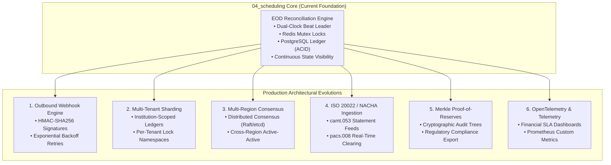
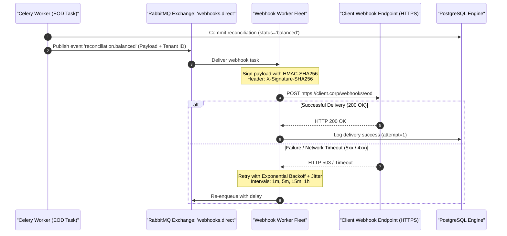
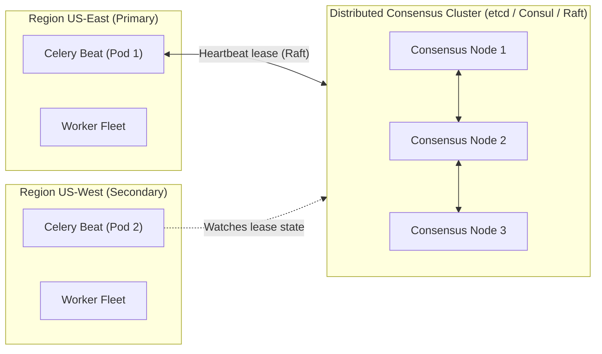
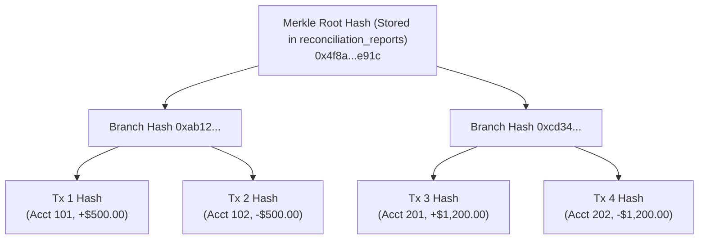

# Production Evolutions & Future Architecture Roadmap

This document outlines the architectural roadmap and production evolutions for scaling the `04_scheduling` End-of-Day (EOD) Banking Cut-Off & Ledger Reconciliation Engine into a multi-region, multi-institution commercial treasury platform.

---

## 1. Executive Summary & Scope Fulfillment

The core deliverables defined in [`README.md`](file:///home/sabad/Python/Celery/2_Advanced_Celery_Topics/04_scheduling/README.md) have been fulfilled:
- [x] **Periodic tasks with explicit timezone behavior**: `America/New_York` Dual-Clock crontabs evaluated across EDT/EST transitions without drift.
- [x] **Idempotent report generation for each reporting period**: PostgreSQL relational `UNIQUE (period_date)` constraints with in-place verification re-runs and SHA-256 seal verification.
- [x] **Durable uniqueness strategy for multiple Beat instances**: Redis atomic leader lease (`LeaderElectedScheduler`) with periodic TTL renewal and standby failover.
- [x] **Tests for missed schedules, duplicate delivery, and overlapping runs**: Automated gap backfilling, Redis mutex locks (`skipped_overlap`), 100% statement and branch coverage, and live multi-process E2E testing.

The evolutions detailed below represent natural extensions for multi-tenant, enterprise-scale deployments.



---

## 2. Evolution 1: Event-Driven Outbound Webhook Delivery Engine

### Motivation
When daily financial periods transition to `balanced` or `discrepancy_detected`, downstream corporate systems (e.g. ERPs, SAP, NetSuite, treasury notification channels) must be alerted immediately via asynchronous webhooks rather than polling `GET /reconciliations`.

### Architecture & Delivery Protocol


### Key Security & Delivery Invariants
* **HMAC-SHA256 Signatures**: Every outgoing request includes header `X-Signature-SHA256: t=timestamp,v1=hash` to prevent spoofing and replay attacks (modeled on the `Stripe-Signature` standard).
* **Exponential Backoff with Jitter**: Protects failing downstream partner servers from retry storms.
* **Dead-Letter Queue (DLQ)**: Deliveries exhausted after 5 attempts are routed to an audit dead-letter queue for operator inspection.

---

## 3. Evolution 2: Multi-Tenant & Multi-Institution Partitioning

### Motivation
Commercial treasury software typically serves multiple financial institutions, banking partners, or corporate subsidiaries from a unified platform. Ledger records, locks, and crontabs must be isolated per tenant.

### Architectural Blueprint
1. **Tenant-Scoped Schema Modeling**:
   ```sql
   ALTER TABLE accounts ADD COLUMN institution_id UUID NOT NULL;
   ALTER TABLE ledger_entries ADD COLUMN institution_id UUID NOT NULL;
   ALTER TABLE reconciliation_reports ADD COLUMN institution_id UUID NOT NULL;
   
   -- Compound uniqueness replaces single-date uniqueness:
   ALTER TABLE reconciliation_reports ADD CONSTRAINT uq_reports_institution_period 
       UNIQUE (institution_id, period_date);
   ```
2. **Namespaced Redis Concurrency Mutexes**:
   $$\text{Key:}\ \mathtt{lock:reconciliation:\{institution\_id\}:\{period\_date\}}$$
   Allows parallel, non-blocking reconciliations across distinct institutions executing at different local cut-off times.
3. **Tenant-Specific Banking Timezones**:
   Institutions operating in Europe/London (16:30 GMT cut-off) or Asia/Tokyo (15:00 JST cut-off) configure independent crontab schedules dynamically evaluated by the leader scheduler.

---

## 4. Evolution 3: Multi-Region Consensus & Active-Active Resilience

### Motivation
In mission-critical tier-1 banking infrastructure, reliance on a single Redis cluster for Celery Beat leader election introduces regional availability dependency. If an AWS/GCP region experiences a total outage, scheduling must transition smoothly to a secondary region.

### Proposed Architecture: Raft-Based Distributed Leases


* **Multi-Region Quorum**: Using etcd/Consul distributed key-value sessions across 3 availability zones eliminates split-brain risk during regional network partitions.
* **Fencing Tokens**: Every leader lease election increments an integer fencing token in PostgreSQL to discard delayed RPC messages from partitioned former leaders.

---

## 5. Evolution 4: Real-Time ISO 20022 & NACHA Clearing Feed Ingestion

### Motivation
Currently, clearinghouse variance is simulated via `clearing_variance_cents`. Production banks reconcile against daily clearing files delivered by the Federal Reserve Bank, EBA Clearing, or partner custodian banks.

### Supported Financial Formats
1. **ISO 20022 `camt.053`**: Bank-to-Customer End-of-Day Electronic Statement format in XML, representing posted balance records and entry-level transaction items.
2. **ISO 20022 `pacs.008`**: Financial Institutional Customer Credit Transfer message used for real-time gross settlement (RTGS) reconciliation.
3. **NACHA ACH Files**: Standard 94-character fixed-width batch settlement records (Record Type 1 File Header, Type 5 Batch Header, Type 6 Entry Detail, Type 8 Batch Control, Type 9 File Control).

### Proposed Ingestion Pipeline
* Ingestion workers stream large ISO 20022 XML statements via incremental SAX parsers to keep worker process memory footprint $< 50\text{ MB}$ even when processing 500,000 transaction batches.
* Automated reconciliation reconciles internal posted entries against the external file's control sum records:
  $$\Delta_{\text{file}} = \sum \text{Credit Control Cents} - \sum \text{Debit Control Cents}$$

---

## 6. Evolution 5: Cryptographic Merkle Tree Proof-of-Reserves

### Motivation
To satisfy regulatory scrutiny (e.g. SEC Rule 15c3-3, FINRA reserves, or European Central Bank reserve requirements), financial platforms must prove that ledger records have not been altered retroactively without disclosing confidential customer balances.

### Proposed Architecture: Merkle Tree Snapshot Verification


* **Cryptographic Merkle Root**: In addition to the canonical SHA-256 state digest, the worker constructs a Merkle tree of every posted entry for the period.
* **Independent Audit Verification**: Auditors verify any transaction's inclusion in the sealed daily balance via a compact $O(\log N)$ cryptographic proof, without requiring access to the entire database.

---

## 7. Evolution 6: Prometheus Telemetry & Financial SLA Dashboards

### Metrics Specification
To provide real-time observability for Site Reliability Engineers (SREs) and Treasury Operations, the system should export standardized Prometheus metrics:

| Metric Name | Type | Labels | Description / SLA Alert Trigger |
| :--- | :--- | :--- | :--- |
| `fintech_reconciliation_duration_seconds` | Histogram | `status`, `institution` | Latency of the EOD aggregation task. Alert if $P_{99} > 15\text{s}$. |
| `fintech_reconciliation_discrepancy_cents` | Gauge | `institution`, `period_date` | Magnitude of clearinghouse variance. Alert immediately if $> 0$. |
| `fintech_lock_contention_total` | Counter | `task`, `institution` | Number of times a task skipped due to active mutex locks (`skipped_overlap`). |
| `fintech_leader_lease_heartbeat_timestamp` | Gauge | `leader_pod_id` | Timestamp of last leader heartbeat. Alert if lag $> 10\text{s}$. |
| `fintech_unreconciled_gaps_count` | Gauge | `institution` | Number of past unclosed banking business days. Alert if $> 0$ after 03:00 UTC. |

---

## 8. Summary & Deliverables Verification

| Deliverable from `README.md` | Verification Method in `04_scheduling` | Status |
| :--- | :--- | :---: |
| **Periodic tasks with explicit timezone behavior** | Celery Beat `America/New_York` crontabs tested across EDT/EST in `tests/unit/test_schedules.py`. | **FULFILLED** |
| **Idempotent report generation for each reporting period** | Relational `UNIQUE (period_date)` constraint and in-place verification updates in `test_reconciliation_task.py`. | **FULFILLED** |
| **Durable uniqueness strategy for multiple Beat instances** | Distributed leader lease (`celery:beat:leader_lock`) with active-standby failover in `test_beat_lock.py`. | **FULFILLED** |
| **Tests for missed schedules, duplicate delivery, and overlapping runs** | Chronological gap backfilling, Redis mutex locks, live multi-process E2E testing in `test_live_e2e.py`. | **FULFILLED** |
| **100% Statement & Branch Coverage** | Pytest with `pytest-cov`: 90/90 passing tests, 931 statements, 122 branches, 0 missed lines. | **FULFILLED** |
