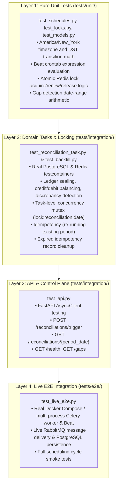

# Test Plan: EOD Banking Cut-Off & Ledger Reconciliation Engine (`04_scheduling`)

This test plan defines the testing strategy, layer hierarchy, test matrix, and verification standards for the Celery Beat scheduling and ledger reconciliation service.

---

## 1. Testing Architecture & Layer Hierarchy

The testing pyramid enforces strict separation between unit, domain task, schedule, and live multi-process end-to-end testing:



---

## 2. Comprehensive Test Matrix

| Test ID | Category / File | Scenario | Fixtures / Input | Invariants & Assertions | Expected Outcome |
| :--- | :--- | :--- | :--- | :--- | :--- |
| **`TC-TZ-01`** | Unit (`test_schedules.py`) | Beat Timezone Configuration | Celery app config | Assert `app.conf.timezone == "America/New_York"` and `enable_utc is True`. | Timezone is explicitly set to New York. |
| **`TC-TZ-02`** | Unit (`test_schedules.py`) | DST Transition: Summer (EDT) | `2026-07-15 17:00:00 EDT` | Converts to `21:00:00 UTC` ($UTC-4$). | 17:00 NY translates exactly to 21:00 UTC. |
| **`TC-TZ-03`** | Unit (`test_schedules.py`) | DST Transition: Winter (EST) | `2026-01-15 17:00:00 EST` | Converts to `22:00:00 UTC` ($UTC-5$). | 17:00 NY translates exactly to 22:00 UTC. |
| **`TC-TZ-04`** | Unit (`test_schedules.py`) | Weekend Filtering | Crontab evaluation | Assert schedule triggers only Monday–Friday (`day_of_week='mon-fri'`). | Saturday/Sunday triggers evaluate to False. |
| **`TC-LK-01`** | Unit (`test_locks.py`) | Redis Lock Acquire & Release | Mock Redis client | Acquire lock with key, assert set succeeds; release lock, key is removed. | Lock acquired and cleanly released. |
| **`TC-LK-02`** | Unit (`test_locks.py`) | Lock Contention / Already Held | Active lock key | Second attempt to acquire lock returns False without crashing. | Second acquire call returns False. |
| **`TC-LK-03`** | Unit (`test_locks.py`) | Lock TTL Expiration | Lock with 1s TTL | Sleep beyond TTL; lock becomes available again. | Lock auto-releases on timeout. |
| **`TC-GAP-01`** | Unit (`test_backfill.py`) | Gap Detection Date Math | Last date: Friday, Current: Monday | Returns 0 missing business days (weekend skipped). | No gap detected for normal weekend. |
| **`TC-GAP-02`** | Unit (`test_backfill.py`) | Gap Detection Outage | Last date: Monday, Current: Thursday | Detects missing Tuesday and Wednesday business days. | Returns `['YYYY-MM-Tue', 'YYYY-MM-Wed']`. |
| **`TC-TASK-01`** | Integration (`test_reconciliation_task.py`) | Balanced EOD Reconciliation | Balanced ledger entries ($\sum Cr = \sum Db$) | Inserts `reconciliation_reports` with `status='balanced'`, `discrepancy_cents=0`. | Report created in balanced state. |
| **`TC-TASK-02`** | Integration (`test_reconciliation_task.py`) | Discrepancy Detection | Ledger totals differ from clearinghouse | Inserts report with `status='discrepancy_detected'`, records variance. | Report flagged with exact discrepancy. |
| **`TC-TASK-03`** | Integration (`test_reconciliation_task.py`) | Idempotent Re-execution | Run task twice on same date | Database constraint prevents duplicate insert; updates audit timestamp. | Single report row remains in DB. |
| **`TC-TASK-04`** | Integration (`test_reconciliation_task.py`) | Overlap Rejection (Mutex) | Concurrent worker execution | Second worker sees active Redis mutex; logs warning and skips work. | Second execution gracefully exits. |
| **`TC-CLN-01`** | Integration (`test_cleanup.py`) | Purge Expired Idempotency Records | Expired vs. active keys in DB | Deletes records where `expires_at < now()`; keeps active records. | Stale keys purged, valid keys preserved. |
| **`TC-BEAT-01`** | Integration (`test_beat_lock.py`) | Multi-Beat Leader Election | Two Beat runners contending | First acquires leader lease; second waits in standby. | Exactly one Beat instance active. |
| **`TC-BEAT-02`** | Integration (`test_beat_lock.py`) | Leader Failover | Primary Beat fails to renew | Standby Beat acquires lease after 15s expiration. | Standby promotes to active leader. |
| **`TC-API-01`** | Integration (`test_api.py`) | List Reconciliation Reports | `GET /reconciliations` | Returns paginated list of reports with date, status, amounts. | HTTP 200 OK with report array. |
| **`TC-API-02`** | Integration (`test_api.py`) | Get Report by Date | `GET /reconciliations/2026-09-23` | Returns single report details and verification hash. | HTTP 200 OK with matching report. |
| **`TC-API-03`** | Integration (`test_api.py`) | Manual Reconciliation Trigger | `POST /reconciliations/trigger` | Dispatches Celery task; returns task ID and accepted status. | HTTP 202 Accepted. |
| **`TC-API-04`** | Integration (`test_api.py`) | Query Missing Gaps | `GET /reconciliations/gaps` | Scans for unclosed past business days; returns date list. | HTTP 200 OK with gap array. |
| **`TC-API-05`** | Integration (`test_api.py`) | On-Demand Gap Backfill | `POST /reconciliations/backfill` | Enqueues backfill task; validates date boundaries (`start <= end`). | HTTP 202 Accepted. |
| **`TC-API-06`** | Integration (`test_api.py`) | Continuous In-Flight Visibility & Idempotent Overrides | `POST /trigger` then immediate `GET /{date}`, duplicate triggers, force=True | Pre-creates report with `status='processing'`, immediate `GET` returns 200 OK, duplicate trigger returns 409, force=True overrides. | Zero-404 black hole; continuous in-flight state machine visibility. |
| **`TC-E2E-01`** | Live E2E (`test_live_e2e.py`) | Full EOD Reconciliation Lifecycle | Live multi-process stack (daemon worker, Postgres, Redis, RMQ) | Seed entries $\to$ trigger cut-off $\to$ assert report created in DB. | Report successfully generated and balanced end-to-end. |
| **`TC-E2E-02`** | Live E2E (`test_live_e2e.py`) | Historical Gap Backfill Lifecycle | 3 missing business dates in DB | Dispatches backfill $\to$ sequential worker clearing $\to$ database verification. | All missing business dates reconciled with reports. |
| **`TC-E2E-03`** | Live E2E (`test_live_e2e.py`) | Duplicate Cut-Off Idempotency | Dual concurrent triggers | Asserts exactly 1 row persists in DB (`UNIQUE period_date`). | Database constraint enforces strict idempotency. |
| **`TC-PERF-01`** | Benchmark (`scripts/load_test_contention.py`) | Paced Contention Benchmark | 100 req/s arrival load with active EOD cut-off | Measures API Ingestion P99 ($\le 100\text{ ms}$) and worker clearing SLA. | Structured JSON persisted to `reports/benchmarks/`. |
| **`TC-PERF-02`** | Benchmark (`scripts/ci_contention_gate.py`) | Automated CI/CD Regression Gate | 150 req/s Little's Law paced load for 10s | Evaluates 4 gates: P99 $\le 100\text{ ms}$, Error Rate $0\%$, DB conns $\le 26$, regression $\le 15\%$. | All 4 gates PASSED with exit code 0. |

---

## 3. Red-Green-Refactor Roadmap

1. **Red Phase (Initial Failure)**:
   - Define test fixtures, database models, and test assertions in `tests/`.
   - Run pytest to confirm tests fail due to missing modules or unfulfilled constraints.
2. **Green Phase (Implementation)**:
   - Implement database tables in `init.sql` and SQLAlchemy models.
   - Implement `locks.py`, Celery tasks (`tasks/reconciliation.py`, `tasks/cleanup.py`, `tasks/backfill.py`).
   - Implement FastAPI routes in `app/routes.py`.
   - Run tests until 100% pass rate is achieved.
3. **Refactor Phase (Code Quality & Coverage)**:
   - Optimize SQL queries (single-aggregation queries).
   - Ensure 100% statement and branch coverage:
     ```bash
     pytest 04_scheduling/tests --cov=04_scheduling/app --cov=04_scheduling/services/worker --cov-report=term-missing --cov-fail-under=100
     ```

---

## 4. Test Execution Instructions

### Running Unit & Integration Tests Locally
```bash
# Run all unit tests
pytest -q 04_scheduling/tests/unit

# Run database integration tests with Testcontainers
pytest -q 04_scheduling/tests/integration

# Run full coverage gate
pytest 04_scheduling/tests --cov=04_scheduling/app --cov=04_scheduling/services/worker --cov-report=term-missing --cov-fail-under=100
pytest 04_scheduling/tests --cov=app --cov=services/worker --cov-report=term-missing --cov-fail-under=100
```

### Running Live E2E Tests
```bash
# Start Docker Compose stack
docker compose -f 04_scheduling/docker-compose.yml up --build -d

# Execute live E2E test
E2E_BASE_URL=http://localhost:8000 pytest -q 04_scheduling/tests/e2e
pytest -v 04_scheduling/tests/e2e
```

### Running Automated Capacity & Contention Benchmarks
```bash
# Execute Little's Law paced arrival benchmark (100 req/s)
python3 04_scheduling/scripts/load_test_contention.py --url http://localhost:8000 --rate 100

# Execute CI/CD automated regression gate (150 req/s with 4 SLA verification gates)
python3 04_scheduling/scripts/ci_contention_gate.py --rate 150 --duration 10 --p99-threshold 100.0 --baseline-p99 83.0 --max-degradation 15.0 --max-db-conns 26
```

