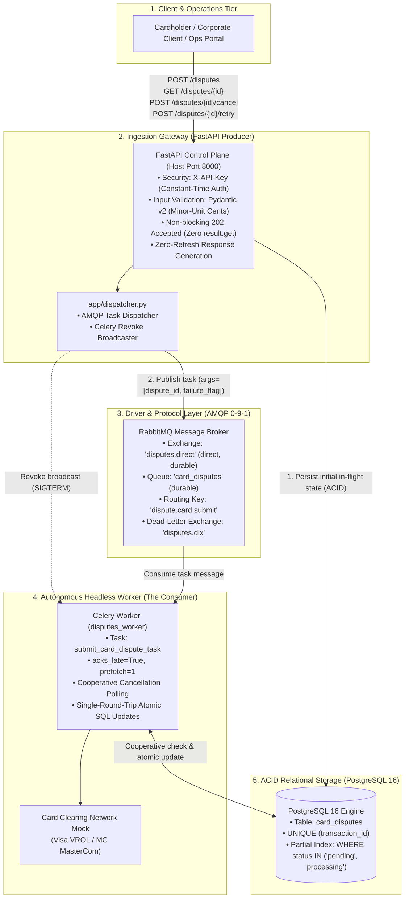
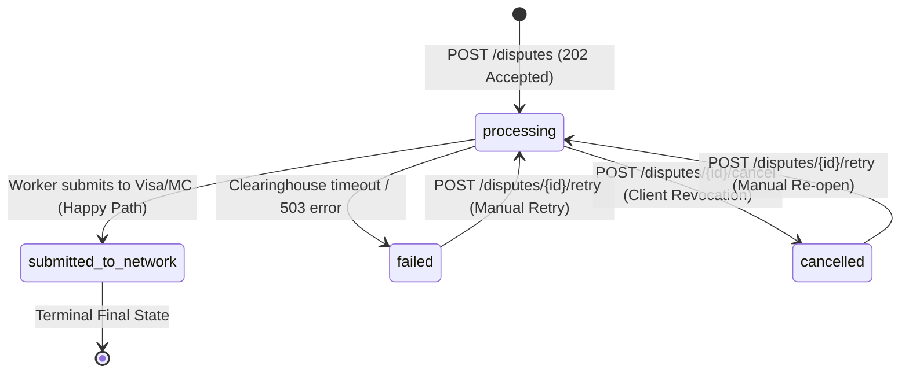
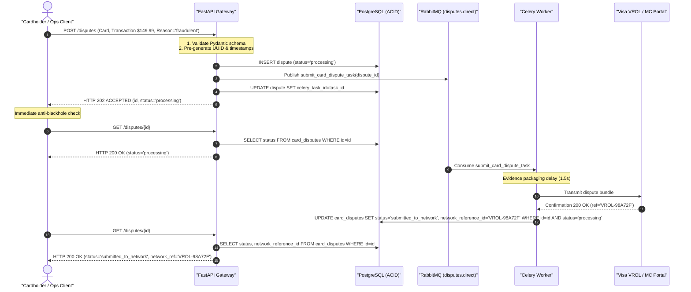
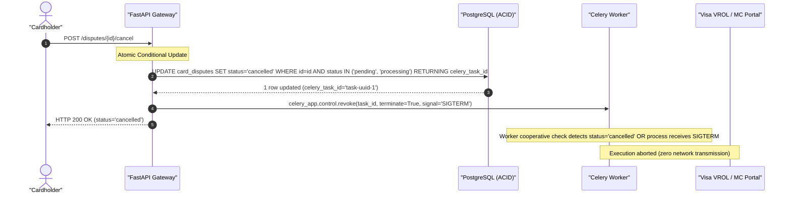
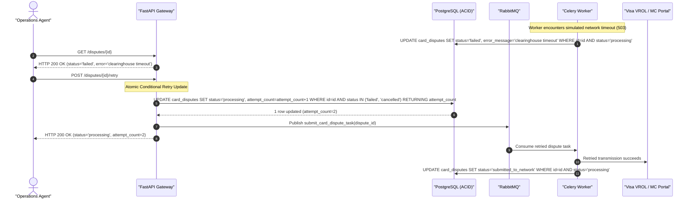
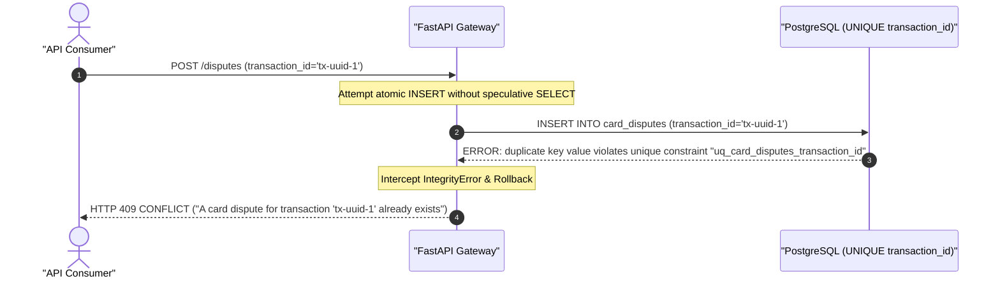

# 05: Application Integration

Build an asynchronous API that submits background jobs, reports their status without blackholes, and supports client-driven cancellation and manual retries.

## Deliverables

- Submission, status, retry, and cancellation endpoints.
- Authentication and input validation at the API boundary.
- No blocking `result.get()` calls in request handlers.
- Stable task-state and error responses for clients (Anti-Blackhole Invariant).
- Contract tests between the API and Celery tasks.

## Evidence

Document API latency separately from job latency and explain how clients handle eventual completion.

---

## Project Definition: Card Dispute & Chargeback Lifecycle Engine

Build a mission-critical financial card dispute and chargeback management platform modeled after modern issuing and acquiring infrastructure (e.g., **Stripe Issuing Disputes**, **Brex Chargeback Manager**, **Adyen Case Management**).

When a corporate cardholder discovers a fraudulent charge, duplicate billing, or missing merchandise, they initiate a formal chargeback. Compiling evidence, validating cardholder claims, and transmitting formal dispute filings to card clearinghouse networks (**Visa VROL / Mastercard MasterCom**) takes several seconds.

The platform provides a resilient asynchronous API boundary that guarantees:
1. **Zero Observable Blackholes**: When an asynchronous dispute is accepted (`HTTP 202 ACCEPTED`), an initial state record is persisted immediately in PostgreSQL with `status="processing"`. An immediate read (`GET /disputes/{id}`) returns `HTTP 200 OK` rather than raising `404 NOT FOUND`.
2. **Minimal Database Queries & Zero-Refresh Responses**: High-throughput writes avoid redundant `SELECT` queries by pre-generating UUID primary keys and timestamps in application memory, reducing query round-trips from $4 \to 1$.
3. **Atomic Idempotency via Database Constraints**: Prevents duplicate disputes on the same transaction by leveraging a relational `UNIQUE (transaction_id)` constraint, catching `IntegrityError` instead of issuing speculative `SELECT` queries.
4. **Race-Free Client Cancellation (`POST /disputes/{id}/cancel`)**: Cardholders can cancel an in-flight dispute before clearinghouse transmission. Atomic conditional SQL updates (`WHERE status IN ('pending', 'processing')`) ensure concurrent cancellations and worker completions resolve deterministically without data corruption.
5. **Operator Recovery via Manual Retries (`POST /disputes/{id}/retry`)**: If clearinghouse APIs reject a dispute bundle with a transient network error ($503$), operations agents can re-enqueue the dispute with bounded attempt tracking.
6. **API-to-Worker Contract Testing**: Schema and parameter contract tests independently verify compatibility between the API dispatcher and Celery worker signatures without spinning up live worker processes.

---

## 1. System Architecture & Topology



### Component Responsibilities

| Component | Layer | Primary Responsibility |
| :--- | :--- | :--- |
| **FastAPI Gateway** | API Producer | Validates request payloads, enforces API key security, writes initial `processing` records, dispatches Celery tasks, and serves zero-refresh responses. |
| **PostgreSQL 16** | Storage Engine | Single source of truth for dispute state machines. Enforces `UNIQUE (transaction_id)` idempotency and accelerates active queries via partial B-Tree indexes. |
| **RabbitMQ** | Message Broker | Durable message transport on direct exchange `disputes.direct`, buffering tasks for worker consumption with DLX routing. |
| **Celery Worker** | Consumer Fleet | Autonomous worker executing `submit_card_dispute_task`. Evaluates cooperative cancellation, simulates clearinghouse network latency, and executes atomic state transitions. |
| **Task Dispatcher** | Application Boundary | Slices arguments into JSON-serializable primitives and injects correlation tracing headers (`X-Request-ID`). |

---

## 2. Deliverables Mapping

| Project Deliverable | Architectural Implementation | Verification Method |
| :--- | :--- | :--- |
| **Submission Endpoint** | `POST /disputes` accepts validated dispute requests, commits initial `status="processing"`, dispatches task, and returns `HTTP 202 ACCEPTED`. | Integration & E2E tests assert `202 Accepted` and immediate `200 OK` on status read. |
| **Status Inspection Endpoint** | `GET /disputes/{id}` queries current state machine (`processing`, `submitted_to_network`, `failed`, `cancelled`). | Integration test confirms zero 404 race window immediately following submission. |
| **Cancellation Endpoint** | `POST /disputes/{id}/cancel` executes atomic conditional SQL update and broadcasts `celery_app.control.revoke(task_id, terminate=True)`. | Integration tests prove in-flight tasks abort before network transmission. |
| **Manual Retry Endpoint** | `POST /disputes/{id}/retry` re-enqueues failed or cancelled disputes with incremented `attempt_count` and new Celery task ID. | Integration tests verify state transitions from `failed` to `processing` and completion. |
| **API Authentication** | `Security(APIKeyHeader)` verifies `X-API-Key` using constant-time string comparison (`hmac.compare_digest`). | Unit & integration tests assert 401 on missing or invalid API keys. |
| **Input Validation** | Pydantic v2 schemas enforce `amount > 0`, 2 decimal places, 3-letter ISO currencies, and standard reason codes. | Schema unit tests assert validation rejections for negative/malformed inputs. |
| **Zero Blocking `result.get()`** | API handlers never wait on Celery results. Polling and eventual completion are managed via database state. | Static analysis confirms zero occurrences of `result.get()` across `app/`. |
| **Contract Tests** | `tests/contract/test_dispute_contract.py` validates task names, signatures, argument types, and AMQP queue bindings. | Automated pytest suite executes contract tests in sub-second isolation. |

---

## 2.1 Project Implementation Milestones

Execution proceeds through 6 structured, reviewable milestones detailed in [`docs/ARCHITECTURE_AND_STANDARDS.md`](file:///home/sabad/Python/Celery/2_Advanced_Celery_Topics/05_application_integration/docs/ARCHITECTURE_AND_STANDARDS.md):

* **Milestone 1**: Proposal & Architectural Specification (README, Architecture & Standards, zero code/Docker).
* **Milestone 2**: Database Schema (`init.sql`) & Autonomous Container Isolation (`Dockerfile.api`, `Dockerfile.worker`, `docker-compose.yml`).
* **Milestone 3**: Domain Models, AMQP Topology & Headless Celery Task Consumer (`submit_card_dispute_task`).
* **Milestone 4**: FastAPI Control Plane Gateway, Security (`X-API-Key`), & AMQP Dispatcher (`app/dispatcher.py`).
* **Milestone 5**: Developer Experience, Compound Debug Profiles (`.vscode/launch.json`), & REST Scenarios (`requests/requests.rest`).
* **Milestone 6**: Automated Test Suites (Unit, Integration, Contract, Live E2E) with 100% Coverage & Dual-Layer Latency Benchmarks.

---

## 3. Data Models & State Machine

### Relational Schema (`init.sql`)

```sql
CREATE TABLE IF NOT EXISTS card_disputes (
    id UUID PRIMARY KEY,
    card_id UUID NOT NULL,
    transaction_id UUID NOT NULL UNIQUE,
    amount_cents INTEGER NOT NULL CHECK (amount_cents > 0),
    currency VARCHAR(3) NOT NULL DEFAULT 'USD',
    reason_code VARCHAR(32) NOT NULL,
    evidence_summary TEXT,
    status VARCHAR(32) NOT NULL DEFAULT 'processing',
    celery_task_id VARCHAR(64),
    attempt_count INTEGER NOT NULL DEFAULT 1 CHECK (attempt_count >= 1),
    network_reference_id VARCHAR(64),
    error_message TEXT,
    created_at TIMESTAMPTZ NOT NULL DEFAULT NOW(),
    updated_at TIMESTAMPTZ NOT NULL DEFAULT NOW()
);

-- Partial B-Tree index for active in-flight dispute state lookups
CREATE INDEX IF NOT EXISTS idx_card_disputes_active_status 
ON card_disputes (status) 
WHERE status IN ('pending', 'processing');

-- Card index for multi-card lookups
CREATE INDEX IF NOT EXISTS idx_card_disputes_card_id 
ON card_disputes (card_id);
```

### State Machine Transitions



---

## 4. REST API Endpoints Specification

| Method | Endpoint | Status Code | Auth Required | Description |
| :--- | :--- | :--- | :--- | :--- |
| `GET` | `/health` | `200 OK` | No | Liveness and readiness health check probe. |
| `POST` | `/disputes` | `202 ACCEPTED` | **Yes** (`X-API-Key`) | Ingest and dispatch asynchronous dispute submission. |
| `GET` | `/disputes/{id}` | `200 OK` | **Yes** (`X-API-Key`) | Retrieve dispute state machine and network reference details. |
| `POST` | `/disputes/{id}/cancel` | `200 OK` | **Yes** (`X-API-Key`) | Revoke in-flight Celery task and mark dispute cancelled. |
| `POST` | `/disputes/{id}/retry` | `200 OK` | **Yes** (`X-API-Key`) | Manually retry a failed or cancelled dispute submission. |

---

## 5. Execution Sequence Diagrams

### 5.1 Happy Path: Dispute Submission & Network Clearing



### 5.2 In-Flight Cancellation Flow (Race-Free Revocation)



### 5.3 Fault Injection & Manual Operator Retry Flow



### 5.4 Duplicate Idempotency Rejection (Zero-Speculative Read)



---

## 6. Latency Evidence & Eventual Completion Model

In financial distributed systems, coupling HTTP response latency to third-party clearinghouse execution degrades throughput and exhausts gateway socket buffers. 

This engine enforces strict **dual-layer latency separation**:
1. **Ingestion Latency ($P_{99} < 15\text{ ms}$)**:
   - Validates incoming Pydantic schemas.
   - Executes a single relational `INSERT` (avoiding `session.refresh()`).
   - Publishes an AMQP message via RabbitMQ connection pool.
   - Immediately returns `HTTP 202 ACCEPTED`.
2. **Asynchronous Clearinghouse Latency ($1.5\text{--}2.5\text{ s}$)**:
   - Worker consumes task asynchronously.
   - Performs cooperative cancellation checks.
   - Compiles and transmits dispute evidence bundle to Visa/Mastercard portal.
   - Transitions database state to `submitted_to_network`.

### How Clients Handle Eventual Completion
Clients should adhere to standard polling or webhook patterns:
* **Short-Polling with Exponential Backoff**: Poll `GET /disputes/{id}` at intervals: $200\text{ ms}$, $500\text{ ms}$, $1.0\text{ s}$, $2.0\text{ s}$ until reaching terminal states (`submitted_to_network`, `failed`, or `cancelled`).
* **Zero Race Blackholes**: Because the initial state is persisted synchronously prior to the 202 response, client polling never receives `404 NOT FOUND`.
