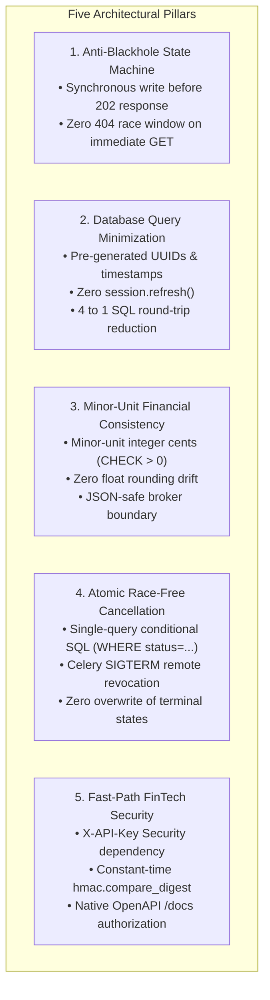
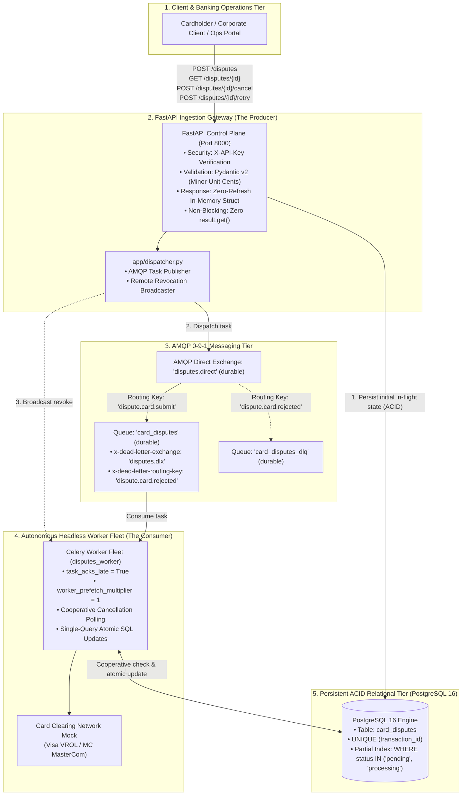
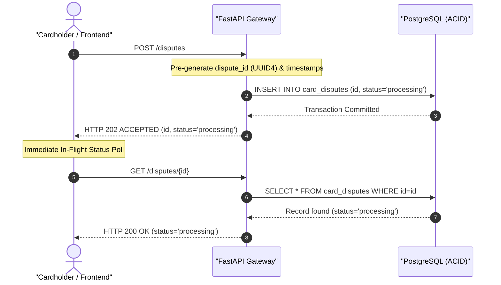
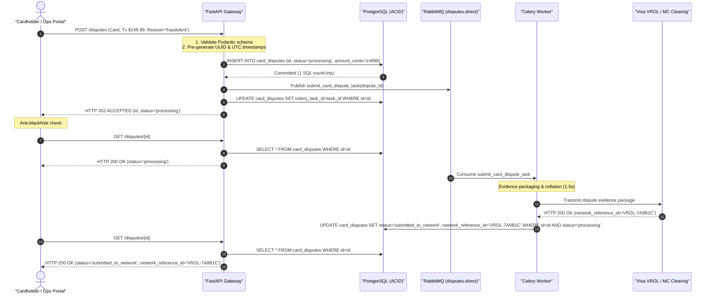
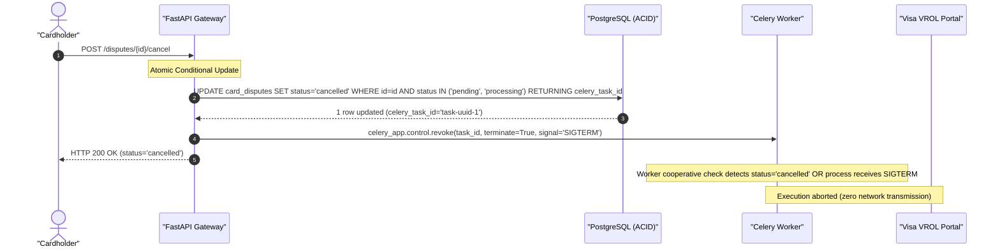
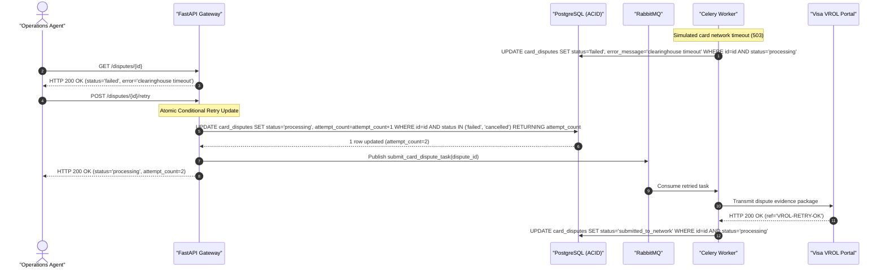
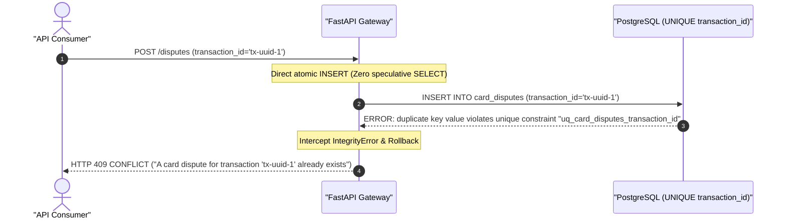

# Architecture & Standards: Card Dispute & Chargeback Lifecycle Engine (`05_application_integration`)

This document defines the architectural specifications, state machine guarantees, concurrency controls, and engineering standards for the Card Dispute Engine.

---

## 1. Executive Summary & Architectural Invariants

The `05_application_integration` module delivers a production-grade asynchronous API boundary for managing financial card disputes. It addresses five fundamental distributed systems challenges:



---

## 2. System Architecture & Topology



---

## 3. The Anti-Blackhole State Machine Contract

### The Distributed Blackhole Problem
In asynchronous distributed systems, a notorious failure mode occurs when an API accepts a job (`HTTP 202 ACCEPTED`), but client frontends immediately query `GET /resource/{id}` and receive `HTTP 404 NOT FOUND`. This happens when the database record is created asynchronously by the worker or in a deferred thread, creating an observable "blackhole race window".

### The FinTech Guarantee
In banking and card operations, an accepted dispute must **never** exist in a blackhole:
1. When `POST /disputes` receives a valid payload, it pre-generates the dispute UUID and current UTC timestamp in application memory.
2. It executes a synchronous relational `INSERT` with `status="processing"`.
3. The transaction is **committed to PostgreSQL before the `202 ACCEPTED` response is dispatched to the client**.
4. An immediate query (`GET /disputes/{id}`) right after receiving `202 Accepted` is mathematically guaranteed to return `HTTP 200 OK` with `status: "processing"`.
5. There is **zero observable nanosecond where an accepted dispute returns 404**.



---

## 4. Database Query Minimization & Zero-Refresh Architecture

In high-throughput financial write APIs, issuing redundant database round-trips severely throttles ingestion capacity and exhausts PostgreSQL connection pools.

### The Problem: Synchronous Refresh Overhead
Standard ORM implementations execute 4 database queries per ingestion request:
1. `SELECT 1 FROM accounts WHERE id = :id` (Speculative existence read).
2. `SELECT 1 FROM card_disputes WHERE transaction_id = :tx_id` (Speculative idempotency read).
3. `INSERT INTO card_disputes VALUES (...)` (Write row).
4. `SELECT * FROM card_disputes WHERE id = :id` (Redundant `session.refresh(instance)` to reload defaults).

### The Invariant: Zero-Refresh Response Generation
This platform reduces database overhead from **$4 \to 1$ query round-trip**:
1. **Application-Layer Key Provisioning**: Primary keys (`uuid.uuid4()`) and UTC timestamps (`datetime.now(timezone.utc)`) are generated in Python memory prior to ORM instantiation.
2. **Elimination of `session.refresh()`**: High-throughput endpoints never invoke `await session.refresh(instance)`. The response Pydantic schema is constructed directly from known, validated application memory state.
3. **Atomic Constraint Idempotency**: Eliminates speculative `SELECT` queries before `INSERT`. It attempts the `INSERT` directly within the database transaction; if a duplicate transaction is disputed, PostgreSQL's relational `UNIQUE (transaction_id)` constraint raises `IntegrityError`. The application intercepts the exception, rolls back, and returns `HTTP 409 CONFLICT`.

$$\text{Query Reduction} = \frac{4 - 1}{4} = 75\% \text{ reduction in database network round-trips}$$

---

## 5. Race-Free Cancellation Mechanics (Atomic Conditional SQL)

### The Concurrency Hazard
A critical race condition occurs when a user requests cancellation (`POST /disputes/{id}/cancel`) at the exact same millisecond that a worker finishes evidence packaging and attempts to submit the dispute to the card network.

Without mutual exclusion:
* If the worker overwrites the cancelled status, a revoked dispute is illegally transmitted to Visa/Mastercard.
* If the API cancellation overwrites the completed status, the database falsely claims the dispute was cancelled when real money was already disputed at the network clearinghouse.

### The Solution: Row-Level Locks via Conditional SQL Updates
PostgreSQL's atomic update serialization guarantees that whoever commits first wins, and the loser detects the conflict without race conditions:

#### 1. API Cancellation Update
```sql
UPDATE card_disputes 
SET status = 'cancelled', updated_at = NOW() 
WHERE id = :dispute_id 
  AND status IN ('pending', 'processing')
RETURNING id, status, celery_task_id;
```

#### 2. Worker Completion Update
```sql
UPDATE card_disputes 
SET status = 'submitted_to_network', network_reference_id = :ref, updated_at = NOW() 
WHERE id = :dispute_id 
  AND status = 'processing'
RETURNING id, status;
```

### Mathematical Proof of Concurrency Resolution

| Scenario | Cancellation Executed | Worker Completion Executed | Outcome |
| :--- | :--- | :--- | :--- |
| **Case A: Cancellation Wins** | Finds `status = 'processing'`. Updates to `'cancelled'`. Returns 1 row. Broadcasts Celery `revoke`. | Queries `WHERE status = 'processing'`. Matches **0 rows**. | Worker detects `row is None`, aborts cleanly, and does **not** transmit to network or overwrite status. |
| **Case B: Worker Wins** | Queries `WHERE status IN ('pending', 'processing')`. Matches **0 rows**. | Finds `status = 'processing'`. Updates to `'submitted_to_network'`. Returns 1 row. | API detects `row is None`, verifies dispute is already `submitted_to_network`, and returns `409 CONFLICT` ("Dispute already submitted"). |

### Celery Remote Control Revocation
In addition to database-level mutual exclusion, the API broadcasts a remote revocation control message:
```python
celery_app.control.revoke(task_id, terminate=True, signal="SIGTERM")
```
If the Celery worker process is currently asleep or preparing evidence, the operating system delivers `SIGTERM` to the worker child process, immediately aborting execution before network transmission.

---

## 6. Financial Data Modeling & Minor-Unit Cents Arithmetic

### The Problem: IEEE 754 Floating-Point Drift
Using standard programming language floats (`float`) for currency introduces precision errors:
$$0.10 + 0.20 = 0.30000000000000004$$
In corporate card banking, such drift violates regulatory and clearinghouse accounting rules.

### The Invariant: Minor-Unit Integer Cents
1. **API Boundary**: All monetary inputs accept Python `Decimal` constrained to 2 decimal places (`gt=0.00`).
2. **Internal Processing & Relational Storage**: Monetary amounts are immediately converted to **integer cents**:
   $$\text{amount\_cents} = \operatorname{int}(\text{amount} \times 100)$$
3. **Storage Column**: `amount_cents INTEGER NOT NULL CHECK (amount_cents > 0)`.
4. **Zero Float Drift**: Every arithmetic comparison and database check runs on exact integers.

---

## 7. Execution Sequence Diagrams

### 7.1 Happy Path: Dispute Ingestion, Evidence Packaging, and Clearing



### 7.2 In-Flight Cancellation Flow (Race-Free Revocation)



### 7.3 Fault Injection & Manual Operator Retry Flow



### 7.4 Duplicate Idempotency Rejection (Zero-Speculative Read)



---

## 8. Dual-Layer Latency & Eventual Consistency Profiling

### Ingestion Latency Profile
* **Endpoint**: `POST /disputes`
* **Target SLA**: $P_{99} < 15\text{ ms}$
* **Execution Path**:
  1. Header authentication & rate limit check ($< 1\text{ ms}$).
  2. Pydantic v2 payload schema validation ($< 1\text{ ms}$).
  3. Single relational `INSERT` over persistent keep-alive `asyncpg` pool ($2\text{--}4\text{ ms}$).
  4. Non-blocking AMQP publish to RabbitMQ socket ($1\text{--}3\text{ ms}$).
  5. Instantiation of `DisputeResponse` from application memory ($< 0.5\text{ ms}$).

### Asynchronous Clearinghouse Latency Profile
* **Background Task**: `submit_card_dispute_task`
* **Expected Duration**: $1.5\text{--}2.5\text{ s}$
* **Execution Path**:
  1. AMQP queue consumption ($5\text{--}10\text{ ms}$).
  2. In-flight cooperative check ($2\text{--}4\text{ ms}$).
  3. Evidence compilation and network transmission simulation ($1500\text{ ms}$).
  4. Single atomic SQL state transition ($2\text{--}4\text{ ms}$).

### Eventual Completion Polling Guidelines for Clients
1. **Immediate Verification**: Client initiates `POST /disputes`, receiving `202 ACCEPTED` with dispute ID and initial `status: "processing"`.
2. **Paced Polling**: Client polls `GET /disputes/{id}` using Little's Law paced intervals:
   - Attempt 1: $200\text{ ms}$ post-submission.
   - Attempt 2: $600\text{ ms}$ post-submission.
   - Attempt 3: $1200\text{ ms}$ post-submission.
   - Attempt 4: $2000\text{ ms}$ post-submission.
3. **Terminal Evaluation**: Polling halts once status transitions to:
   - `submitted_to_network` (Success, displays `network_reference_id`).
   - `failed` (Failure, presents "Retry Dispute" action to cardholder).
   - `cancelled` (Revoked, removes active alert).

---

## 9. Contract Testing Architecture

In distributed architectures, contract tests prevent runtime schema mismatches between API message producers and worker task consumers without requiring live Redis, RabbitMQ, or PostgreSQL instances.

The contract test suite (`tests/contract/test_dispute_contract.py`) validates:
1. **Task Registry & Name Contract**:
   Asserts `app.dispatcher.DISPUTE_TASK_NAME == submit_card_dispute_task.name`.
2. **Signature & Parameter Invariants**:
   Inspects `inspect.signature(submit_card_dispute_task.run)` to guarantee `dispute_id: str` is required and `simulate_failure: bool = False` defaults cleanly.
3. **AMQP Queue & Exchange Bindings**:
   Verifies `card_disputes` queue binds to `disputes.direct` with routing key `dispute.card.submit` and points to dead-letter exchange `disputes.dlx`.
4. **Serialization Safety**:
   Asserts that all dispatcher arguments are 100% JSON-serializable primitives (strings and booleans), guaranteeing zero live database models or sockets cross the broker.
5. **ContextVar Tracing Headers**:
   Ensures headers injected by the dispatcher (`correlation_id`, `request_id`, `source`) adhere to the schema expected by the worker's `task_prerun` signal handler.

---

## 10. Operational Runbook & Production Invariants

### 1. In-Flight Dispute Cancellation Runbook
* **Symptom**: Cardholder identifies a previously disputed charge as valid (e.g. spouse authorized charge or merchant issued direct credit).
* **Action**: Issue `POST /disputes/{id}/cancel` with valid `X-API-Key`.
* **Resolution**:
  - If in-flight: API revokes active Celery task via `celery_app.control.revoke(task_id, terminate=True)` and marks record `cancelled`.
  - If already completed: API returns `409 CONFLICT` informing operator that clearinghouse transmission has already occurred.

### 2. Upstream Network Timeout Recovery Runbook
* **Symptom**: Card network gateway returns 503 Service Unavailable or network times out. Dispute marks as `failed`.
* **Action**: Operations reviews failure reason via `GET /disputes/{id}` and issues `POST /disputes/{id}/retry`.
* **Resolution**:
  - API verifies dispute is in `failed` state.
  - Increments `attempt_count` ($1 \to 2$).
  - Publishes fresh Celery task message with new `task_id`.
  - Transitions dispute back to `processing`.

---

## 11. Project Implementation Milestones & Roadmap

In adherence to project standards, execution is partitioned into small, cohesive, independently verifiable milestones:

| Milestone | Scope & Deliverables | Primary Invariants & Verification |
| :--- | :--- | :--- |
| **Milestone 1: Project Planning & Architectural Specification** | • Update `README.md` with proposal, deliverables mapping, and sequence diagrams.<br/>• Author `docs/ARCHITECTURE_AND_STANDARDS.md` defining the 5 FinTech pillars, anti-blackhole contract, and project milestones. | • Zero code/Docker files introduced.<br/>• 100% valid Mermaid diagrams verified via script.<br/>• User review & approval before any commit. |
| **Milestone 2: Database Schema & Container Infrastructure Isolation** | • Author `init.sql` schema (`amount_cents`, `UNIQUE (transaction_id)`, partial status index).<br/>• Autonomous container definitions: `Dockerfile.api`, `services/worker/Dockerfile`, `docker-compose.yml`.<br/>• Python manifests: `requirements_api.txt`, `services/worker/requirements.txt`, `requirements_dev.txt`. | • Clean service isolation: no FastAPI in worker, no Celery in database.<br/>• `docker compose config` validation.<br/>• User review & approval before commit. |
| **Milestone 3: Domain Schemas, AMQP Topology & Worker Consumer** | • Pydantic v2 domain schemas (`DisputeCreateRequest`, `DisputeResponse`, `DisputeCancelResponse`, `DisputeRetryResponse`) with specimen examples.<br/>• Kombu AMQP driver configuration (`disputes.direct`, `card_disputes` queue, DLX bindings).<br/>• Headless Celery worker task (`submit_card_dispute_task`) with cooperative cancellation and single-query atomic transitions. | • Minor-unit integer cents validation.<br/>• Broker safety (strictly JSON primitives).<br/>• User review & approval before commit. |
| **Milestone 4: FastAPI Control Plane Gateway & AMQP Producer Dispatcher** | • Async FastAPI endpoints (`POST /disputes`, `GET /disputes/{id}`, `POST /disputes/{id}/cancel`, `POST /disputes/{id}/retry`, `GET /health`).<br/>• Constant-time API Key security dependency (`Security(APIKeyHeader)`).<br/>• Modular middlewares (`correlation.py`, `error_handling.py`, `profiling.py`).<br/>• AMQP task dispatcher (`app/dispatcher.py`) with correlation propagation and remote task revocation (`celery_app.control.revoke`). | • Anti-blackhole guarantee: synchronous commit before 202 response.<br/>• Query minimization: zero `session.refresh()` ($4 \to 1$ SQL round-trip reduction).<br/>• User review & approval before commit. |
| **Milestone 5: Developer Experience, Compound Debugging & REST Workflows** | • Progressive debug profiles in `.vscode/launch.json` (API, Worker, Compound multi-service launch).<br/>• Interactive REST client test workflows in `requests/requests.rest` covering happy path, anti-blackhole verification, in-flight cancel, timeout retry, and idempotency conflict. | • Zero dangling configurations.<br/>• Zero-manual-copy chained variables.<br/>• User review & approval before commit. |
| **Milestone 6: Comprehensive Automated Test Suite (100% Coverage Mandate)** | • Unit tests (`tests/unit/`): Schema constraints, minor-unit conversions, dispatcher serialization.<br/>• Integration tests (`tests/integration/`): Database transactions, API routes, security dependency, atomic cancellation race condition verification.<br/>• Contract tests (`tests/contract/test_dispute_contract.py`): Task name, signature, and AMQP queue binding contracts.<br/>• Live E2E tests (`tests/e2e/test_live_e2e.py`): Live multi-process distributed test against real PostgreSQL, RabbitMQ, and Celery worker fleet.<br/>• Dual-layer latency profiling benchmark (`scripts/benchmark_latency.py`). | • **100% statement coverage** requirement (`pytest --cov-fail-under=100`).<br/>• User review & approval before commit. |
