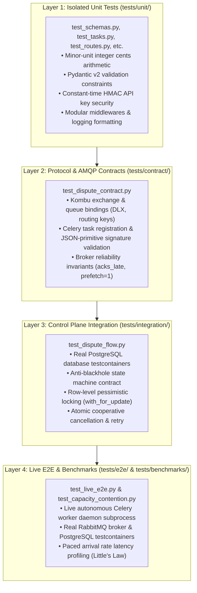

# Test Plan: Card Dispute & Chargeback Lifecycle Engine (`05_application_integration`)

This test plan defines the testing strategy, layer hierarchy, test matrix, and verification standards for the Card Dispute & Chargeback Lifecycle Engine.

---

## 1. Testing Architecture & Layer Hierarchy

The testing pyramid enforces strict separation between unit, AMQP contract, database integration, capacity benchmarks, and live multi-process end-to-end testing:



---

## 2. Comprehensive Test Matrix

| Test ID | Category / File | Scenario | Fixtures / Input | Invariants & Assertions | Expected Outcome |
| :--- | :--- | :--- | :--- | :--- | :--- |
| **`TC-SCH-01`** | Unit (`test_schemas.py`) | Monetary Precision Math | Major dollars to integer cents | `to_cents(Decimal("149.99")) == 14999` with `ROUND_HALF_UP`. | Exact minor-unit conversion. |
| **`TC-SCH-02`** | Unit (`test_schemas.py`) | Schema Constraints | Invalid card last 4 / negative amount | Pydantic validation raises `ValidationError` on bad formats. | 422 Unprocessable Entity. |
| **`TC-SEC-01`** | Unit (`test_security.py`) | API Key Verification | Missing / invalid `X-API-Key` | `hmac.compare_digest` constant-time verification. | HTTP 401 Unauthorized. |
| **`TC-SEC-02`** | Unit (`test_security.py`) | Valid API Key | Master key secret | Grants access, returns valid string token. | Access granted. |
| **`TC-MID-01`** | Unit (`test_middlewares.py`)| Correlation Propagation | Incoming `X-Request-ID` | Extracted and propagated into `ContextVar` and headers. | Traceability across async calls. |
| **`TC-MID-02`** | Unit (`test_middlewares.py`)| Error Handling Middleware | Unhandled route exception | Intercepts 500 error, logs exception, returns normalized JSON. | Zero server crash. |
| **`TC-MID-03`** | Unit (`test_middlewares.py`)| Latency Profiling Middleware | Request roundtrip | Measures `duration_ms` and attaches `X-Process-Time-Ms`. | Timing header attached. |
| **`TC-DISP-01`**| Unit (`test_dispatcher.py`) | AMQP Dispatch | Valid dispute UUID | Publishes Celery task with correlation tracing headers. | Task ID returned. |
| **`TC-DISP-02`**| Unit (`test_dispatcher.py`) | Remote Revocation | Active Celery task ID | Issues broadcast `celery_app.control.revoke(terminate=True)`. | Revocation signal sent. |
| **`TC-TASK-01`**| Unit (`test_tasks.py`) | Task Execution Happy Path | Valid dispute in `processing` status | Transitions status to `submitted_to_network`, sets network reference ID. | Network reference ID populated. |
| **`TC-TASK-02`**| Unit (`test_tasks.py`) | In-Flight Cancellation Abort | Dispute already marked `cancelled` | Worker inspects DB status, aborts network call, logs cancellation. | Graceful task abort. |
| **`TC-TASK-03`**| Unit (`test_tasks.py`) | Clearinghouse Timeout Handling | `simulate_failure=True` | Transitions status to `failed`, records `error_message`. | Failed status persisted. |
| **`TC-AMQP-01`**| Contract (`test_dispute_contract.py`) | AMQP Topology & DLX Bindings | Celery app task queues | Validates `card_disputes` queue has DLX args pointing to `disputes.dlx`. | DLX and routing keys match spec. |
| **`TC-AMQP-02`**| Contract (`test_dispute_contract.py`) | Serialization Safety | Celery app serializer config | `task_serializer == "json"` and `accept_content == ["json"]`. | Anti-arbitrary-code execution. |
| **`TC-AMQP-03`**| Contract (`test_dispute_contract.py`) | Task Signature Safety | `submit_card_dispute_task` args | Inspects parameter annotations: strictly primitives, zero ORM/Session. | Broker payload safety. |
| **`TC-INT-01`** | Integration (`test_dispute_flow.py`) | Anti-Blackhole State Visibility | Real PostgreSQL container | Synchronously commits `processing` before HTTP 202; immediate `GET` returns 200. | Zero 404 race window. |
| **`TC-INT-02`** | Integration (`test_dispute_flow.py`) | Database Idempotency | Duplicate `transaction_id` | Database `UNIQUE` constraint raises `IntegrityError`, caught as HTTP 409. | Idempotency preserved. |
| **`TC-INT-03`** | Integration (`test_dispute_flow.py`) | Row Locking & Cancellation | Real PostgreSQL container | Uses `with_for_update()`, transitions to `cancelled`, duplicate cancel returns 409. | Safe concurrent cancellation. |
| **`TC-INT-04`** | Integration (`test_dispute_flow.py`) | Failed Dispute Retry Flow | Real PostgreSQL container | Retrying failed dispute increments `attempt_count` to 2; non-failed retry returns 409. | State machine retry contract. |
| **`TC-E2E-01`** | Live E2E (`test_live_e2e.py`) | Full Live Dispute Lifecycle | Live Celery worker daemon subprocess | Submits dispute $\to$ worker dequeues $\to$ database updated to `submitted_to_network`. | Full end-to-end clearing. |
| **`TC-E2E-02`** | Live E2E (`test_live_e2e.py`) | Live Failure & Retry | Live worker + RabbitMQ broker | Simulates timeout $\to$ status `failed` $\to$ triggers retry $\to$ worker clears task. | Retry cleared by worker. |
| **`TC-E2E-03`** | Live E2E (`test_live_e2e.py`) | Cooperative Queue Cancellation | Live worker + RabbitMQ broker | Cancels buffered queue task $\to$ worker aborts on dequeue without state overwrite. | Cancellation invariant preserved. |
| **`TC-BENCH-01`**| Benchmark (`test_capacity_contention.py`) | Prefetch & Ingestion SLA | Little's Law paced harness | Validates `worker_prefetch_multiplier=1`, late acks, and sub-50ms P99 latency. | All capacity assertions passed. |

---

## 3. Test Execution & Verification

### Running Test Suites Locally
```bash
# Run unit tests only (< 1s)
pytest tests/unit

# Run AMQP contract tests
pytest tests/contract

# Run database integration tests with Testcontainers
pytest tests/integration

# Run live multi-process distributed E2E suite
pytest tests/e2e -v

# Run capacity and contention benchmarks
pytest tests/benchmarks -v
```

### Full CI/CD Gate Execution (100% Coverage Mandate)
```bash
bash scripts/run_local_ci.sh -p 05_application_integration --full
```
