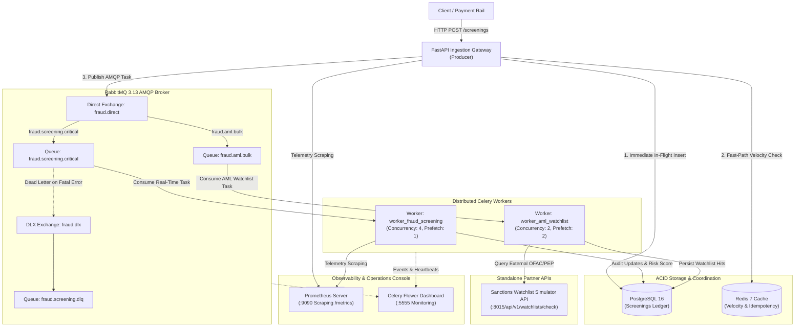
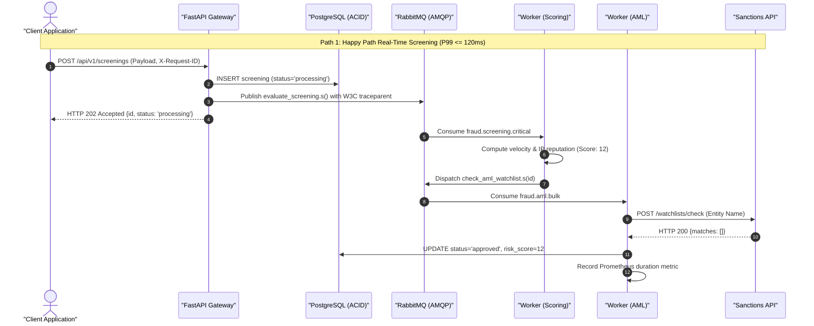
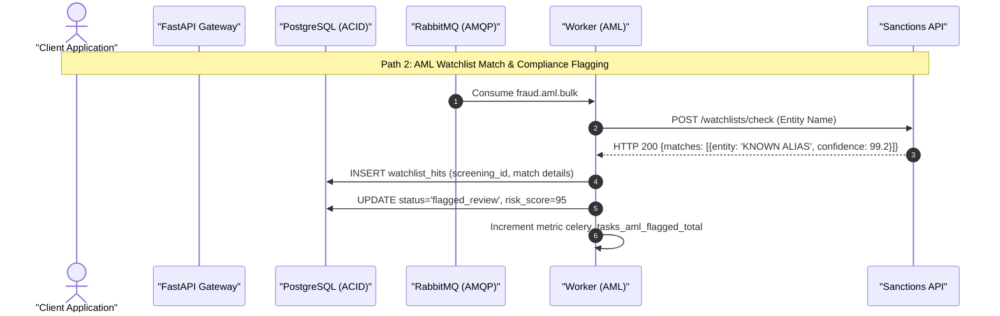
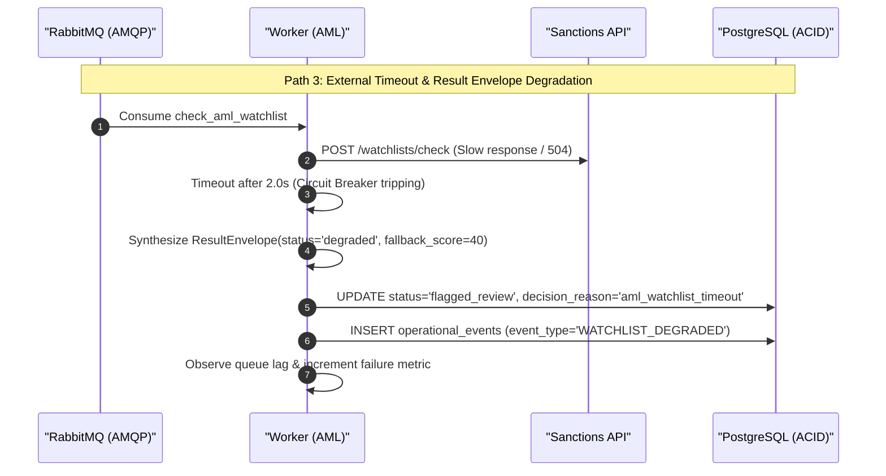
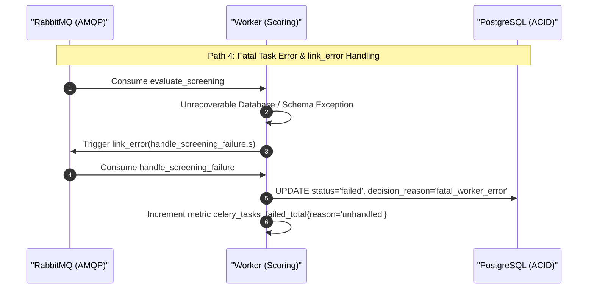
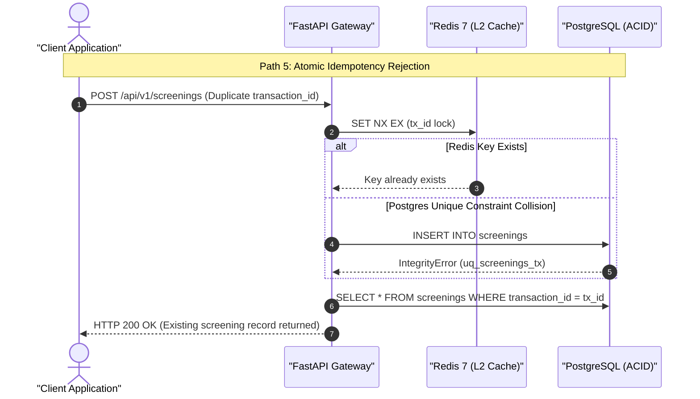

# Architecture, Observability Telemetry & Operations Specification

> **Module**: `06_observability_and_operations`  
> **System**: Real-Time Fraud Detection & AML Sanctions Screening Rail  
> **Standard Compliance**: Production-Grade Distributed Celery, Prometheus, OpenTelemetry, Kombu AMQP 0-9-1, FastAPI Async, PostgreSQL ACID

---

## 1. System Architecture & Topology

The system orchestrates real-time fraud scoring and sanctions compliance screening across decoupled microservices. Real-time velocity and scoring tasks execute on high-priority queues, while deep AML sanctions queries route to secondary workers or partner APIs with circuit breakers.



---

## 2. Data Models & Schema Design

### 2.1 Database Tables (`init.sql`)

```sql
-- 1. Master Screenings Table (ACID Financial Ledger)
CREATE TABLE IF NOT EXISTS screenings (
    id UUID PRIMARY KEY,
    transaction_id VARCHAR(64) NOT NULL,
    account_id VARCHAR(64) NOT NULL,
    amount_cents BIGINT NOT NULL CHECK (amount_cents > 0),
    currency VARCHAR(3) NOT NULL DEFAULT 'USD',
    client_ip VARCHAR(45) NOT NULL,
    risk_score INT DEFAULT NULL CHECK (risk_score >= 0 AND risk_score <= 100),
    status VARCHAR(20) NOT NULL DEFAULT 'processing',
    decision_reason VARCHAR(255) DEFAULT NULL,
    latency_ms NUMERIC(8, 2) DEFAULT NULL,
    created_at TIMESTAMPTZ NOT NULL DEFAULT NOW(),
    updated_at TIMESTAMPTZ NOT NULL DEFAULT NOW(),
    CONSTRAINT uq_screenings_tx UNIQUE (transaction_id),
    CONSTRAINT ck_screening_status CHECK (
        status IN ('pending', 'processing', 'approved', 'flagged_review', 'blocked', 'failed')
    )
);

-- 2. Partial B-Tree Index for In-Flight State Visibility
-- Eliminates write amplification on terminal states; keeps active records in CPU L3 cache
CREATE INDEX IF NOT EXISTS idx_screenings_active_status 
ON screenings (created_at DESC) 
WHERE status IN ('pending', 'processing');

-- 3. Watchlist Hits Table (Compliance Sanctions Audit)
CREATE TABLE IF NOT EXISTS watchlist_hits (
    id UUID PRIMARY KEY,
    screening_id UUID NOT NULL REFERENCES screenings(id) ON DELETE CASCADE,
    entity_name VARCHAR(255) NOT NULL,
    watchlist_type VARCHAR(32) NOT NULL, -- 'OFAC_SDN', 'EU_SANCTIONS', 'PEP'
    match_confidence NUMERIC(5, 2) NOT NULL, -- e.g. 98.50
    created_at TIMESTAMPTZ NOT NULL DEFAULT NOW()
);

CREATE INDEX IF NOT EXISTS idx_watchlist_hits_screening_id 
ON watchlist_hits (screening_id);

-- 4. Operational Audit Log (Diagnostic Event Store)
CREATE TABLE IF NOT EXISTS operational_events (
    id UUID PRIMARY KEY,
    correlation_id VARCHAR(64) NOT NULL,
    task_id VARCHAR(64) DEFAULT NULL,
    event_type VARCHAR(64) NOT NULL, -- 'QUEUE_AGE_BREACH', 'EXTERNAL_TIMEOUT', 'CIRCUIT_BREAKER_OPEN'
    payload JSONB NOT NULL,
    created_at TIMESTAMPTZ NOT NULL DEFAULT NOW()
);

CREATE INDEX IF NOT EXISTS idx_operational_events_correlation 
ON operational_events (correlation_id);
```

### 2.2 Invariant Guarantees
1. **Index Deduplication**: No redundant index on `transaction_id` or `id` (automatically indexed by `PRIMARY KEY` and `UNIQUE` constraints).
2. **Minor-Unit Financial Arithmetic**: Financial values processed internally as integer cents (`amount_cents BIGINT`) and formatted as `NUMERIC(14, 2)` across API boundaries.
3. **In-Flight State Visibility**: On `POST /api/v1/screenings`, an initial row with `status="processing"` is committed to PostgreSQL **before** returning `HTTP 202 ACCEPTED`. Immediate `GET /api/v1/screenings/{id}` calls return `HTTP 200 OK` with `status="processing"`, eliminating observable black holes.

---

## 3. Distributed Sequence Diagrams (All Execution Paths)

### Path 1: Happy Path Real-Time Screening (Low Risk, Auto-Approved)


### Path 2: High-Risk AML Watchlist Match (Flagged for Review)


### Path 3: External Watchlist Degradation & Circuit-Breaker Fallback (Result Envelope)


### Path 4: Fatal Task Error & Errback Compensation


### Path 5: Idempotency Rejection (Duplicate Transaction)


---

## 4. Observability & Telemetry Architecture

### 4.1 Prometheus Metric Registry (`/metrics`)
The system exposes standardized Prometheus metrics scraped via `/metrics`:

| Metric Name | Type | Labels | Description |
| :--- | :--- | :--- | :--- |
| `http_requests_total` | Counter | `method`, `endpoint`, `status` | Total incoming API ingestion requests. |
| `http_request_duration_seconds` | Histogram | `method`, `endpoint` | Ingestion HTTP latency ($P_{50}, P_{95}, P_{99}$). |
| `celery_tasks_total` | Counter | `task_name`, `status` | Total Celery tasks executed across worker fleet. |
| `celery_task_duration_seconds` | Histogram | `task_name`, `queue` | Task execution runtime in seconds ($P_{50}, P_{95}, P_{99}$). |
| `celery_tasks_in_flight` | Gauge | `task_name`, `queue` | Currently executing tasks per child process. |
| `celery_queue_depth` | Gauge | `queue_name` | Number of ready/unacknowledged AMQP messages. |
| `celery_queue_message_age_seconds` | Gauge | `queue_name` | Age of oldest unacknowledged message in queue. |
| `celery_tasks_retried_total` | Counter | `task_name`, `reason` | Count of task retries due to transient errors. |

### 4.2 OpenTelemetry W3C TraceContext Propagation
* **Producer Propagation**:
  When FastAPI dispatches Celery tasks, the current OpenTelemetry span context is serialized using `TraceContextTextMapPropagator().inject(carrier)` and injected into Celery task headers (`headers={"traceparent": ...}`).
* **Consumer Extraction**:
  Worker `@signals.task_prerun` extracts the `traceparent` header to parent the worker span, creating a continuous distributed trace across `HTTP -> AMQP Queue -> Celery Worker -> Sanctions API`.

### 4.3 Structured Contextual Logging
Every log entry emits machine-readable JSON containing:
```json
{
  "timestamp": "2026-09-27T13:30:00.123Z",
  "level": "INFO",
  "logger": "services.worker.tasks.screening",
  "message": "screening_evaluation_completed",
  "request_id": "a1b2c3d4-e5f6-7890-abcd-ef1234567890",
  "task_id": "99887766-5544-3322-1100-aabbccddeeff",
  "queue": "fraud.screening.critical",
  "screening_id": "33445566-7788-99aa-bbcc-ddeeff001122",
  "duration_ms": 42.15,
  "risk_score": 12,
  "status": "approved"
}
```

### 4.4 Container Health Probes
* **Liveness (`/health/live`)**:
  Returns `HTTP 200 {"status": "alive"}` verifying the Python event loop is unblocked without polling downstream databases.
* **Readiness (`/health/ready`)**:
  Actively checks:
  1. PostgreSQL: `SELECT 1` via connection pool.
  2. Redis: `redis_client.ping()`.
  3. RabbitMQ: AMQP connection pre-ping.
  Returns `HTTP 200 {"status": "ready"}` or `HTTP 503 Service Unavailable`.

### 4.5 Graceful Worker Lifecycle (`SIGTERM`)
Celery workers register `@signals.worker_shutting_down`:
1. Cleanly releases acquired Redis distributed locks.
2. Closes and flushes SQLAlchemy async engine connection pools.
3. Allows in-flight idempotent tasks to commit or rollback cleanly without orphaned locks.

---

## 5. Operational Runbooks for SRE Operators

### Runbook A: Stuck Worker & Lock Deadlock Triage
* **Symptoms**: `celery_tasks_in_flight` remains non-zero for $> 30\text{ s}`; worker ceases consuming new messages.
* **Diagnostic Step 1**: Identify active worker tasks:
  ```bash
  celery -A services.worker.celery_app:celery_app inspect active
  ```
* **Diagnostic Step 2**: Inspect PostgreSQL locks:
  ```sql
  SELECT pid, query, state, age(clock_timestamp(), query_start) 
  FROM pg_stat_activity 
  WHERE state != 'idle';
  ```
* **Mitigation Step 3**: Revoke stuck task with termination signal:
  ```bash
  celery -A services.worker.celery_app:celery_app control revoke <TASK_ID> --terminate --signal=SIGKILL
  ```

### Runbook B: Queue Backpressure & Saturation Triage
* **Symptoms**: Prometheus alert `CeleryQueueLagBreach` fires; `celery_queue_message_age_seconds` exceeds 10s.
* **Diagnostic Step 1**: Check queue depths and consumer counts:
  ```bash
  celery -A services.worker.celery_app:celery_app inspect reserved
  ```
* **Mitigation Step 2**: Scale worker concurrency dynamically:
  ```bash
  celery -A services.worker.celery_app:celery_app control autoscale 8,2
  ```
* **Mitigation Step 3**: Tune prefetch count via worker configuration (`worker_prefetch_multiplier = 1`).

### Runbook C: Poison Pill & Dead Letter Queue (DLQ) Remediation
* **Symptoms**: `fraud.screening.dlq` depth increases; repeated retry storms in worker logs.
* **Diagnostic Step 1**: Inspect dead-letter messages without acknowledging:
  ```bash
  python3 scripts/inspect_dlq.py --queue fraud.screening.dlq --count 5
  ```
* **Mitigation Step 2**: Patch malformed payload or resolve upstream bug.
* **Mitigation Step 3**: Replay DLQ messages back to primary exchange:
  ```bash
  python3 scripts/replay_dlq.py --dlq fraud.screening.dlq --target-exchange fraud.direct
  ```

---

## 6. Incident Walkthrough Specification (The Evidence)

An automated walkthrough script (`scripts/incident_walkthrough.py`) simulates a production failure:
1. **The Trigger**: The sanctions partner API is injected with a 100% failure rate / 504 Gateway Timeout.
2. **The Alert**: Prometheus detects latency spike ($P_{99} \ge 2.0\text{ s}$) and queue message age exceeding threshold.
3. **The Triage**: The operator navigates Flower (`http://localhost:5555`) to observe task retries in `fraud.aml.bulk`.
4. **Root Cause Isolation**: Correlating `X-Request-ID` across structured logs identifies the HTTP 504 Gateway Timeout from the external sanctions URL.
5. **Operational Mitigation**: Operator enables the circuit-breaker fallback toggle via environment/configuration.
6. **Recovery**: Workers resume processing tasks in degraded mode (`status="flagged_review"`); queue drains back to 0; $P_{99}$ latency drops back below 120ms.

---

## 7. Project Milestones Breakdown

| Milestone | Scope & Deliverables | Primary Skills & Tools | Verification Gate |
| :--- | :--- | :--- | :--- |
| **Milestone 1** | Architectural specification, sequence diagrams, data models, SRE runbooks, and test plan (`docs/TEST_PLAN.md`). | `celery-doc`, `celery-commit` | `python3 scripts/verify_mermaid.py` passes with 0 errors. |
| **Milestone 2** | Container orchestration (`docker-compose.yml`), PostgreSQL schema (`init.sql`), service Dockerfiles, and minimal requirements. | `celery-commit` | Containers spin up healthy; schema initializes cleanly. |
| **Milestone 3** | Domain models, AMQP Kombu topology, Sanctions Watchlist Simulator API (`services/sanctions_api/`), Celery worker consumer (`services/worker/`), unit test suite (`tests/unit/`), worker debug profiles (`launch.json`). | `celery-test`, `celery-debug-setup` | Unit tests pass with 100% coverage; worker debug launchable. |
| **Milestone 4** | FastAPI Ingestion Gateway (`app/`), middlewares (correlation, error handling, profiling), producer dispatcher (`app/dispatcher.py`), `requests/requests.rest` workflows, and integration tests (`tests/integration/`). | `celery-debug-setup`, `celery-test` | Integration tests pass; `/docs` Swagger executes out-of-the-box. |
| **Milestone 5** | Prometheus metrics engine (`/metrics`), Flower dashboard, SRE triage runbooks, and automated incident walkthrough script (`scripts/incident_walkthrough.py`). | `celery-observability`, `celery-debug-setup` | Prometheus scrapes cleanly; incident walkthrough verifies recovery. |
| **Milestone 6** | Live multi-process distributed E2E test suite (`tests/e2e/test_live_e2e.py`) and capacity/contention latency benchmarks (`tests/benchmarks/`). Final 100% statement coverage validation. | `celery-test`, `celery-commit` | Full local CI pass (`./scripts/run_local_ci.sh -p 06_observability_and_operations --full`). |
