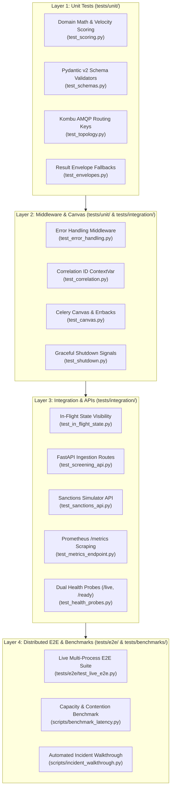

# Test Plan: Real-Time Fraud Detection & AML Sanctions Screening Rail

> **Module**: `06_observability_and_operations`  
> **Target Coverage**: 100% Statement & Branch Coverage  
> **Testing Pyramid**: Unit Tests $\to$ Canvas & Middlewares $\to$ Integration & API $\to$ Distributed Live E2E & Benchmarks

---

## 1. Test Architecture & Layer Hierarchy

Testing is organized into four distinct tiers to maintain strict isolation, sub-second unit test execution, and comprehensive distributed verification:



---

## 2. Comprehensive Test Matrix Table

The following matrix defines all functional and non-functional use cases covered across the module:

| Test ID | Category | Target File | Fixture / Input | Invariants & Assertions | Expected Outcome |
| :--- | :--- | :--- | :--- | :--- | :--- |
| `TC-01` | Unit | `test_schemas.py` | Valid screening payload with Decimal amount | Verify minor-unit integer conversion and specimen data validity | Pydantic model parses cleanly; `amount_cents` is exact integer |
| `TC-02` | Unit | `test_schemas.py` | Negative amount, invalid IP, or empty account ID | Verify Pydantic v2 `Field` constraints and custom validators | Raises `ValidationError` with HTTP 422 schema match |
| `TC-03` | Unit | `test_scoring.py` | Synthetic velocity history and transaction data | Verify risk score calculation bounded in `[0, 100]` with zero float drift | Correct numerical risk score and rule breakdown |
| `TC-04` | Unit | `test_scoring.py` | High-risk country IP and rapid velocity burst | Verify composite score exceeds threshold $\ge 85$ | Outcome categorized as `blocked` or `flagged_review` |
| `TC-05` | Unit | `test_envelopes.py` | Simulated external sanctions API timeout | Assert Result Envelope catches exception and returns degraded status | `ResultEnvelope(status='degraded', fallback_score=40)` |
| `TC-06` | Unit | `test_topology.py` | Kombu queue and exchange binding definitions | Verify routing keys (`fraud.screening.critical`, `fraud.aml.bulk`) and DLX configuration | Exchanged bound to queues with matching topic/direct keys |
| `TC-07` | Canvas | `test_canvas.py` | Screening canvas with mock tasks | Verify `.s()` signature argument piping and chord barrier callback | Task chain executes sequentially with upstream data passed |
| `TC-08` | Canvas | `test_canvas.py` | Fatal worker exception in task body | Verify Celery `link_error` errback triggers failure handler | State machine transitions to `status='failed'` in DB |
| `TC-09` | Middleware | `test_correlation.py` | Incoming request with custom `X-Request-ID` | Verify ContextVar is set and response headers echo the same ID | Header `X-Request-ID` matches input exactly |
| `TC-10` | Middleware | `test_correlation.py` | Incoming request without `X-Request-ID` | Verify middleware auto-generates a valid UUIDv4 | Response contains new UUID in `X-Request-ID` header |
| `TC-11` | Middleware | `test_error_handling.py` | Endpoint raising unhandled `RuntimeError` | Assert exception is intercepted, logged with traceback, and normalized | Returns HTTP 500 JSON `{"detail": "internal server error", "request_id": ...}` |
| `TC-12` | Integration | `test_in_flight_state.py` | `POST /api/v1/screenings` payload | Assert immediate DB insert with `status='processing'` before worker completes | `GET /api/v1/screenings/{id}` immediately returns HTTP 200 with `status='processing'` |
| `TC-13` | Integration | `test_screening_api.py` | Duplicate `transaction_id` submitted twice | Catch `IntegrityError` on unique constraint; rollback and return existing row | Returns HTTP 200 with existing screening record (Atomic Idempotency) |
| `TC-14` | Integration | `test_sanctions_api.py` | Query simulator with known sanctioned name | Verify simulator matches entity name against mock OFAC SDN list | Returns HTTP 200 `{matches: [{entity: ..., confidence: 99.2}]}` |
| `TC-15` | Integration | `test_sanctions_api.py` | Simulator failure mode toggle enabled | Verify simulator returns simulated HTTP 504 Gateway Timeout | Returns HTTP 504 with timeout payload for resilience testing |
| `TC-16` | Integration | `test_metrics_endpoint.py` | Issue requests to API and worker tasks | Query `GET /metrics` and inspect Prometheus exposition format | Returns HTTP 200 with `http_requests_total` and `celery_tasks_total` |
| `TC-17` | Integration | `test_health_probes.py` | `GET /health/live` | Assert lightweight process-level liveness check | Returns HTTP 200 `{"status": "alive"}` without querying DB |
| `TC-18` | Integration | `test_health_probes.py` | `GET /health/ready` with DB/Redis reachable | Assert deep dependency readiness check | Returns HTTP 200 `{"status": "ready"}` with dependency statuses |
| `TC-19` | Integration | `test_shutdown.py` | Worker process receives `SIGTERM` signal | Verify `@signals.worker_shutting_down` releases Redis lock and disposes DB pool | Distributed lock released in Redis; DB connections cleanly closed |
| `TC-20` | Live E2E | `test_live_e2e.py` | Full multi-process stack (Postgres, RabbitMQ, Worker, API, Sanctions API) | End-to-end asynchronous screening dispatch through Celery workers | Screening transitions from `processing` to `approved` in DB; metrics increment |
| `TC-21` | Benchmark | `benchmark_latency.py` | Little's Law paced arrival load (e.g. 100 req/s) under background queue saturation | Measure API ingestion latency and worker clearing SLA | Asserts API $P_{99} \le 25\text{ ms}$ and Worker clearing $P_{99} \le 120\text{ ms}$ |
| `TC-22` | Operations | `incident_walkthrough.py` | Inject sanctions latency $\to$ trigger Prometheus alert $\to$ apply runbook circuit breaker | Verify end-to-end incident detection, triage, and recovery | Alert fires; runbook mitigation restores $P_{99} \le 120\text{ ms}$; zero data loss |

---

## 3. Red-Green-Refactor TDD Sequence

Development proceeds strictly in accordance with test-driven development:

1. **Phase 1: Unit & Schema TDD (Milestone 3)**
   - Author `tests/unit/test_schemas.py` and `tests/unit/test_scoring.py` (Red).
   - Implement domain models, risk calculators, and schema validators (Green).
   - Refactor pure arithmetic and minor-unit conversions to ensure zero floating-point math.
2. **Phase 2: AMQP Routing & Worker Consumer TDD (Milestone 3)**
   - Author `tests/unit/test_topology.py` and `tests/unit/test_envelopes.py` (Red).
   - Implement Kombu queue bindings, task definitions, and Result Envelope wrappers (Green).
   - Refactor worker warm-up hooks (`@signals.worker_process_init`) and signal metric recorders.
3. **Phase 3: API Gateway & Middlewares TDD (Milestone 4)**
   - Author `tests/integration/test_screening_api.py`, `test_in_flight_state.py`, and `test_middlewares.py` (Red).
   - Implement FastAPI routes, dispatcher, and error handling middlewares (Green).
   - Refactor zero-refresh response generation and database session scoping.
4. **Phase 4: Observability, Metrics & Health Probes TDD (Milestone 5)**
   - Author `tests/integration/test_metrics_endpoint.py` and `test_health_probes.py` (Red).
   - Implement Prometheus registry, `/metrics` endpoint, and liveness/readiness probes (Green).
   - Validate Prometheus scraping format with automated assertions.
5. **Phase 5: Distributed Live E2E & Benchmarking (Milestone 6)**
   - Author `tests/e2e/test_live_e2e.py` and `scripts/benchmark_latency.py`.
   - Launch real distributed workers, broker, and database; verify full asynchronous canvas lifecycle.
   - Enforce **100% statement coverage** gate:
     ```bash
     pytest --cov=app --cov=services/worker --cov-report=term-missing --cov-fail-under=100
     ```

---

## 4. Test Execution Commands

```bash
# 1. Fast static and unit tests (< 2s)
pytest tests/unit/ -v

# 2. Integration and middleware tests with hybrid testcontainers
pytest tests/integration/ -v

# 3. Live multi-process distributed E2E tests
pytest tests/e2e/test_live_e2e.py -v -m e2e

# 4. Strict 100% statement coverage audit
pytest --cov=app --cov=services/worker --cov-report=term-missing --cov-fail-under=100

# 5. Local CI verification runner
./scripts/run_local_ci.sh -p 06_observability_and_operations --full
```
