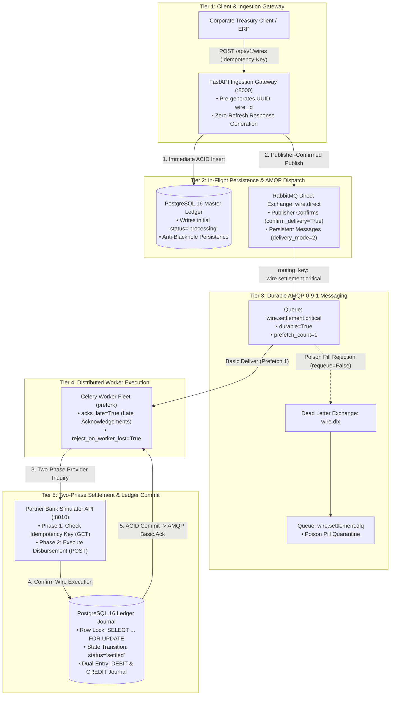
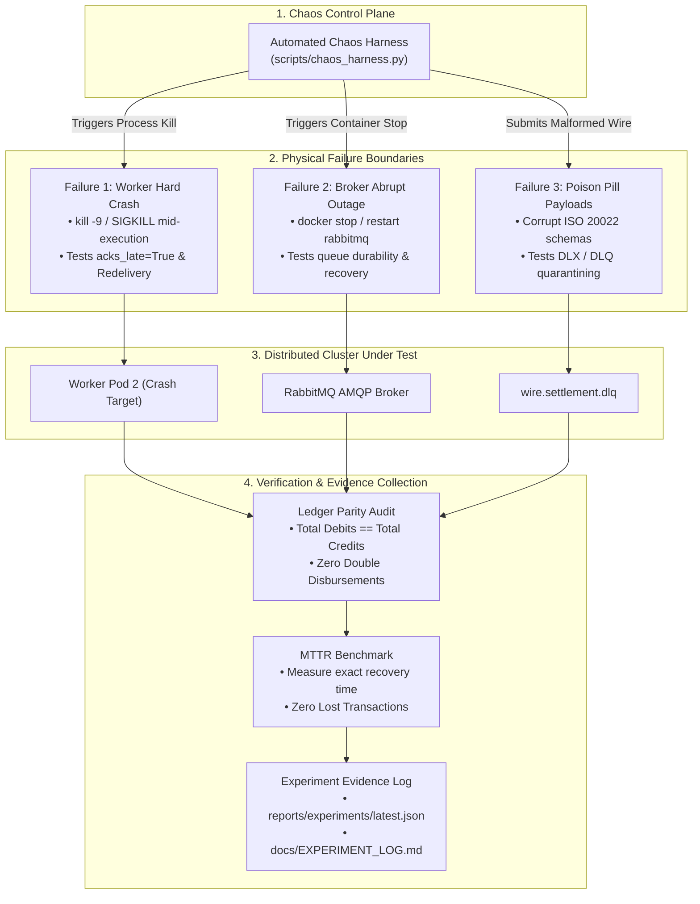
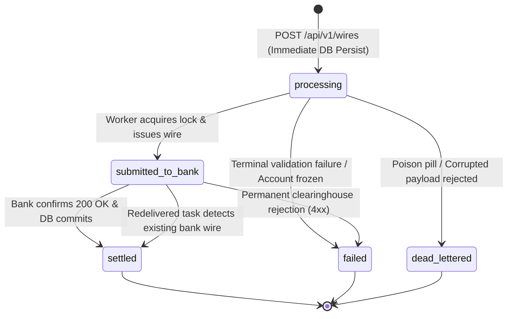
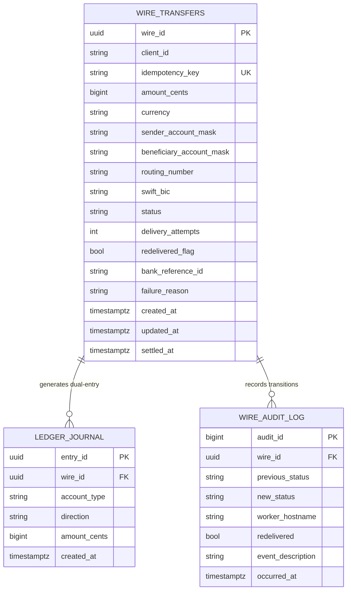
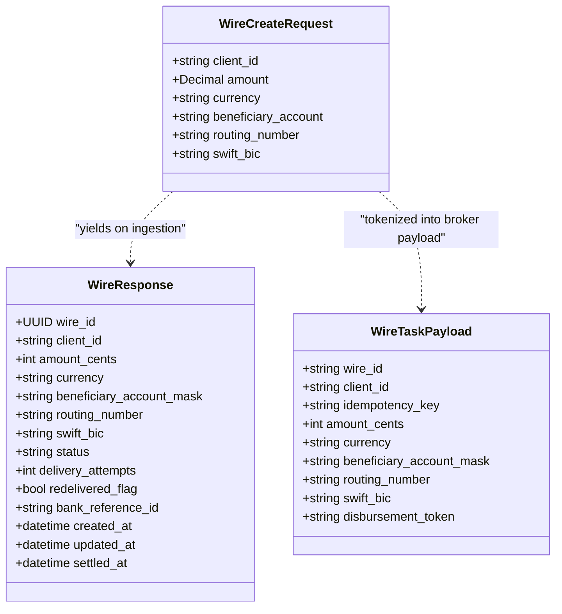
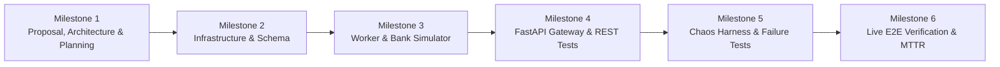

# Architecture, Failure Recovery & Chaos Engineering Specification

> **Module**: `07_failure_recovery_lab`  
> **System**: High-Value Interbank Wire & Treasury Settlement Gateway (Fedwire / SWIFT / ISO 20022)  
> **Standards Compliance**: Kombu AMQP 0-9-1, Celery 5.4, PostgreSQL 16 ACID, FastAPI Async, Docker Chaos Injection, Clean Architecture

---

## 1. System Architecture & Topology

The High-Value Interbank Wire Settlement Gateway is a containerized, distributed financial backend designed to execute irrevocable money movements over wholesale clearinghouse rails (e.g., Fedwire, CHIPS, SWIFT MT103/ISO 20022 `pacs.008`).

To provide effortless visual clarity and eliminate crossing arrows, the architecture is partitioned into two dedicated top-down views:
1. **The Production Settlement Pipeline (Section 1.1)**: Shows the strict top-to-bottom vertical runtime flow from client ingestion to external clearinghouse settlement.
2. **The Chaos Engineering & Failure Testbed (Section 1.2)**: Shows the automated chaos injection vectors, failure boundaries, and evidence collection loops.

---

### 1.1 Production Settlement Pipeline (Tiered Vertical Flow)

---

### 1.2 Chaos Engineering & Failure Injection Testbed

---

### 1.3 Detailed Component Architecture

* **FastAPI Ingestion Gateway (`app/`)**: High-throughput producer running on port `:8000`. Generates UUID primary keys in-memory, persists initial `processing` records directly to PostgreSQL, and uses Kombu publisher confirms (`confirm_delivery=True`) to guarantee durable broker receipt before returning `HTTP 202 ACCEPTED`.
* **ACID Storage & Dual-Entry Ledger (`PostgreSQL 16`)**: The relational system of record on port `:5432`. Enforces relational uniqueness `UNIQUE(client_id, idempotency_key)`, row locks (`SELECT ... FOR UPDATE`), and partial B-Tree indexes on active states.
* **Durable Messaging Broker (`RabbitMQ 3.13`)**: AMQP 0-9-1 message broker on ports `:5672` (AMQP) and `:15672` (Management). Configured with durable direct exchange `wire.direct`, durable dead-letter exchange `wire.dlx`, and disk-backed queues.
* **Distributed Celery Worker Fleet (`services/worker/`)**: Headless worker processes running with `acks_late=True`, `reject_on_worker_lost=True`, and `prefetch_count=1`. Implements two-phase provider verification to guarantee zero duplicate payouts on message redelivery.
* **Wholesale Bank Simulator API (`services/bank_simulator_api/`)**: Standalone FastAPI service running on port `:8010`. Emulates Federal Reserve Fedwire and SWIFT endpoints with idempotent transaction tracking and configurable chaos hooks (jitter, artificial HTTP 503 errors).
* **Automated Chaos Harness (`scripts/chaos_harness.py`)**: Programmatic chaos harness that drives the 5 failure recovery experiments, tracks Mean Time to Recovery (MTTR), and verifies that ledger drift remains exactly 0 cents.

---

## 2. Data Models, State Machine & Database DDL Design

### 2.1 The Wire Transfer State Machine

The lifecycle of an interbank wire follows a deterministic state machine designed to prevent observable "black holes" and eliminate phantom payouts during infrastructure failure.

* **`processing`**: Wire accepted via `HTTP 202 ACCEPTED`. Record is immediately persisted in PostgreSQL before AMQP dispatch. An immediate read via `GET /api/v1/wires/{id}` returns `HTTP 200 OK` with `status="processing"`.
* **`submitted_to_bank`**: Celery worker has dispatched the wire request to the external Bank Simulator API with an idempotency key.
* **`settled`**: Clearinghouse confirms funds transfer; internal ledger accounts post immutable debit/credit entries.
* **`failed`**: Irrecoverable business rejection (e.g., sanctioned counterparty or permanent banking rail error).
* **`dead_lettered`**: Malformed payload or unparseable frame diverted to `wire.settlement.dlq` after exhausting delivery attempts.

---

### 2.2 Relational Database Schema Model (PostgreSQL 16)

The relational schema is defined declaratively in [init.sql](../init.sql). The relational entity model and balancing tables are visualized below:

#### Key Relational Invariants & Storage Rules:
* **Source DDL**: [init.sql](../init.sql).
* **Strict Monetary Precision**: `amount_cents` is stored as `BIGINT CHECK (amount_cents > 0)` representing minor currency units. Floats and rounding are strictly prohibited.
* **Partial B-Tree Index (`idx_wire_in_flight_status`)**: Covers `WHERE status IN ('processing', 'submitted_to_bank')`. This eliminates write amplification on settled transactions while guaranteeing sub-millisecond retrieval of in-flight records.
* **Index Deduplication**: No redundant `CREATE INDEX` on `(client_id, idempotency_key)` since PostgreSQL automatically provisions a B-Tree index for the `UNIQUE` constraint.

---

### 2.3 Domain Entity & AMQP Contracts (Pydantic v2)

Domain schemas decouple client presentation from internal broker communication. Detailed class definitions reside in [app/schemas.py](../app/schemas.py) and [shared/amqp_topology.py](../shared/amqp_topology.py):

#### Key Contract Invariants:
* **Zero-Knowledge Broker**: Raw unmasked account numbers are never passed to Celery workers or RabbitMQ. Only the `disbursement_token` and `beneficiary_account_mask` are transmitted.
* **Pydantic Validation**: Strict regex on Fedwire ABA routing number (`^\d{9}$`) and SWIFT BIC length (8–11 chars). Strict Decimal inputs are converted to integer cents at the API perimeter.

---

## 3. Distributed Sequence Diagrams (All Execution Paths)

To maintain single-responsibility documentation and avoid bloated architecture specifications, all detailed dark-theme sequence diagrams covering distributed execution and failure recovery flows are housed in the dedicated document:

👉 **[docs/SEQUENCE_DIAGRAMS.md](SEQUENCE_DIAGRAMS.md)**

### Summary of Documented Execution Paths:
1. **Path 1: Normal Wire Submission & Settlement (Happy Path)**: Zero-refresh ingestion, publisher confirms (`confirm_delivery=True`), late acknowledgements (`acks_late=True`), and two-phase provider settlement.
2. **Path 2: Worker Hard Crash (`SIGKILL`) & Redelivery Recovery (`acks_late=True`)**: Mid-execution process termination after disbursement; automatic queue redelivery to surviving worker; Phase 1 inquiry detects existing transaction to eliminate double payouts.
3. **Path 3: The Early Ack Failure Mode (`acks_late=False`) - The Silent Data Loss Trap**: Proves why default Celery early acknowledgements cause irrevocable message loss upon worker crashes.
4. **Path 4: Broker Hard Crash & Reconnect / Recovery**: Demonstrates NVMe WAL replay, persistent queue survival (`delivery_mode=2`), and automatic worker channel reconnection.
5. **Path 5: Poison Pill Malformed Payload & DLX/DLQ Dead-Letter Handling**: Non-retryable formatting errors rejected without requeue (`requeue=False`), routed to `wire.dlx` $\to$ `wire.settlement.dlq` with diagnostic `x-death` metadata.

---

## 4. Failure Recovery & Chaos Engineering Strategy

The laboratory implements five formal chaos experiments designed to validate system behavior under extreme failure boundaries:

| Experiment ID | Experiment Name | Injected Failure Boundary | Tested Configuration | Invariant Verification & Success Criteria |
| :--- | :--- | :--- | :--- | :--- |
| **`EXP-01`** | **Worker Hard Crash During Execution** | `kill -9` (`SIGKILL`) sent to worker child process immediately after Bank Simulator dispatch. | `acks_late=True` `reject_on_worker_lost=True` `prefetch=1` | 1. Broker redelivers task to surviving worker. 2. Worker Phase 1 query detects existing bank reference. 3. Zero duplicate wire disbursements. 4. Ledger parity: $\Delta\text{drift} = 0$. |
| **`EXP-02`** | **Early vs. Late Ack Comparison** | 500 concurrent wires dispatched; worker child processes randomly killed every 500ms. | Mode A: `acks_late=False` Mode B: `acks_late=True` | **Mode A**: 10–25% silent wire loss (tasks disappear from queue). **Mode B**: 0% task loss; 100% redelivered and safely settled. |
| **`EXP-03`** | **Broker Abrupt Stop & Restart** | `docker stop rabbitmq` executed during 100 req/s wire ingestion load, sustained for 10s. | `durable=True` `delivery_mode=2` `confirm_delivery=True` | 1. Publisher confirms reject in-flight requests cleanly. 2. 100% of confirmed messages survive broker reboot on disk. 3. Workers auto-reconnect and drain queue with 0 loss. |
| **`EXP-04`** | **Poison Pill Dead-Lettering** | Malformed wire payloads submitted with unrecoverable formatting errors. | `wire.dlx` `requeue=False` `max_retries=3` | 1. Task does not loop infinitely or crash workers. 2. Message routed to `wire.settlement.dlq`. 3. `x-death` headers record failure diagnostics. 4. DB transitions to `dead_lettered`. |
| **`EXP-05`** | **Mean Time to Recovery (MTTR) & Drift** | Multi-failure chaos scenario (worker kills + broker restarts + network latency). | Full Production Configuration | 1. MTTR measured and recorded. 2. Mathematical proof: $\sum \text{Debits} = \sum \text{Credits} = \sum \text{Bank Transfers}$. |

---

## 5. Automated Chaos Harness & Experiment Log Design

### 5.1 Chaos Harness Architecture (`scripts/chaos_harness.py`)
The automated chaos test harness manages container interactions and failure injection:
* **Docker CLI / SDK Orchestration**: Interacts directly with Docker containers (`docker-compose.yml`) to inject `SIGKILL`, pause processes, stop/restart containers, and introduce artificial network delays.
* **State & Metric Verification**: Polls FastAPI `/api/v1/wires/{id}` and directly audits PostgreSQL database records and RabbitMQ management queues to compute loss and duplication rates.
* **Deterministic Reporting**: Outputs execution metrics into `reports/experiments/latest_experiment_log.json` and renders the markdown report in `docs/EXPERIMENT_LOG.md`.

---

## 6. Architectural Standards & Quality Invariants

1. **Zero-Knowledge Broker Invariant**:
   - Strictly zero counterparty bank account numbers or PANs traverse the message broker in plaintext.
   - Counterparty accounts are masked (`beneficiary_account_mask: "******7890"`). Detailed credentials remain encrypted in vault storage.
2. **Precision & Monetary Arithmetic**:
   - All financial amounts are stored and manipulated as minor-unit integer cents (`BIGINT` in PostgreSQL, `int` in Python).
   - Division or float conversions are strictly forbidden in settlement paths to eliminate IEEE 754 drift.
3. **Eager Singleton Initialization at Module Load**:
   - Database connection pools (`asyncpg`), HTTP clients (`httpx.AsyncClient`), and thread executors are initialized eagerly at module import time, eliminating cold-start latency.
4. **Role-Based Connection Budgeting**:
   - Single-threaded Celery worker child processes are budgeted with lightweight pools (`pool_size=2, max_overflow=2`), while the FastAPI gateway allocates higher capacity (`pool_size=10, max_overflow=20`), preventing database connection exhaustion.
5. **No-Masking Invariant**:
   - All protocol or library warnings (such as AMQP heartbeat renegotiation or Redis connection drops) are resolved via explicit configuration rather than log-level suppression.

---

## 7. Project Milestones & Verification Roadmap

The implementation roadmap and verification milestones are tracked in the dedicated roadmap document:

👉 **[docs/MILESTONES.md](MILESTONES.md)**

### Milestone Progress Overview:
* **Milestone 1 (Complete)**: Architecture specification, data models, state machines, and sequence diagrams.
* **Milestone 2 (Complete)**: Multi-container orchestration (`docker-compose.yml`), PostgreSQL 16 schema (`init.sql`), Kombu AMQP 0-9-1 topology, RabbitMQ pre-loaded definitions, worker base configuration (`acks_late=True`), and 100% unit test coverage.
* **Milestone 3 (Complete)**: Domain models (`shared/models.py`), Pydantic v2 schemas (`shared/schemas.py`), Bank Simulator API (`services/bank_simulator_api/`), and Celery worker task execution with Two-Phase Provider Inquiry (`services/worker/tasks/`).
* **Milestone 4 (Complete)**: FastAPI wire ingestion gateway (`app/main.py`), correlation middleware, Kombu publisher-confirmed dispatcher, and REST scenario suite.
* **Milestone 5 (Complete)**: Automated chaos harness (`scripts/chaos_harness.py`) and failure recovery integration tests (worker SIGKILL, early vs late ack, broker restart, poison pill DLQ quarantine).
* **Milestone 6 (Next)**: Distributed live multi-process E2E verification, MTTR benchmarking, and immutable experiment evidence logs.

---

## 8. Documentation References & Single Source of Truth

| System Concern | Canonical File / Artifact | Purpose |
| :--- | :--- | :--- |
| **System Overview & Quickstart** | [README.md](../README.md) | Executive summary, business context, quickstart guide |
| **Architecture & Invariants** | [docs/ARCHITECTURE_AND_STANDARDS.md](ARCHITECTURE_AND_STANDARDS.md) | System topology, invariants, pooling & storage design |
| **Distributed Sequences** | [docs/SEQUENCE_DIAGRAMS.md](SEQUENCE_DIAGRAMS.md) | All 5 execution, redelivery, and failure sequence diagrams |
| **Project Milestones** | [docs/MILESTONES.md](MILESTONES.md) | Roadmap breakdown, deliverables matrix, and status |
| **Relational DDL** | [init.sql](../init.sql) | PostgreSQL 16 schema, constraints, partial indexes |
| **AMQP 0-9-1 Topology** | [shared/amqp_topology.py](../shared/amqp_topology.py) | Kombu exchanges, queues, DLX routing |
| **Multi-Container Cluster** | [docker-compose.yml](../docker-compose.yml) | 6-container orchestrated runtime environment |

