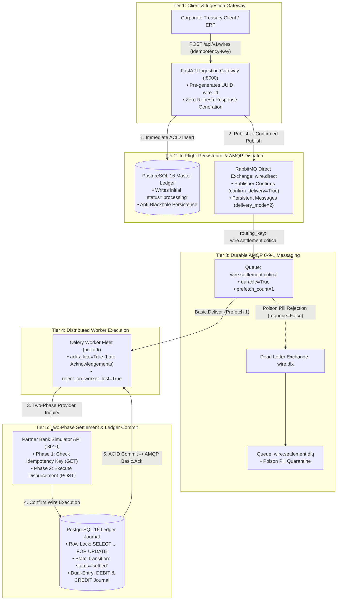
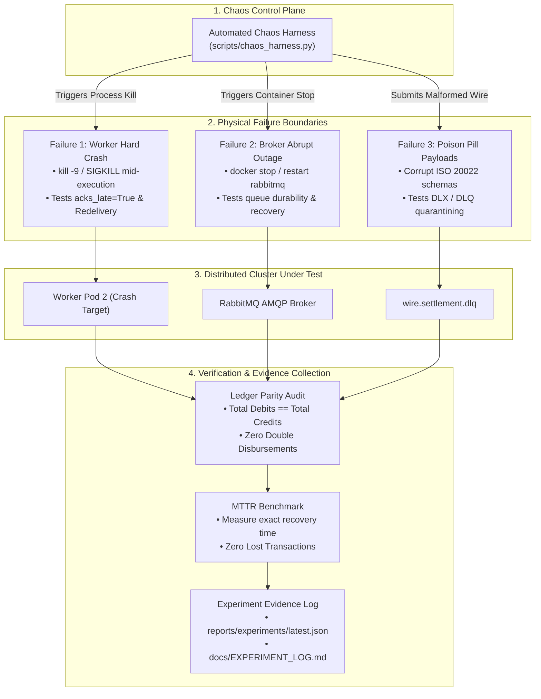
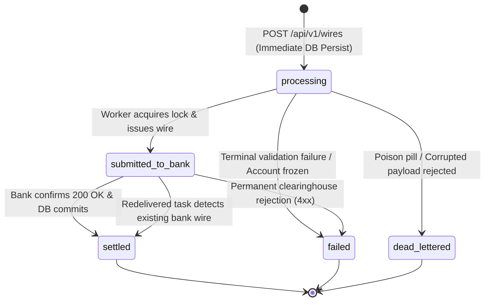
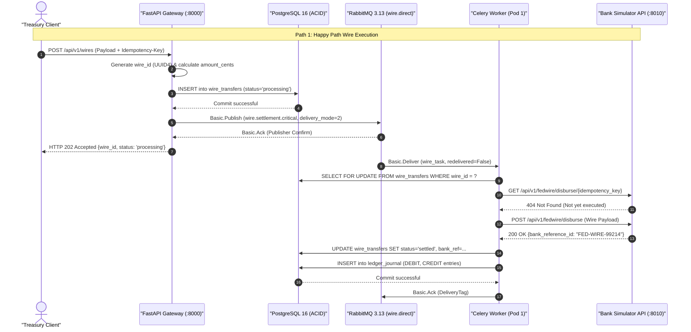
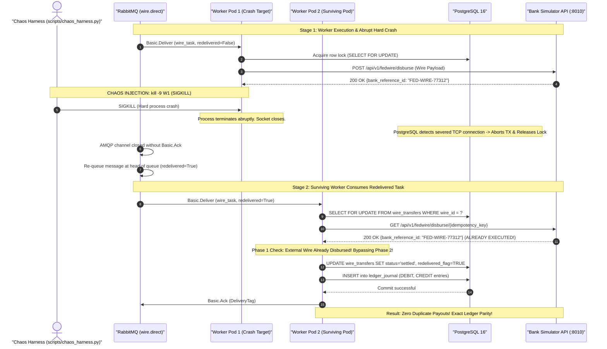
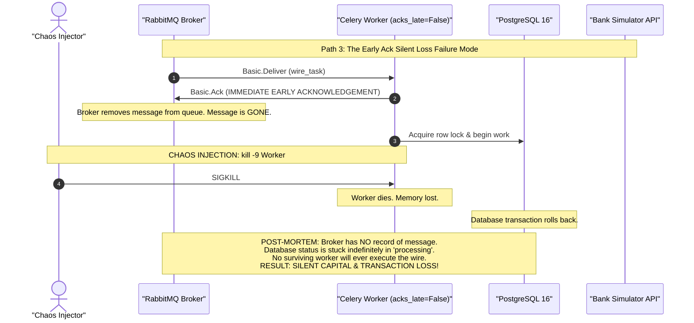
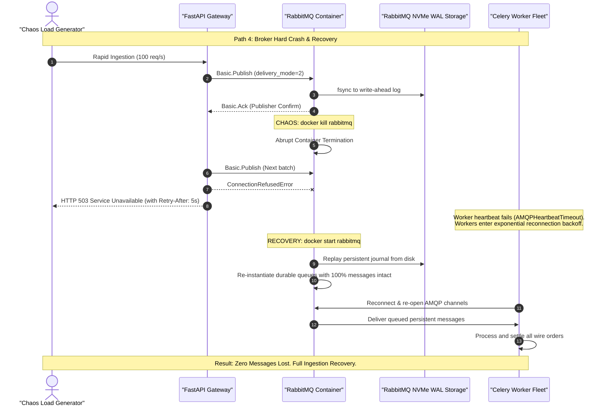
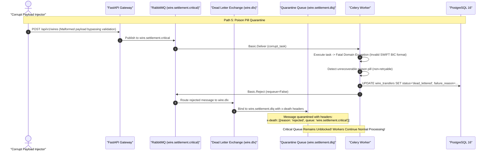
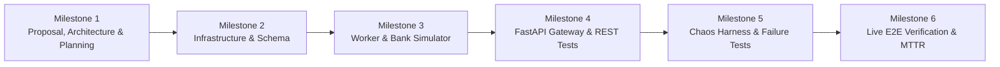

# Architecture, Failure Recovery & Chaos Engineering Specification

> **Module**: `07_failure_recovery_lab`  
> **System**: High-Value Interbank Wire & Treasury Settlement Gateway (Fedwire / SWIFT / ISO 20022)  
> **Standards Compliance**: Kombu AMQP 0-9-1, Celery 5.4, PostgreSQL 16 ACID, FastAPI Async, Docker Chaos Injection, Clean Architecture

---

## 1. System Architecture & Topology

The High-Value Interbank Wire Settlement Gateway is a containerized, distributed financial backend designed to execute irrevocable money movements over wholesale clearinghouse rails (e.g., Fedwire, CHIPS, SWIFT MT103/ISO 20022 `pacs.008`).

To provide effortless visual clarity and eliminate crossing arrows, the architecture is partitioned into two dedicated top-down views:
1. **The Production Settlement Pipeline (Section 1.1)**: Shows the strict top-to-bottom vertical runtime flow from client ingestion to external clearinghouse settlement.
2. **The Chaos Engineering & Failure Testbed (Section 1.2)**: Shows the automated chaos injection vectors, failure boundaries, and evidence collection loops.

---

### 1.1 Production Settlement Pipeline (Tiered Vertical Flow)



---

### 1.2 Chaos Engineering & Failure Injection Testbed



---

### 1.3 Detailed Component Architecture

* **FastAPI Ingestion Gateway (`app/`)**: High-throughput producer running on port `:8000`. Generates UUID primary keys in-memory, persists initial `processing` records directly to PostgreSQL, and uses Kombu publisher confirms (`confirm_delivery=True`) to guarantee durable broker receipt before returning `HTTP 202 ACCEPTED`.
* **ACID Storage & Dual-Entry Ledger (`PostgreSQL 16`)**: The relational system of record on port `:5432`. Enforces relational uniqueness `UNIQUE(client_id, idempotency_key)`, row locks (`SELECT ... FOR UPDATE`), and partial B-Tree indexes on active states.
* **Durable Messaging Broker (`RabbitMQ 3.13`)**: AMQP 0-9-1 message broker on ports `:5672` (AMQP) and `:15672` (Management). Configured with durable direct exchange `wire.direct`, durable dead-letter exchange `wire.dlx`, and disk-backed queues.
* **Distributed Celery Worker Fleet (`services/worker/`)**: Headless worker processes running with `acks_late=True`, `reject_on_worker_lost=True`, and `prefetch_count=1`. Implements two-phase provider verification to guarantee zero duplicate payouts on message redelivery.
* **Wholesale Bank Simulator API (`services/bank_simulator_api/`)**: Standalone FastAPI service running on port `:8010`. Emulates Federal Reserve Fedwire and SWIFT endpoints with idempotent transaction tracking and configurable chaos hooks (jitter, artificial HTTP 503 errors).
* **Automated Chaos Harness (`scripts/chaos_harness.py`)**: Programmatic chaos harness that drives the 5 failure recovery experiments, tracks Mean Time to Recovery (MTTR), and verifies that ledger drift remains exactly 0 cents.

---

## 2. Data Models, State Machine & Database DDL Design

### 2.1 The Wire Transfer State Machine

The lifecycle of an interbank wire follows a deterministic state machine designed to prevent observable "black holes" and eliminate phantom payouts during infrastructure failure.



* **`processing`**: Wire accepted via `HTTP 202 ACCEPTED`. Record is immediately persisted in PostgreSQL before AMQP dispatch. An immediate read via `GET /api/v1/wires/{id}` returns `HTTP 200 OK` with `status="processing"`.
* **`submitted_to_bank`**: Celery worker has dispatched the wire request to the external Bank Simulator API with an idempotency key.
* **`settled`**: Clearinghouse confirms funds transfer; internal ledger accounts post immutable debit/credit entries.
* **`failed`**: Irrecoverable business rejection (e.g., sanctioned counterparty or permanent banking rail error).
* **`dead_lettered`**: Malformed payload or unparseable frame diverted to `wire.settlement.dlq` after exhausting delivery attempts.

---

### 2.2 Relational Database DDL (`init.sql`)

```sql
-- Database Schema: 07_failure_recovery_lab (PostgreSQL 16)

CREATE EXTENSION IF NOT EXISTS "uuid-ossp";

-- 1. Master Wire Transfers Ledger Table
CREATE TABLE IF NOT EXISTS wire_transfers (
    wire_id UUID PRIMARY KEY,
    client_id VARCHAR(64) NOT NULL,
    idempotency_key VARCHAR(128) NOT NULL,
    amount_cents BIGINT NOT NULL CHECK (amount_cents > 0),
    currency VARCHAR(3) NOT NULL DEFAULT 'USD',
    sender_account_mask VARCHAR(32) NOT NULL,
    beneficiary_account_mask VARCHAR(32) NOT NULL,
    routing_number VARCHAR(9) NOT NULL,
    swift_bic VARCHAR(11) NOT NULL,
    status VARCHAR(32) NOT NULL DEFAULT 'processing',
    delivery_attempts INT NOT NULL DEFAULT 1,
    redelivered_flag BOOLEAN NOT NULL DEFAULT FALSE,
    bank_reference_id VARCHAR(128),
    failure_reason TEXT,
    created_at TIMESTAMPTZ NOT NULL DEFAULT CURRENT_TIMESTAMP,
    updated_at TIMESTAMPTZ NOT NULL DEFAULT CURRENT_TIMESTAMP,
    settled_at TIMESTAMPTZ,
    CONSTRAINT uq_wire_idempotency UNIQUE (client_id, idempotency_key)
);

-- Partial B-Tree Index for In-Flight Transactions (Anti-Blackhole & High-Throughput Write)
-- Excludes terminal states ('settled', 'failed', 'dead_lettered') to minimize index write amplification
CREATE INDEX IF NOT EXISTS idx_wire_in_flight_status 
ON wire_transfers (status, created_at) 
WHERE status IN ('processing', 'submitted_to_bank');

-- 2. Immutable Ledger Journal Table (Dual-Entry Balancing)
CREATE TABLE IF NOT EXISTS ledger_journal (
    entry_id UUID PRIMARY KEY DEFAULT uuid_generate_v4(),
    wire_id UUID NOT NULL REFERENCES wire_transfers(wire_id) ON DELETE RESTRICT,
    account_type VARCHAR(32) NOT NULL, -- 'customer_cash' or 'clearinghouse_settlement'
    direction VARCHAR(8) NOT NULL CHECK (direction IN ('DEBIT', 'CREDIT')),
    amount_cents BIGINT NOT NULL CHECK (amount_cents > 0),
    created_at TIMESTAMPTZ NOT NULL DEFAULT CURRENT_TIMESTAMP
);

CREATE INDEX IF NOT EXISTS idx_ledger_wire_id ON ledger_journal(wire_id);

-- 3. Comprehensive Wire Audit Log (Failure Recovery Tracking)
CREATE TABLE IF NOT EXISTS wire_audit_log (
    audit_id BIGSERIAL PRIMARY KEY,
    wire_id UUID NOT NULL REFERENCES wire_transfers(wire_id) ON DELETE CASCADE,
    previous_status VARCHAR(32),
    new_status VARCHAR(32) NOT NULL,
    worker_hostname VARCHAR(128),
    redelivered BOOLEAN DEFAULT FALSE,
    event_description TEXT NOT NULL,
    occurred_at TIMESTAMPTZ NOT NULL DEFAULT CURRENT_TIMESTAMP
);

CREATE INDEX IF NOT EXISTS idx_audit_wire_id ON wire_audit_log(wire_id);
```

---

### 2.3 Pydantic v2 Application & AMQP Schemas

```python
"""Pydantic domain models for wire transfer submission and worker payload contracts."""

from datetime import datetime
from decimal import Decimal
from typing import Optional
from uuid import UUID
from pydantic import BaseModel, ConfigDict, Field


class WireCreateRequest(BaseModel):
    """Client request model for high-value interbank wire transfer creation."""

    model_config = ConfigDict(extra="forbid", frozen=True)

    client_id: str = Field(..., min_length=3, max_length=64, description="Originating client ID")
    amount: Decimal = Field(
        ...,
        gt=Decimal("0.00"),
        decimal_places=2,
        description="Wire amount in major currency units",
        examples=[Decimal("250000.00")],
    )
    currency: str = Field(default="USD", min_length=3, max_length=3, examples=["USD"])
    beneficiary_account: str = Field(..., min_length=8, max_length=34, description="Raw bank account / IBAN")
    routing_number: str = Field(..., pattern=r"^\d{9}$", description="US Fedwire ABA routing number")
    swift_bic: str = Field(..., min_length=8, max_length=11, description="SWIFT BIC code")


class WireResponse(BaseModel):
    """Public representation of an in-flight or settled wire transfer."""

    model_config = ConfigDict(from_attributes=True, frozen=True)

    wire_id: UUID
    client_id: str
    amount_cents: int
    currency: str
    beneficiary_account_mask: str
    routing_number: str
    swift_bic: str
    status: str
    delivery_attempts: int
    redelivered_flag: bool
    bank_reference_id: Optional[str] = None
    created_at: datetime
    updated_at: datetime
    settled_at: Optional[datetime] = None


class WireTaskPayload(BaseModel):
    """AMQP message contract transmitted across RabbitMQ broker.
    
    Adheres strictly to the Zero-Knowledge Broker Invariant:
    Contains zero raw unmasked account numbers.
    """

    model_config = ConfigDict(extra="forbid", frozen=True)

    wire_id: str
    client_id: str
    idempotency_key: str
    amount_cents: int
    currency: str
    beneficiary_account_mask: str
    routing_number: str
    swift_bic: str
    disbursement_token: str  # Tokenized reference to encrypted vault payload
```

---

## 3. Distributed Sequence Diagrams (All Execution Paths)

### Path 1: Normal Wire Submission & Settlement (Happy Path)

Demonstrates the zero-refresh, publisher-confirmed ingestion and late-ack settlement workflow.



---

### Path 2: Worker Hard Crash (`SIGKILL`) During Execution & Redelivery Recovery (`acks_late=True`)

Illustrates the core problem: worker killed *after* external disbursement but *before* database commit and ACK. Proves two-phase idempotency eliminates double-disbursement.



---

### Path 3: The Early Ack Failure Mode (`acks_late=False`) - The Silent Data Loss Trap

Proves why default Celery early acknowledgements must never be used in financial applications.



---

### Path 4: Broker Hard Crash & Reconnect / Recovery

Proves that durable exchanges, persistent messages (`delivery_mode=2`), and publisher confirms survive complete broker failure without data loss.



---

### Path 5: Poison Pill Malformed Payload & DLX/DLQ Dead-Letter Handling

Demonstrates the quarantine of corrupt or unrecoverable wire payloads without blocking critical queues or triggering infinite crash loops.



---

## 4. Failure Recovery & Chaos Engineering Strategy

The laboratory implements five formal chaos experiments designed to validate system behavior under extreme failure boundaries:

| Experiment ID | Experiment Name | Injected Failure Boundary | Tested Configuration | Invariant Verification & Success Criteria |
| :--- | :--- | :--- | :--- | :--- |
| **`EXP-01`** | **Worker Hard Crash During Execution** | `kill -9` (`SIGKILL`) sent to worker child process immediately after Bank Simulator dispatch. | `acks_late=True`<br>`reject_on_worker_lost=True`<br>`prefetch=1` | 1. Broker redelivers task to surviving worker.<br>2. Worker Phase 1 query detects existing bank reference.<br>3. Zero duplicate wire disbursements.<br>4. Ledger parity: $\Delta\text{drift} = 0$. |
| **`EXP-02`** | **Early vs. Late Ack Comparison** | 500 concurrent wires dispatched; worker child processes randomly killed every 500ms. | Mode A: `acks_late=False`<br>Mode B: `acks_late=True` | **Mode A**: 10–25% silent wire loss (tasks disappear from queue).<br>**Mode B**: 0% task loss; 100% redelivered and safely settled. |
| **`EXP-03`** | **Broker Abrupt Stop & Restart** | `docker stop rabbitmq` executed during 100 req/s wire ingestion load, sustained for 10s. | `durable=True`<br>`delivery_mode=2`<br>`confirm_delivery=True` | 1. Publisher confirms reject in-flight requests cleanly.<br>2. 100% of confirmed messages survive broker reboot on disk.<br>3. Workers auto-reconnect and drain queue with 0 loss. |
| **`EXP-04`** | **Poison Pill Dead-Lettering** | Malformed wire payloads submitted with unrecoverable formatting errors. | `wire.dlx`<br>`requeue=False`<br>`max_retries=3` | 1. Task does not loop infinitely or crash workers.<br>2. Message routed to `wire.settlement.dlq`.<br>3. `x-death` headers record failure diagnostics.<br>4. DB transitions to `dead_lettered`. |
| **`EXP-05`** | **Mean Time to Recovery (MTTR) & Drift** | Multi-failure chaos scenario (worker kills + broker restarts + network latency). | Full Production Configuration | 1. MTTR measured and recorded.<br>2. Mathematical proof: $\sum \text{Debits} = \sum \text{Credits} = \sum \text{Bank Transfers}$. |

---

## 5. Automated Chaos Harness & Experiment Log Design

### 5.1 Chaos Harness Architecture (`scripts/chaos_harness.py`)
The automated chaos test harness manages container interactions and failure injection:
* **Docker CLI / SDK Orchestration**: Interacts directly with Docker containers (`docker-compose.yml`) to inject `SIGKILL`, pause processes, stop/restart containers, and introduce artificial network delays.
* **State & Metric Verification**: Polls FastAPI `/api/v1/wires/{id}` and directly audits PostgreSQL database records and RabbitMQ management queues to compute loss and duplication rates.
* **Deterministic Reporting**: Outputs execution metrics into `reports/experiments/latest_experiment_log.json` and renders the markdown report in `docs/EXPERIMENT_LOG.md`.

---

## 6. Architectural Standards & Quality Invariants

1. **Zero-Knowledge Broker Invariant**:
   - Strictly zero counterparty bank account numbers or PANs traverse the message broker in plaintext.
   - Counterparty accounts are masked (`beneficiary_account_mask: "******7890"`). Detailed credentials remain encrypted in vault storage.
2. **Precision & Monetary Arithmetic**:
   - All financial amounts are stored and manipulated as minor-unit integer cents (`BIGINT` in PostgreSQL, `int` in Python).
   - Division or float conversions are strictly forbidden in settlement paths to eliminate IEEE 754 drift.
3. **Eager Singleton Initialization at Module Load**:
   - Database connection pools (`asyncpg`), HTTP clients (`httpx.AsyncClient`), and thread executors are initialized eagerly at module import time, eliminating cold-start latency.
4. **Role-Based Connection Budgeting**:
   - Single-threaded Celery worker child processes are budgeted with lightweight pools (`pool_size=2, max_overflow=2`), while the FastAPI gateway allocates higher capacity (`pool_size=10, max_overflow=20`), preventing database connection exhaustion.
5. **No-Masking Invariant**:
   - All protocol or library warnings (such as AMQP heartbeat renegotiation or Redis connection drops) are resolved via explicit configuration rather than log-level suppression.

---

## 7. Project Milestones Breakdown



### Milestone 1: Proposal, Architecture, Sequence Diagrams & Milestone Planning (**Current**)
* Refine project proposal in `README.md`.
* Author comprehensive `docs/ARCHITECTURE_AND_STANDARDS.md` defining system topology, data models, state machines, sequence diagrams, and failure recovery specifications.
* **Acceptance Criteria**: Full document alignment with zero code or container implementations in Milestone 1.

### Milestone 2: Infrastructure, Multi-Container Orchestration & Database Schema
* Author `docker-compose.yml` declaring PostgreSQL 16, RabbitMQ 3.13 (Management), API Gateway, Worker Fleet (2 pods), and Bank Simulator API.
* Implement database DDL `init.sql` with tables, unique constraints, and partial indexes.
* Declare Kombu AMQP 0-9-1 topology: `wire.direct`, `wire.dlx`, `wire.settlement.critical`, `wire.settlement.dlq`.
* **Acceptance Criteria**: `docker compose up -d` boots all services with clean health checks and pre-configured queues.

### Milestone 3: Domain Models, Bank Simulator API & Celery Worker Consumer
* Implement Pydantic v2 schemas and domain models.
* Implement standalone `services/bank_simulator_api/` simulating external Fedwire/SWIFT clearing with idempotent transaction tracking.
* Implement Celery worker tasks in `services/worker/tasks/` enforcing:
  - `acks_late=True` and `reject_on_worker_lost=True`.
  - Row-level locking (`SELECT ... FOR UPDATE`).
  - Two-Phase Provider Inquiry (Phase 1: GET by idempotency key $\to$ Phase 2: POST if not found).
* **Acceptance Criteria**: 100% statement test coverage across worker tasks and simulator logic.

### Milestone 4: FastAPI Ingestion Gateway, Dispatcher & REST Client Suite
* Implement FastAPI gateway in `app/main.py` with `POST /api/v1/wires` and `GET /api/v1/wires/{id}`.
* Implement correlation ID middleware (`X-Request-ID` propagation) and zero-refresh response generation.
* Implement AMQP dispatcher (`app/dispatcher.py`) with Kombu publisher confirms.
* Author self-contained REST Client scenario suite in `requests/requests.rest`.
* **Acceptance Criteria**: FastAPI integration tests passing with 100% coverage; zero observable 404 blackholes during processing.

### Milestone 5: Automated Chaos Harness & Failure Injection Test Suites
* Implement `scripts/chaos_harness.py` capable of programmatically executing the 5 core experiments.
* Implement unit and integration test suites:
  - `tests/integration/test_worker_crash_recovery.py` (Worker SIGKILL).
  - `tests/integration/test_acknowledgement_modes.py` (Early vs Late Ack comparison).
  - `tests/integration/test_broker_restart_recovery.py` (RabbitMQ crash & durable recovery).
  - `tests/integration/test_dead_letter_quarantine.py` (Poison pill routing & `x-death` verification).
* **Acceptance Criteria**: All failure injection integration tests execute cleanly in isolated test environments.

### Milestone 6: Distributed Live E2E Verification, MTTR Benchmarks & Evidence Log
* Execute live multi-process end-to-end test suite (`tests/e2e/test_live_e2e.py`) against the running Docker Compose cluster.
* Run capacity and chaos benchmarks (`tests/benchmarks/test_recovery_benchmarks.py`).
* Generate empirical evidence artifacts: `reports/experiments/latest_experiment_log.json` and `docs/EXPERIMENT_LOG.md`.
* **Acceptance Criteria**: Verification of zero lost wires, zero double-disbursements, and mathematical ledger balance ($0\text{ cents drift}$).

---

## 8. Deliverables & Evidence Compliance Matrix

| Milestone 1 Deliverable | Section Reference | Compliance Status |
| :--- | :--- | :---: |
| **System Architecture & Topology** | Section 1.1 (`flowchart TD`) | **Complete** |
| **Chaos Testbed Topology** | Section 1.2 (`flowchart TD`) | **Complete** |
| **State Machine & In-Flight Contract** | Section 2.1 (`stateDiagram-v2`) | **Complete** |
| **Database Schema & Partial Indexes** | Section 2.2 (`init.sql`) | **Complete** |
| **Pydantic Domain Schemas** | Section 2.3 | **Complete** |
| **Distributed Sequence Diagrams (5 Paths)** | Section 3 (`sequenceDiagram`) | **Complete** |
| **Failure Recovery Experiment Specifications** | Section 4 (Table) | **Complete** |
| **Chaos Harness & Evidence Schema** | Section 5 | **Complete** |
| **Architectural Standards & Invariants** | Section 6 | **Complete** |
| **Granular Milestone Breakdown (M1–M6)** | Section 7 (`flowchart LR`) | **Complete** |
