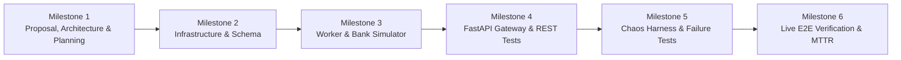

# Project Delivery Milestones & Verification Roadmap

> **Module**: `07_failure_recovery_lab`  
> **System**: High-Value Interbank Wire & Treasury Settlement Gateway  
> **Lifecycle Governance**: 6-Stage Clean Architecture Delivery Pipeline  

This document defines the chronological milestone roadmap, technical deliverables, and acceptance criteria for the failure recovery laboratory.

---

## 1. Milestone Delivery Timeline

---

## 2. Granular Milestone Breakdown

### Milestone 1: Proposal, Architecture, Sequence Diagrams & Milestone Planning (**Complete**)
* Refine project proposal in [README.md](../README.md).
* Author comprehensive [docs/ARCHITECTURE_AND_STANDARDS.md](ARCHITECTURE_AND_STANDARDS.md) defining system topology, invariants, and failure recovery specifications.
* Author dedicated [docs/SEQUENCE_DIAGRAMS.md](SEQUENCE_DIAGRAMS.md) and [docs/MILESTONES.md](MILESTONES.md).
* **Acceptance Criteria**: Full architectural definition with zero application code or container implementations in Milestone 1.

### Milestone 2: Infrastructure, Multi-Container Orchestration & Database Schema (**Complete**)
* Author `docker-compose.yml` declaring PostgreSQL 16, RabbitMQ 3.13 (Management), API Gateway, Worker Fleet (2 pods), and Bank Simulator API.
* Implement database DDL [init.sql](../init.sql) with tables, unique constraints, and partial indexes.
* Declare Kombu AMQP 0-9-1 topology: `wire.direct`, `wire.dlx`, `wire.settlement.critical`, `wire.settlement.dlq`.
* **Acceptance Criteria**: `docker compose up -d` boots all services with clean health checks and pre-configured queues.

### Milestone 3: Domain Models, Bank Simulator API & Celery Worker Consumer (**Next**)
* Implement Pydantic v2 schemas and domain models.
* Implement standalone `services/bank_simulator_api/` simulating external Fedwire/SWIFT clearing with idempotent transaction tracking.
* Implement Celery worker tasks in `services/worker/tasks/` enforcing:
  - `acks_late=True` and `reject_on_worker_lost=True`.
  - Row-level locking (`SELECT ... FOR UPDATE`).
  - Two-Phase Provider Inquiry (Phase 1: GET by idempotency key $\to$ Phase 2: POST if not found).
* **Acceptance Criteria**: 100% statement test coverage across worker tasks and simulator logic.

### Milestone 4: FastAPI Ingestion Gateway, Dispatcher & REST Client Suite
* Implement FastAPI gateway in `app/main.py` with `POST /api/v1/wires` and `GET /api/v1/wires/{id}`.
* Implement correlation ID middleware (`X-Request-ID` propagation) and zero-refresh response generation.
* Implement AMQP dispatcher (`app/dispatcher.py`) with Kombu publisher confirms.
* Author self-contained REST Client scenario suite in `requests/requests.rest`.
* **Acceptance Criteria**: FastAPI integration tests passing with 100% coverage; zero observable 404 blackholes during processing.

### Milestone 5: Automated Chaos Harness & Failure Injection Test Suites
* Implement `scripts/chaos_harness.py` capable of programmatically executing the 5 core experiments.
* Implement unit and integration test suites:
  - `tests/integration/test_worker_crash_recovery.py` (Worker SIGKILL).
  - `tests/integration/test_acknowledgement_modes.py` (Early vs Late Ack comparison).
  - `tests/integration/test_broker_restart_recovery.py` (RabbitMQ crash & durable recovery).
  - `tests/integration/test_dead_letter_quarantine.py` (Poison pill routing & `x-death` verification).
* **Acceptance Criteria**: All failure injection integration tests execute cleanly in isolated test environments.

### Milestone 6: Distributed Live E2E Verification, MTTR Benchmarks & Evidence Log
* Execute live multi-process end-to-end test suite (`tests/e2e/test_live_e2e.py`) against the running Docker Compose cluster.
* Run capacity and chaos benchmarks (`tests/benchmarks/test_recovery_benchmarks.py`).
* Generate empirical evidence artifacts: `reports/experiments/latest_experiment_log.json` and `docs/EXPERIMENT_LOG.md`.
* **Acceptance Criteria**: Verification of zero lost wires, zero double-disbursements, and mathematical ledger balance ($0\text{ cents drift}$).

---

## 3. Deliverables Compliance Matrix

### Milestone 1 Deliverables Matrix

| Milestone 1 Deliverable | Document Reference | Compliance Status |
| :--- | :--- | :---: |
| **System Architecture & Topology** | [ARCHITECTURE_AND_STANDARDS.md](ARCHITECTURE_AND_STANDARDS.md) | **Complete** |
| **Chaos Testbed Topology** | [ARCHITECTURE_AND_STANDARDS.md](ARCHITECTURE_AND_STANDARDS.md) | **Complete** |
| **State Machine & In-Flight Contract** | [ARCHITECTURE_AND_STANDARDS.md](ARCHITECTURE_AND_STANDARDS.md) | **Complete** |
| **Relational Data Model (ER Diagram)** | [ARCHITECTURE_AND_STANDARDS.md](ARCHITECTURE_AND_STANDARDS.md) | **Complete** |
| **Distributed Sequence Diagrams (5 Paths)** | [docs/SEQUENCE_DIAGRAMS.md](SEQUENCE_DIAGRAMS.md) | **Complete** |
| **Failure Recovery Experiment Specifications** | [ARCHITECTURE_AND_STANDARDS.md](ARCHITECTURE_AND_STANDARDS.md) | **Complete** |
| **Architectural Standards & Invariants** | [ARCHITECTURE_AND_STANDARDS.md](ARCHITECTURE_AND_STANDARDS.md) | **Complete** |
| **Granular Milestone Breakdown (M1–M6)** | [docs/MILESTONES.md](MILESTONES.md) | **Complete** |

### Milestone 2 Deliverables Matrix

| Milestone 2 Deliverable | Implementation Artifact | Verification & Compliance Status |
| :--- | :--- | :---: |
| **Multi-Container Compose Orchestration** | `docker-compose.yml` (Postgres, RabbitMQ, API, 2 Worker Pods, Bank Simulator) | **Complete & Verified Healthy** |
| **Database DDL & Partial Indexes** | `init.sql` (`wire_transfers`, `ledger_journal`, `wire_audit_log`, `idx_wire_in_flight_status`) | **Complete & Verified (Zero Duplicate Indexes)** |
| **Kombu AMQP 0-9-1 Queue Topology** | `shared/amqp_topology.py` (`wire.direct`, `wire.dlx`, `wire.settlement.critical`, `wire.settlement.dlq`) | **Complete & 100% Tested** |
| **Pre-Configured RabbitMQ Definitions** | `docker/rabbitmq/definitions.json` & `docker/rabbitmq/rabbitmq.conf` | **Complete & Pre-Loaded at Boot** |
| **Service Entrypoints & Dockerfiles** | `Dockerfile.api`, `services/worker/Dockerfile`, `services/bank_simulator_api/Dockerfile` | **Complete & Built Cleanly** |
| **Celery Late-Ack Worker Configuration** | `services/worker/celery_app.py` (`acks_late=True`, `reject_on_worker_lost=True`) | **Complete & Connected** |
| **Unit Test Suite & Statement Coverage** | `tests/unit/test_amqp_topology.py`, `test_init_sql.py`, `test_docker_compose.py`, etc. | **Complete (100% Test Coverage)** |
| **VS Code Debug Environments** | `.vscode/launch.json` (API, Bank Simulator, Worker, Compound Launcher) | **Complete & Ready** |
