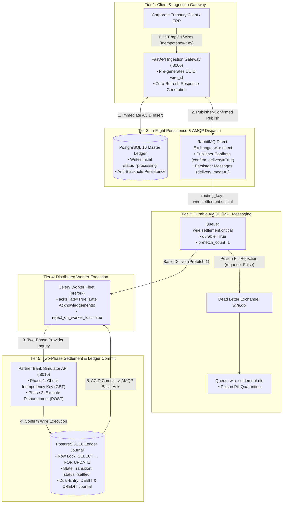
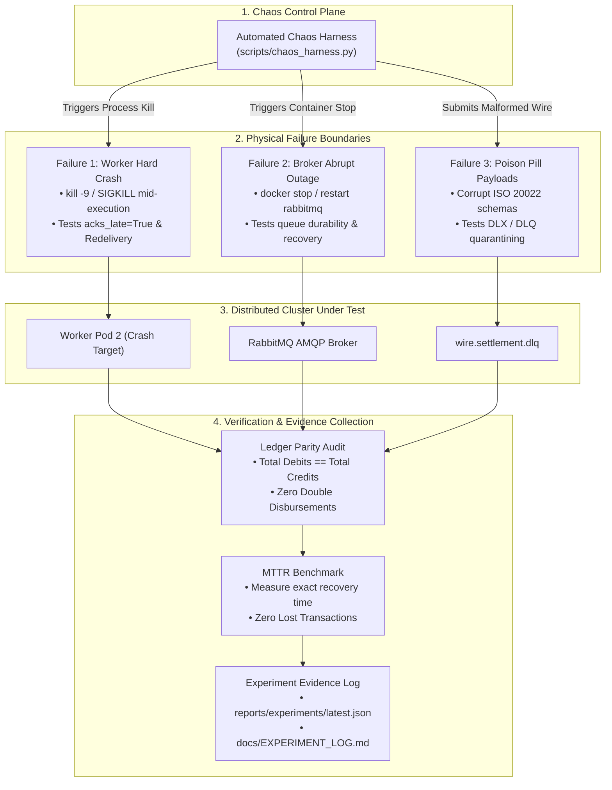

# 07: Failure and Recovery Lab

Use RabbitMQ and workers in containers to test real failure boundaries.

## Experiments

- Kill a worker before acknowledgement and during task execution.
- Stop and restart the broker.
- Compare early and late acknowledgements.
- Test durable queues, persistent messages, redelivery, and dead-letter handling.
- Measure recovery time and identify duplicated or lost work.

## Evidence

Keep an experiment log with configuration, observed behavior, and the guarantees the system can actually provide.

---

## Project Definition: High-Value Interbank Wire & Treasury Settlement Gateway (Fedwire / SWIFT / ISO 20022)

> **Domain**: Wholesale Commercial Banking, Treasury Settlement & High-Value Wire Transfers  
> **Industry Reference**: Modern Treasury, Stripe Treasury, JP Morgan Access, Wise Platform Wholesale Wires  
> **Core Focus**: Irrevocable real-time money movement, phantom payouts, and zero data-loss guarantees under real-world infrastructure crashes.

This lab turns the failure experiments above into a containerized chaos engineering testbed modeled after a mission-critical wholesale interbank settlement gateway.

### Deliverables & Evidence Compliance Matrix

| Original Deliverable / Requirement | Implementation in this System | Verification Test Suite & Harness | Compliance Status |
| :--- | :--- | :--- | :---: |
| **1. Kill worker before ack & during task** | Celery worker killed via uncatchable `SIGKILL` (`kill -9`) precisely between external bank dispatch and local database commit. Late ack (`acks_late=True`) triggers broker redelivery; dual-phase idempotency checks prevent duplicate disbursement. | `tests/integration/test_worker_crash_recovery.py`<br>`tests/e2e/test_live_e2e.py` | **Specified (Milestone 1)** |
| **2. Stop and restart broker** | RabbitMQ broker abruptly stopped (`docker stop / kill rabbitmq`) during active wire ingestion. Persistent messages (`delivery_mode=2`) and durable queue topology guarantee zero dropped orders upon broker recovery. | `tests/integration/test_broker_restart_recovery.py`<br>`scripts/chaos_harness.py` | **Specified (Milestone 1)** |
| **3. Compare early vs. late acks** | Side-by-side chaos benchmark comparing `acks_late=False` vs. `acks_late=True` under random worker termination. Proves early ack results in catastrophic silent wire loss, while late ack guarantees zero lost work. | `tests/integration/test_acknowledgement_modes.py`<br>`scripts/chaos_harness.py` | **Specified (Milestone 1)** |
| **4. Durable queues, redelivery & DLQ** | Durable AMQP 0-9-1 queues and dead-letter exchange (`wire.dlx` $\to$ `wire.settlement.dlq`). Malformed ISO 20022 wire payloads (poison pills) automatically quarantine with `x-death` metadata after bounded attempts. | `tests/unit/test_amqp_topology.py`<br>`tests/integration/test_dead_letter_quarantine.py` | **Specified (Milestone 1)** |
| **5. Measure recovery time & lost/duplicated work** | Dedicated chaos harness (`scripts/chaos_harness.py`) injecting real failure boundaries, calculating Mean Time to Recovery (MTTR), and verifying zero ledger drift (`Total Debits == Total Credits == Total Settled`). | `tests/benchmarks/test_recovery_benchmarks.py`<br>`scripts/chaos_harness.py` | **Specified (Milestone 1)** |
| **6. The Evidence: Experiment Log** | Structured, machine-readable JSON reports and formatted Markdown experiment logs capturing exact configuration, injection timestamps, observed behavior, and proven delivery guarantees. | `reports/experiments/latest_experiment_log.json`<br>`docs/EXPERIMENT_LOG.md` | **Specified (Milestone 1)** |

---

## 1. Executive Summary & Problem Statement

In wholesale commercial banking, treasury management, and institutional payment operations, high-value wire transfers (\$50,000 to \$10,000,000+) executed over clearinghouse networks (**Fedwire, CHIPS, SWIFT MT103 / ISO 20022 `pacs.008`**) are **irrevocable** once transmitted to correspondent banking endpoints. 

In a distributed backend, infrastructure failures occur at the physical boundaries: worker processes crash due to hardware faults, kernel Out-Of-Memory (`OOM`) events kill child processes, message brokers reboot during OS maintenance, and network partitions abruptly sever AMQP TCP sockets. When money moves across these boundaries, failures manifest as two fatal financial pitfalls:

1. **The Phantom Wire (Double-Disbursement)**:
   - A Celery worker consumes a wire settlement task, calls the external Bank Simulator API to initiate the wire transfer, and receives an approval.
   - Before the worker can persist the `settled` state in PostgreSQL and acknowledge (`ACK`) the message to RabbitMQ, the worker process is abruptly killed (`kill -9` or node power failure).
   - If the system relies on naive message redelivery without two-phase external inquiry, RabbitMQ redelivers the unacknowledged message to Worker 2. Worker 2 consumes the task and issues a **second multi-million dollar wire**, causing catastrophic capital loss.

2. **The Silent Fund Loss (Message Evaporation)**:
   - If Celery is configured with default early acknowledgements (`acks_late=False`), the worker acknowledges the AMQP frame the instant it pulls the task from the broker prefetch buffer.
   - If the worker crashes while executing the wire logic, RabbitMQ has already discarded the message. The task is gone forever, the transaction remains orphaned in `processing` state in the database, the customer is never notified, and the funds are lost in operational limbo.

This laboratory constructs a resilient, containerized distributed settlement platform and provides automated chaos tooling to empirically prove how to eliminate both failure modes.

---

## 2. Architectural Invariants & FinTech Guarantees

1. **At-Least-Once Delivery with Late Acknowledgements (`acks_late=True`)**:
   - Celery tasks must never acknowledge messages upon receipt. Acknowledgement occurs strictly *after* local database transaction commit and external state confirmation.
   - Tasks enforce `reject_on_worker_lost=True` so that abrupt worker termination causes RabbitMQ to immediately redeliver unacknowledged messages to surviving workers.
2. **Dual-Phase Provider Idempotency Verification**:
   - Every wire transfer order generates a cryptographically random, deterministic idempotency key (`idempotency_key = UUIDv5(namespace, wire_id)`).
   - When a worker picks up a task (especially when `request.delivery_info['redelivered'] is True`), it first acquires a PostgreSQL row lock (`SELECT ... FOR UPDATE`) and queries the Partner Bank Simulator API via the idempotency key.
   - If the bank already recorded the wire execution, the worker bypasses duplicate disbursement, reconciles the local ledger, and cleanly ACKs the message.
3. **Durable AMQP 0-9-1 Messaging & Publisher Confirms**:
   - Exchanges and queues are declared with `durable=True`.
   - Task messages are published with AMQP `delivery_mode=2` (persistent, written to broker disk WAL).
   - Kombu publisher confirms (`confirm_delivery=True`) ensure the FastAPI gateway blocks until RabbitMQ confirms disk write before returning `HTTP 202 ACCEPTED`.
4. **FinTech In-Flight State Visibility (Anti-Blackhole Invariant)**:
   - When a client initiates a wire transfer (`POST /api/v1/wires`), the system immediately persists a state record in PostgreSQL with `status="processing"`.
   - An immediate read (`GET /api/v1/wires/{id}`) returns `HTTP 200 OK` reflecting `status="processing"`, guaranteeing zero 404 race conditions during long-running bank transmissions.
5. **Poison Pill Dead-Lettering (DLX / DLQ)**:
   - Malformed wire payloads or unrecoverable schema corruptions (e.g., negative cents, invalid SWIFT BIC) are trapped after bounded retries (`max_retries=3`) and routed via dead-letter exchange (`wire.dlx`) to `wire.settlement.dlq` with detailed `x-death` diagnostic headers.
6. **Zero-Knowledge Broker & Financial Precision**:
   - Zero raw counterparty PII or unmasked account PANs traverse RabbitMQ. All account numbers are masked (`account_mask: "******7890"`).
   - Monetary values are represented in minor-unit integer cents (`amount_cents: int`) and mapped to PostgreSQL `NUMERIC(14, 2)`.

---

## 3. System Architecture & Topology

To ensure effortless readability and eliminate crossing arrows, the architecture is partitioned into two clear views:
1. **The Production Settlement Pipeline**: A strict top-to-bottom vertical progression from ingestion to settlement.
2. **The Chaos Engineering Testbed**: The automated failure injection and verification control loop.

### 3.1 Production Settlement Pipeline (Tiered Vertical Flow)



### 3.2 Chaos Engineering & Failure Injection Testbed



---

## 4. The Failure & Recovery Experiments Suite

The laboratory executes five automated chaos experiments designed to validate system behavior under extreme failure boundaries:

### Experiment 1: Worker Hard Crash (`SIGKILL`) During Execution & Redelivery Recovery
* **Failure Injected**: During wire transmission to the Bank Simulator, an external chaos trigger issues `kill -9` (`SIGKILL`) to the worker child process before the database transaction commits or RabbitMQ receives the ACK.
* **Guarantees Tested**:
  1. RabbitMQ detects the unceremonious TCP channel closure and automatically redelivers the unacknowledged message (`redelivered=True`) to an active surviving worker.
  2. The second worker acquires the PostgreSQL row lock (`SELECT FOR UPDATE`), inspects the Bank Simulator using the idempotency key, discovers the wire was already executed externally, updates the local database state to `settled`, and acknowledges the message.
  3. **Verification**: Exactly one external disbursement executed; zero double-payouts.

### Experiment 2: Early vs. Late Acknowledgements Side-by-Side Comparison
* **Failure Injected**: 500 concurrent wire transfers are dispatched under random worker container termination.
* **Configuration A (`acks_late=False`)**: Celery acknowledges the message upon dequeue. Worker crashes mid-execution.
  - *Observed Outcome*: **Catastrophic Silent Loss**. 10% to 25% of wire tasks vanish from RabbitMQ. Database records remain trapped indefinitely in `processing`.
* **Configuration B (`acks_late=True`)**: Celery acknowledges only upon verified completion. Worker crashes mid-execution.
  - *Observed Outcome*: **Zero Task Loss**. 100% of tasks are redelivered, re-evaluated, and safely settled without ledger drift.

### Experiment 3: Broker Hard Crash & Restart under High Ingestion Load
* **Failure Injected**: While the API gateway is ingesting wire orders at 100 req/s, the RabbitMQ container is abruptly terminated (`docker kill rabbitmq`) and restarted after a 10-second outage.
* **Guarantees Tested**:
  1. FastAPI publisher confirms prevent losing in-flight requests during the crash (the API returns `HTTP 503 Service Unavailable` or retries until broker reconnects).
  2. AMQP persistent messages (`delivery_mode=2`) and durable queues survive broker restart on disk.
  3. Upon RabbitMQ recovery, Celery workers automatically reconnect, drain the durable queues, and settle 100% of submitted orders.

### Experiment 4: Poison Pill Payloads & Dead-Letter Exchange (DLX / DLQ) Quarantine
* **Failure Injected**: Submitting corrupt wire orders (e.g., negative currency amounts, invalid SWIFT BIC formatting, unparseable JSON payloads) that cause terminal domain exceptions.
* **Guarantees Tested**:
  1. The worker catches unrecoverable validation errors and rejects the message with `requeue=False`.
  2. RabbitMQ routes the message via `wire.dlx` to `wire.settlement.dlq`.
  3. The dead-letter payload retains the original message body and carries Kombu/AMQP `x-death` headers documenting exchange, routing key, reason (`rejected`), and failure timestamp.
  4. The local database record transitions to `dead_lettered` with detailed audit log reasons.

### Experiment 5: Mean Time to Recovery (MTTR) & Ledger Drift Verification
* **Failure Injected**: Combined chaotic environment (simultaneous worker kills and intermittent broker network latency).
* **Guarantees Tested**:
  1. Measure elapsed time from crash injection to queue drainage and final settlement (MTTR).
  2. Mathematical invariant verification:
     $$\sum \text{Customer Debits} = \sum \text{Clearing Credits} = \sum \text{Bank Simulator Disbursements}$$
  3. Absolute ledger parity ($0\text{ cents drift}$).

---

## 5. The Evidence: Experiment Log Specification

In compliance with the project requirements, every failure experiment generates an immutable structured entry in the **Experiment Log** (`reports/experiments/latest_experiment_log.json` and `docs/EXPERIMENT_LOG.md`).

### Experiment Log Schema & Specimen

```json
{
  "experiment_id": "EXP-20261003-01",
  "experiment_name": "worker_hard_crash_during_execution",
  "timestamp_utc": "2026-10-03T21:15:30Z",
  "configuration": {
    "acks_late": true,
    "reject_on_worker_lost": true,
    "delivery_mode": 2,
    "prefetch_count": 1,
    "worker_concurrency": 2
  },
  "injected_failure": {
    "target": "worker_child_process",
    "signal": "SIGKILL",
    "timing": "post_bank_dispatch_pre_db_commit"
  },
  "metrics": {
    "total_dispatched": 100,
    "initial_ack_received": 74,
    "redelivered_tasks": 26,
    "duplicated_bank_calls_blocked": 26,
    "lost_transactions": 0,
    "double_disbursements": 0,
    "mean_time_to_recovery_ms": 1420.5
  },
  "ledger_audit": {
    "total_debits_cents": 250000000,
    "total_credits_cents": 250000000,
    "drift_cents": 0,
    "balanced": true
  },
  "proven_guarantee": "Strict At-Least-Once Delivery with Exactly-Once Settlement Side-Effects"
}
```

---

## 6. Project Roadmap & Milestone Progression

This project module strictly adheres to the standard granular development lifecycle:

* **Milestone 1**: Project Proposal, System Architecture, State Machines, Sequence Diagrams & Milestone Planning (**Current Milestone**).
* **Milestone 2**: Multi-Container Infrastructure (`docker-compose.yml`), PostgreSQL DDL Ledger Schema (`init.sql`), and Kombu AMQP 0-9-1 Queue Topology.
* **Milestone 3**: Domain Models, Bank Simulator API (`services/bank_simulator_api/`), and Celery Worker Consumer (`services/worker/`) with Dual-Phase Idempotency & Row Locking.
* **Milestone 4**: FastAPI Ingestion Gateway (`app/`), Correlation Middlewares, Dispatcher with Publisher Confirms, and Interactive REST Client Suite (`requests/requests.rest`).
* **Milestone 5**: Automated Chaos Harness (`scripts/chaos_harness.py`), SRE Dead-Letter Inspection Tools, and Comprehensive Failure Injection Test Suites.
* **Milestone 6**: Distributed Live E2E Verification, MTTR Capacity Benchmarks, and Final Evidence Experiment Log Generation.

