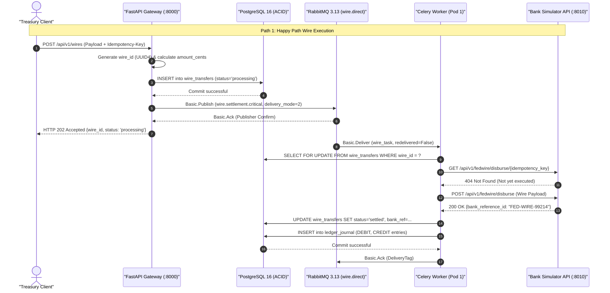
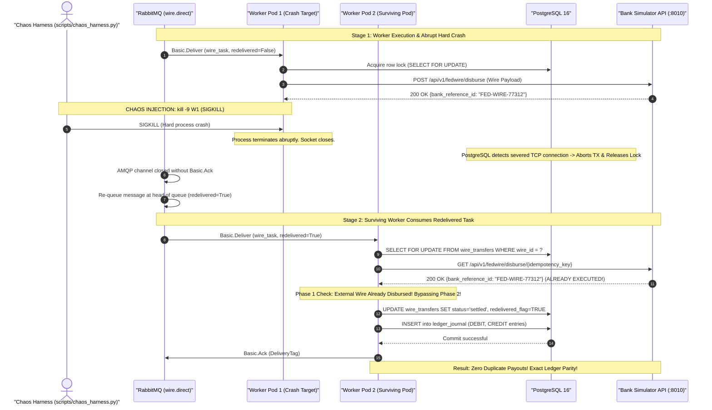
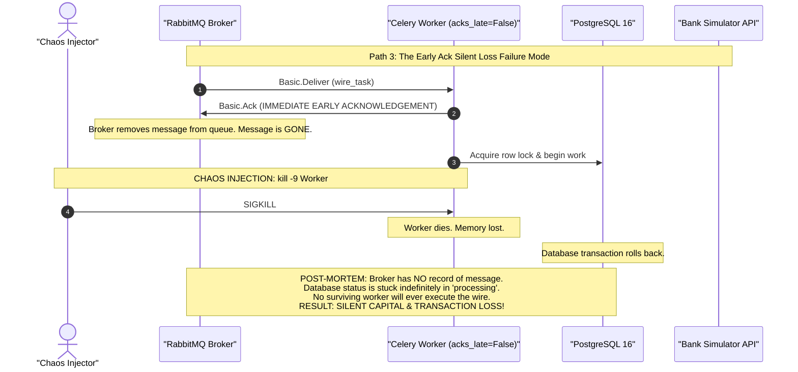
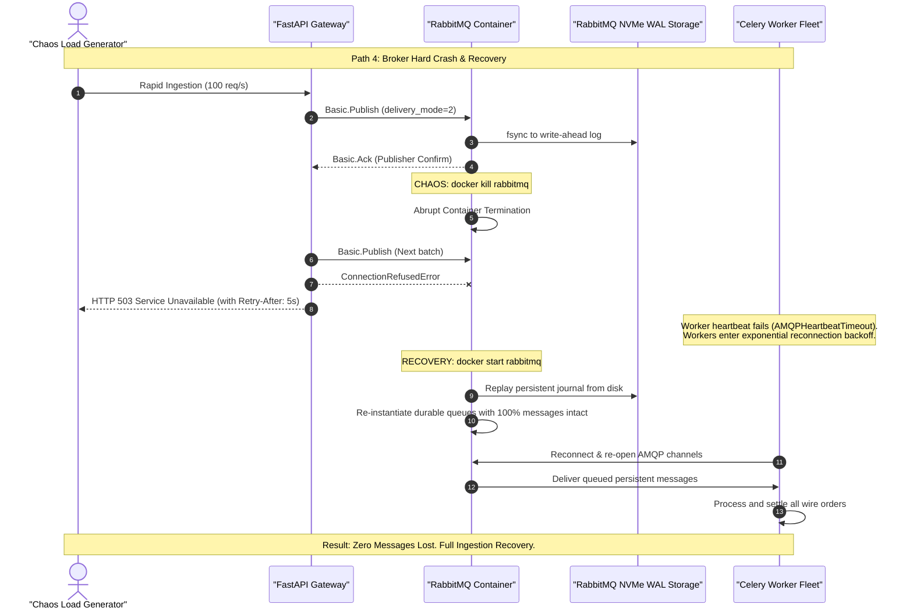
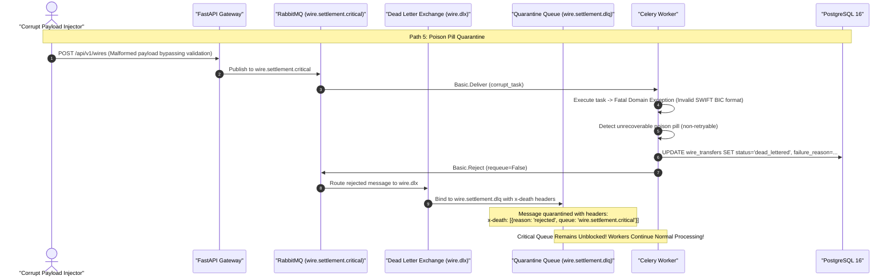

# Distributed Sequence Diagrams (All Execution & Failure Paths)

> **Module**: `07_failure_recovery_lab`  
> **System**: High-Value Interbank Wire & Treasury Settlement Gateway  
> **Standards Compliance**: Celery 5.4, RabbitMQ 3.13 AMQP 0-9-1, PostgreSQL 16 ACID  

This document formalizes the distributed sequence diagrams covering **all normal, degraded, and failure execution paths** across the wire settlement lifecycle.

---

## 1. Path 1: Normal Wire Submission & Settlement (Happy Path)

Demonstrates the zero-refresh, publisher-confirmed ingestion and late-ack settlement workflow.

---

## 2. Path 2: Worker Hard Crash (`SIGKILL`) & Redelivery Recovery (`acks_late=True`)

Illustrates the core problem: worker killed *after* external disbursement but *before* database commit and ACK. Proves two-phase idempotency eliminates double-disbursement upon redelivery.

---

## 3. Path 3: The Early Ack Failure Mode (`acks_late=False`) - Silent Data Loss

Proves why default Celery early acknowledgements must never be used in financial applications.

---

## 4. Path 4: Broker Hard Crash & Reconnect / Recovery

Proves that durable exchanges, persistent messages (`delivery_mode=2`), and publisher confirms survive complete broker failure without data loss.

---

## 5. Path 5: Poison Pill Malformed Payload & DLX/DLQ Dead-Letter Handling

Demonstrates the quarantine of corrupt or unrecoverable wire payloads without blocking critical queues or triggering infinite crash loops.

